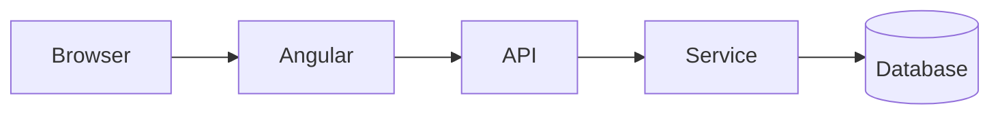

# ChatGPT Free vs Go vs Plus — Master Guide to Getting Maximum Value

> **Last verified:** 13 August 2026  
> **Scope:** Personal ChatGPT plans — Free, Go, and Plus  
> **Goal:** Help you use each plan efficiently for learning, coding, research, files, projects, handbook creation, productivity, and daily work.

---

## Table of Contents

1. [The Most Important Idea](#1-the-most-important-idea)
2. [Current Plan Comparison](#2-current-plan-comparison)
3. [Understanding Models and Reasoning](#3-understanding-models-and-reasoning)
4. [What “Unlimited Chat” Actually Means](#4-what-unlimited-chat-actually-means)
5. [How to Get the Most From the Free Tier](#5-how-to-get-the-most-from-the-free-tier)
6. [How to Get the Most From ChatGPT Go](#6-how-to-get-the-most-from-chatgpt-go)
7. [How to Get the Most From ChatGPT Plus](#7-how-to-get-the-most-from-chatgpt-plus)
8. [The Best Mode/Tool for Each Type of Work](#8-the-best-modetool-for-each-type-of-work)
9. [Projects: Your Most Important Organizational Feature](#9-projects-your-most-important-organizational-feature)
10. [The Handbook Factory — Create Large `.md` Learning Guides Efficiently](#10-the-handbook-factory--create-large-md-learning-guides-efficiently)
11. [Study Mode for Serious Learning](#11-study-mode-for-serious-learning)
12. [Coding and Software Development](#12-coding-and-software-development)
13. [Deep Research](#13-deep-research)
14. [Web Search](#14-web-search)
15. [Files, Data Analysis, and Library](#15-files-data-analysis-and-library)
16. [ChatGPT Work](#16-chatgpt-work)
17. [Codex](#17-codex)
18. [Scheduled Tasks and Monitoring](#18-scheduled-tasks-and-monitoring)
19. [Agent Mode](#19-agent-mode)
20. [Memory and Personalization](#20-memory-and-personalization)
21. [Voice and English Practice](#21-voice-and-english-practice)
22. [Image Generation](#22-image-generation)
23. [How to Check Your Limits](#23-how-to-check-your-limits)
24. [How to Avoid Wasting Quota](#24-how-to-avoid-wasting-quota)
25. [Prompting System That Produces Better Results](#25-prompting-system-that-produces-better-results)
26. [Reusable Prompt Templates](#26-reusable-prompt-templates)
27. [Recommended Daily/Weekly Workflow](#27-recommended-dailyweekly-workflow)
28. [Which Plan Should You Choose?](#28-which-plan-should-you-choose)
29. [Known Documentation Differences](#29-known-documentation-differences)
30. [Official Sources](#30-official-sources)

---

# 1. The Most Important Idea

Do **not** think of ChatGPT only as:

```text
Question
  ↓
Answer
  ↓
Close chat
  ↓
Start another unrelated chat
```

That is the least efficient way to use it.

Think of ChatGPT as a system:

```text
                 ┌──────────────┐
                 │   PROJECT    │
                 └──────┬───────┘
                        │
         ┌──────────────┼──────────────┐
         │              │              │
       Files         Chats        Instructions
         │              │              │
         └──────────────┼──────────────┘
                        │
                   Shared Context
                        │
         ┌──────────────┼──────────────────┐
         │              │                  │
      Learning        Building          Research
         │              │                  │
      Study Mode       Codex          Deep Research
         │              │                  │
       Quiz          Code Review       Sources
         │              │                  │
         └──────────────┼──────────────────┘
                        │
                    Final Output
```

The highest-value workflow is:

```text
Understand → Plan → Build → Test → Review → Improve → Save → Reuse
```

instead of repeatedly asking disconnected questions.

---

# 2. Current Plan Comparison

OpenAI changes models, limits, and feature availability frequently. This table reflects official documentation verified on **13 August 2026**.

| Capability | Free | Go | Plus |
|---|---:|---:|---:|
| Everyday text chats | Unlimited* | Unlimited* | Unlimited* |
| Default current family | GPT-5.6 Luna | GPT-5.6 Luna | GPT-5.6 Sol on eligible paid experience |
| Think option | Yes, Luna | Yes, Luna | Advanced Sol reasoning available |
| GPT-5.6 Sol Medium | No | No | Yes |
| GPT-5.6 Sol High | No | No | Yes |
| GPT-5.6 Sol Extra High | No | No | No |
| GPT-5.6 Sol Pro | No | No | No |
| Web search | Yes | Yes | Yes |
| Study Mode | Yes | Yes | Yes |
| File uploads | Limited | Expanded | Expanded/higher |
| Data analysis | Limited | Expanded | Expanded |
| Image generation | Limited | Expanded | Expanded |
| Deep Research | Limited | More/plan-dependent | Expanded |
| Projects | Yes | Yes | Yes |
| Maximum project files | 5 | 25 | 25 |
| Number of Projects | No fixed count limit | No fixed count limit | No fixed count limit |
| Library storage | 500 MB | 4 GB | 20 GB |
| Memory/context | Limited | Longer | Expanded |
| Codex | Limited | Included with plan limits | Expanded |
| ChatGPT Work | Limited | Limited | Expanded on desktop/web/mobile |
| Scheduled Tasks | Not listed on Free pricing | Account/rollout dependent | Yes |
| Agent Mode | Not standard Free benefit | Not standard Go benefit | Included; separate allowance |
| Connections to internal tools/apps | Limited | Plan-dependent | Broader access |
| API usage | Separate | Separate | Separate |
| Plus price | — | — | US list price: $20/month |

\* “Unlimited” is subject to abuse-prevention guardrails. Premium reasoning, files, images, voice, data analysis, Deep Research, Agent, and other tools can have **separate quotas**.

## What this means in simple language

### Free

Best when you mainly need:

- normal text chat,
- web search,
- Study Mode,
- occasional files,
- occasional image generation,
- basic data analysis,
- Projects,
- lightweight coding,
- GPT-5.6 Luna.

### Go

Best when Free is good enough intellectually, but you repeatedly hit tool limits.

You mainly gain:

- more file usage,
- more image usage,
- more data-analysis usage,
- more storage,
- longer memory/context,
- larger Projects,
- Think using GPT-5.6 Luna.

Go does **not** currently include GPT-5.6 Sol.

### Plus

Best when the quality of reasoning matters.

You mainly gain:

- GPT-5.6 Sol,
- Medium and High reasoning,
- broader model/tool access,
- higher usage limits,
- expanded Deep Research,
- expanded Codex,
- ChatGPT Work,
- larger Library,
- scheduled workflows,
- Agent mode,
- broader connected-app capabilities,
- earlier access to some new capabilities.

---

# 3. Understanding Models and Reasoning

Knowing **when not to use expensive reasoning** is one of the best ways to get more from a paid plan.

## 3.1 Instant

Use Instant for:

- definitions,
- syntax questions,
- rewriting,
- grammar,
- small code snippets,
- simple SQL,
- explanations,
- brainstorming,
- summaries,
- straightforward handbook sections,
- common programming concepts.

Example:

```text
Explain Java HashMap in beginner-friendly language with a small example.
```

You usually do **not** need High reasoning for this.

---

## 3.2 Think on Free and Go

Free and Go can use **Think**, powered by GPT-5.6 Luna.

Use Think when:

- a normal answer misses something,
- logic has multiple steps,
- debugging is moderately difficult,
- you want a more careful comparison,
- you want better planning.

Example:

```text
Think through this bug carefully.

I have an Angular frontend calling a Spring Boot API.
The frontend receives HTTP 200, but the database is not updated.

Give me a step-by-step debugging tree and tell me what evidence
I should collect at each layer.
```

---

## 3.3 Medium Reasoning on Plus

Medium should be your default advanced-reasoning option.

Excellent for:

- code reviews,
- moderately difficult debugging,
- architecture,
- SQL optimization,
- API design,
- business logic,
- DSA,
- technical comparisons,
- detailed learning.

Use Medium before automatically jumping to High.

---

## 3.4 High Reasoning on Plus

Save High for tasks where additional reasoning is likely to materially improve the result.

Use it for:

- difficult production bugs,
- distributed-system design,
- difficult DSA,
- security analysis,
- migration planning,
- complex database logic,
- multi-file root-cause analysis,
- detailed architecture trade-offs,
- ambiguous business rules,
- critical code review.

Example:

```text
Use High reasoning.

Analyze this incident as a senior production engineer.

Do not stop at the first plausible cause.

I want:
1. Observed symptoms
2. Competing hypotheses
3. Evidence for/against each
4. Most likely root cause
5. Reproduction plan
6. Safe fix
7. Regression risks
8. Tests
9. Prevention
```

---

## 3.5 Extra High and Pro

As of this guide:

- Plus does **not** include GPT-5.6 Sol Extra High.
- Plus does **not** include GPT-5.6 Sol Pro.

Those are higher-tier capabilities.

---

# 4. What “Unlimited Chat” Actually Means

A common misunderstanding is:

> Unlimited chat = every ChatGPT feature is unlimited.

That is **not** correct.

Think of ChatGPT usage as separate buckets:

```text
Everyday text
    │
    ├── Files
    ├── Images
    ├── Voice
    ├── Data analysis
    ├── Deep Research
    ├── Advanced reasoning
    ├── Agent
    └── Other premium tools
```

You may still be able to chat even after exhausting a particular premium tool or reasoning allowance.

## Example

Suppose you use Plus heavily for:

- 20 difficult High-reasoning requests,
- several Deep Research reports,
- many images,
- Agent tasks,
- file analysis.

A particular tool/model may temporarily reach its allowance even though ordinary ChatGPT remains usable.

## Important rule

Never assume there is one number called:

```text
Your total ChatGPT quota = 5,000 messages
```

There can be multiple independent limits.

---

# 5. How to Get the Most From the Free Tier

The Free plan is much stronger than many people realize.

## 5.1 Use normal text aggressively

Free currently supports unlimited everyday text chats, subject to abuse guardrails.

Use it for:

- learning,
- coding questions,
- explanations,
- planning,
- brainstorming,
- writing,
- interview questions,
- flashcards,
- quizzes,
- documentation,
- SQL learning,
- architecture basics.

Do not “save messages” unnecessarily if you are only having ordinary text conversations.

---

## 5.2 Use Study Mode

Study Mode is available across plans.

Instead of:

```text
Explain dependency injection.
```

use:

```text
Use Study Mode.

Teach dependency injection from zero.

Do not give me everything at once.

Process:
1. Explain intuition.
2. Ask me one question.
3. Wait for my answer.
4. Correct me.
5. Add code.
6. Give a real project example.
7. Quiz me.
```

---

## 5.3 Exploit unlimited Projects

Projects are available on Free.

Current project file cap:

```text
Free → 5 files/project
```

But the number of Projects itself has no fixed count limit.

So instead of putting 50 files in one project:

```text
Java Mastery
```

split intelligently:

```text
Java-Core
Java-Collections
Java-Concurrency
Java-JVM
Java-Interview
```

Each project can maintain its own focused context.

---

## 5.4 Use web search for current information

Never ask normal model memory to be authoritative for:

- current software versions,
- CVEs,
- prices,
- laws,
- tax rules,
- political information,
- new AI models,
- current product documentation,
- latest framework changes.

Ask:

```text
Search the web and prioritize official documentation.
Give me the answer with sources.
```

---

## 5.5 Protect limited tool usage

Free tool usage is more restrictive.

Do not waste file analysis on content you can paste directly.

Bad:

```text
Upload a 3-line text file just to ask what it says.
```

Better:

```text
Paste the 3 lines directly.
```

Save upload capacity for:

- PDFs,
- spreadsheets,
- screenshots,
- code archives,
- complex documents.

---

## 5.6 Use Think only when it adds value

Do not select Think merely because it sounds “better.”

Use normal mode first.

Upgrade the reasoning only when:

- the answer is incomplete,
- the problem has multiple constraints,
- debugging requires hypothesis testing,
- you need deeper reasoning.

---

## 5.7 Free-tier ideal workflow

```text
Normal chat       → most questions
Study Mode        → learning
Search            → current facts
Projects          → organization
Think             → harder reasoning
Files             → only when needed
Data analysis     → valuable datasets
Image generation  → selective
```

---

# 6. How to Get the Most From ChatGPT Go

Go is primarily an **expanded-usage plan** rather than a top reasoning plan.

## 6.1 What Go is good at

Go is excellent when you:

- chat heavily,
- upload documents frequently,
- analyze spreadsheets,
- generate more images,
- need more Library space,
- want longer memory/context,
- need more files per Project,
- want a cheaper plan than Plus.

---

## 6.2 Go's biggest limitation

Go does **not** include GPT-5.6 Sol.

Its Think capability uses **GPT-5.6 Luna**.

This means:

```text
Go = more usage
Plus = more usage + stronger premium reasoning
```

That is the most important distinction.

---

## 6.3 Use Go for document-heavy workflows

Current Library storage:

```text
Free    500 MB
Go        4 GB
Plus     20 GB
```

Go can therefore be very attractive if your problem on Free is mainly:

> I keep hitting file/tool limits.

rather than:

> I need substantially deeper reasoning for difficult engineering problems.

---

## 6.4 Use 25-file Projects strategically

Go supports up to 25 files per Project.

Example learning project:

```text
Spring-Boot-Mastery/
│
├── Project instructions
├── Handbook.md
├── REST-notes.md
├── Security-notes.md
├── JPA-notes.md
├── Testing-notes.md
├── sample-project.zip
├── architecture.pdf
├── interview-questions.md
└── ...
```

---

## 6.5 Good Go workflow

```text
Luna normal chat
      ↓
Need more reasoning?
      ↓
Think
      ↓
Need current information?
      ↓
Search
      ↓
Need multi-file context?
      ↓
Project + uploads
      ↓
Need data processing?
      ↓
Data analysis
```

---

## 6.6 When Go is enough

Go may be enough if most of your work is:

- handbook generation,
- general programming learning,
- everyday questions,
- document summarization,
- moderate coding,
- occasional reasoning,
- image creation,
- spreadsheet analysis.

If you constantly need difficult architecture/debugging/research reasoning, Plus is a more meaningful upgrade.

---

# 7. How to Get the Most From ChatGPT Plus

Plus is most valuable when you use its **advanced intelligence**, not merely when you send more messages.

## 7.1 Plus priority stack

Use Plus in this order:

```text
1. Projects
2. Instant
3. Medium reasoning
4. Search
5. Files/Data analysis
6. Study Mode
7. High reasoning
8. Deep Research
9. Codex
10. Work
11. Tasks
12. Agent
```

Not every task needs every feature.

---

## 7.2 Make Medium your advanced default

For serious technical work:

```text
Instant → easy
Medium  → most difficult work
High    → only truly hard work
```

This preserves your highest-value reasoning usage.

---

## 7.3 Use High where mistakes are expensive

Examples:

### Production incident

```text
Use High reasoning.

Analyze logs, request flow, database effects and error handling.
Build competing hypotheses.
Do not change code until you have identified the most likely root cause.
```

### Database migration

```text
Use High reasoning.

Review this migration for:
- locking
- downtime
- rollback
- data loss
- index impact
- foreign keys
- concurrency
- deployment order
```

### Security review

```text
Use High reasoning.

Perform a defensive security review of this authentication flow.
Rank findings by severity.
Give remediation and tests.
```

---

## 7.4 Use Deep Research for expensive decisions

Do not spend Deep Research on:

```text
What is Docker?
```

Use it for:

```text
Compare the leading OCR/document extraction stacks available in 2026.

I need:
- architecture
- official benchmarks where available
- licenses
- GPU requirements
- Windows/Linux compatibility
- structured JSON extraction
- production maturity
- cost
- recommendation by deployment scenario

Prioritize primary sources.
```

---

## 7.5 Use Plus for multi-file work

Plus Library currently offers 20 GB storage.

That means you can build durable technical reference collections:

```text
Project: Angular Migration
├── current package.json
├── target package.json
├── tsconfig
├── angular.json
├── app architecture
├── error logs
├── migration notes
├── security report
└── test output
```

Then ask questions against the project context instead of reposting everything.

---

## 7.6 Use Plus as a reviewer, not only a generator

One of the most valuable uses of stronger reasoning is **criticism**.

After ChatGPT generates something, start a separate review pass:

```text
Now act as a skeptical senior reviewer.

Find:
- hidden assumptions
- missing edge cases
- incorrect claims
- scalability problems
- security risks
- maintainability issues
- overengineering

Do not defend the previous answer.
```

This frequently improves quality more than simply asking for a “better answer.”

---

## 7.7 Use Plus as multiple roles

For a feature:

```text
Round 1 → Product Manager
Round 2 → Solution Architect
Round 3 → Senior Developer
Round 4 → QA Engineer
Round 5 → Security Reviewer
Round 6 → DevOps Engineer
```

Example:

```text
First act as product manager and turn this idea into requirements.

After that, switch roles and review the requirements as a solution architect.

Then produce an implementation plan as a senior engineer.

Finally, create test scenarios as QA.
```

---

# 8. The Best Mode/Tool for Each Type of Work

| Task | Best starting option |
|---|---|
| Simple definition | Instant |
| Grammar | Instant |
| Small code example | Instant |
| Framework explanation | Instant / Study |
| Interview practice | Instant / Study |
| Moderate debugging | Medium or Think |
| Difficult debugging | High on Plus |
| Architecture | Medium → High if needed |
| SQL optimization | Medium |
| Production incident | High |
| Current software version | Search |
| Current news | Search |
| Multi-source market research | Deep Research |
| PDF analysis | File upload |
| Spreadsheet analysis | Data analysis |
| Repository coding | Codex |
| Deliverable creation | Work |
| Recurring reminder | Scheduled Task |
| Website action workflow | Agent where appropriate |
| Learning course | Study Mode |
| Long-running topic | Project |
| Preference continuity | Memory |
| Conversation practice | Voice |
| Visual concept | Image generation |

---

# 9. Projects: Your Most Important Organizational Feature

Projects keep:

- chats,
- files,
- instructions,
- context,

together around one goal.

## 9.1 Bad organization

```text
Chat 1 - Java question
Chat 2 - Spring question
Chat 3 - Java interview
Chat 4 - Java bug
Chat 5 - Java notes
Chat 6 - Java collections
```

Everything becomes scattered.

---

## 9.2 Better organization

```text
Project: Java Mastery

Chats:
├── Learning Roadmap
├── Core Java
├── Collections
├── Concurrency
├── JVM
├── Design Patterns
├── Exercises
├── Interview Practice
└── Capstone Project

Files:
├── Java-Master-Handbook.md
├── exercises.md
├── interview-bank.md
└── sample-project.zip
```

---

## 9.3 Project instructions template

```text
Goal:
Help me master this subject from beginner to advanced professional level.

Teaching rules:
- Explain WHY before HOW.
- Define unfamiliar terms.
- Use simple explanations first.
- Then give technical depth.
- Use real-world scenarios.
- Include code where useful.
- Include common mistakes.
- Include best practices.
- Compare alternatives.
- Include interview questions.
- Give exercises.
- Do not skip prerequisites.
- Correct my misconceptions clearly.
- Prefer production-quality examples.
```

---

## 9.4 Current project limits

As of this guide:

```text
Number of projects:
No fixed count limit

Files per project:
Free     5
Go      25
Plus    25

Only a limited number of files can be uploaded simultaneously.
```

Use multiple focused Projects instead of creating one enormous dumping ground.

---

# 10. The Handbook Factory — Create Large `.md` Learning Guides Efficiently

This section is specifically for creating large master-learning handbooks.

## 10.1 There is no special “handbook quota”

ChatGPT does not give you:

```text
100 handbooks/month
```

A handbook consumes normal model/tool usage.

Your practical constraints are:

- model/reasoning allowances,
- tool limits,
- context size,
- file upload limits,
- Library storage,
- output size,
- abuse guardrails.

Therefore:

> You can create many handbooks. The efficient question is not “How many?” but “How do I create them without wasting premium usage?”

---

## 10.2 Do not generate a 500-page handbook in one prompt

Bad workflow:

```text
Create the complete A-Z master handbook for Java, Spring,
Spring Boot, Hibernate, Microservices, Docker, Kubernetes,
AWS, DSA and System Design in one response.
```

Problems:

- shallow explanations,
- missing topics,
- truncation,
- inconsistent detail,
- repeated content,
- poor reviewability.

---

## 10.3 Better handbook pipeline

```text
Phase 1: Requirements
        ↓
Phase 2: Master TOC
        ↓
Phase 3: Gap Review
        ↓
Phase 4: Chapter Generation
        ↓
Phase 5: Exercises
        ↓
Phase 6: Interview Questions
        ↓
Phase 7: Real Projects
        ↓
Phase 8: Glossary
        ↓
Phase 9: Cross-reference Review
        ↓
Phase 10: Final .md
```

---

## 10.4 Phase 1 — Define the learner

Prompt:

```text
I am creating a master handbook for [TOPIC].

Audience:
Beginner → Advanced professional.

The handbook must work both as:
1. a learning course,
2. a future reference manual.

Before writing content, define:
- prerequisites,
- learning outcomes,
- difficulty levels,
- topic boundaries,
- hands-on expectations.
```

Use Instant or Medium.

---

## 10.5 Phase 2 — Generate the master TOC

Prompt:

```text
Create an exhaustive master table of contents for [TOPIC].

Do not write the chapters yet.

Requirements:
- beginner to advanced
- fundamentals
- internals
- practical usage
- production concerns
- debugging
- testing
- security
- performance
- architecture
- best practices
- anti-patterns
- interview preparation
- exercises
- projects
- glossary

Use hierarchical numbering.

After creating the TOC, perform a second pass and identify
anything an experienced professional would expect but is missing.
```

This is a good Medium-reasoning task.

---

## 10.6 Phase 3 — Challenge the outline

Prompt:

```text
Review this handbook outline as:
1. a senior developer,
2. an interviewer,
3. a technical trainer,
4. a production engineer.

For each role:
- identify missing topics,
- identify unnecessary topics,
- identify sequencing problems.

Then give one corrected final outline.
```

---

## 10.7 Phase 4 — Generate one chapter at a time

Prompt:

```text
Write Chapter 7 only.

For every major concept include:

1. What it is
2. Why it exists
3. Mental model
4. Syntax/API
5. Simple example
6. Real-world scenario
7. Production example
8. Common mistakes
9. Edge cases
10. Performance considerations
11. Security considerations where relevant
12. Alternatives
13. Best practices
14. Interview questions
15. Exercises
16. Chapter summary

Do not repeat material already covered in previous chapters.
```

For straightforward topics use Instant.

Use Medium/High only for deep internals or complex chapters.

---

## 10.8 Phase 5 — Add exercises separately

```text
Create exercises for Chapters 1–10.

Difficulty:
- 10 beginner
- 10 intermediate
- 10 advanced
- 5 debugging exercises
- 5 production scenarios

Do not provide answers yet.
```

Then maintain a separate answer key.

---

## 10.9 Phase 6 — Add interview preparation

```text
Create an interview bank from this handbook.

Categories:
- fundamentals
- conceptual
- code output
- debugging
- design
- performance
- security
- scenario questions
- senior-level trade-offs

For every answer explain what the interviewer is testing.
```

---

## 10.10 Phase 7 — Build projects

A handbook becomes much more useful when it includes implementation.

```text
Generate 5 projects:

1. Beginner
2. Lower-intermediate
3. Intermediate
4. Advanced
5. Production-style capstone

For each give:
- business requirement
- functional requirements
- non-functional requirements
- architecture expectations
- acceptance criteria
- edge cases
- testing expectations

Do not give the implementation.
```

---

## 10.11 Phase 8 — Create a glossary

```text
Create an alphabetical glossary for all important terms in this handbook.

For every term:
- one-sentence definition
- beginner explanation
- related concepts
- chapter reference
```

---

## 10.12 Phase 9 — Run a gap audit

This is where Plus reasoning becomes valuable.

```text
Audit the entire handbook.

Look specifically for:
- missing concepts
- shallow sections
- incorrect claims
- duplicate explanations
- outdated guidance
- missing production scenarios
- missing security issues
- missing testing topics
- missing performance topics
- prerequisite gaps

Return a prioritized correction list.

Do not rewrite the handbook yet.
```

Use Medium or High depending on complexity.

---

## 10.13 Phase 10 — Produce the final `.md`

Only after review:

```text
Produce the final consolidated Markdown handbook.

Requirements:
- proper heading hierarchy
- stable anchor links
- TOC
- code fences with language identifiers
- callout notes
- comparison tables
- glossary
- exercises
- interview section
- project section
- references
- version metadata
```

---

## 10.14 Version your handbooks

Use:

```text
java-master-handbook-v1.md
java-master-handbook-v1.1.md
java-master-handbook-v2.md
```

or Git:

```bash
git init
git add .
git commit -m "Initial Java handbook"
```

Then update chapters rather than regenerating the complete file.

---

## 10.15 Best quota strategy for handbook creation

### Use Instant for

- routine explanations,
- examples,
- formatting,
- exercises,
- glossary,
- summaries,
- simple chapters.

### Use Medium for

- master outline,
- deep conceptual chapters,
- architectural sections,
- gap analysis,
- technical review.

### Use High for

- concurrency internals,
- framework internals,
- security,
- difficult system design,
- complex performance analysis,
- final quality audit.

### Use Search for

- current versions,
- current framework behavior,
- deprecations,
- official compatibility matrices.

### Use Deep Research for

- technology landscape comparison,
- current best practices requiring many sources,
- major framework/version migration reports.

This approach can reduce unnecessary premium usage dramatically.

---

# 11. Study Mode for Serious Learning

Study Mode is designed for understanding rather than merely receiving answers.

## Use it for

- learning a topic from zero,
- exam preparation,
- DSA practice,
- interview preparation,
- code-reading practice,
- mathematical concepts,
- framework internals.

## Best prompt

```text
Use Study Mode.

Goal:
Master Spring dependency injection.

Current level:
I understand Java classes/interfaces but not Spring DI.

Rules:
- One concept at a time.
- Ask me questions.
- Wait for my answer.
- Correct misunderstanding before moving on.
- Use a real project example.
- Give a mini exercise after every section.
- End with a cumulative quiz.
```

## Important

Do not use Study Mode when your goal is simply:

> Give me the final answer as fast as possible.

Study Mode deliberately makes learning interactive.

---

# 12. Coding and Software Development

## 12.1 Use ChatGPT across the entire SDLC

```text
Idea
 ↓
Requirements
 ↓
Architecture
 ↓
Database
 ↓
API contract
 ↓
Implementation
 ↓
Tests
 ↓
Security review
 ↓
Performance review
 ↓
Deployment
 ↓
Monitoring
 ↓
Documentation
```

---

## 12.2 Requirements prompt

```text
Act as a senior product engineer.

Turn this rough idea into:
- actors
- user stories
- functional requirements
- non-functional requirements
- validation rules
- error cases
- permissions
- audit requirements
- acceptance criteria

Do not design the solution until requirements are clear.
```

---

## 12.3 Architecture prompt

```text
Design a production architecture for these requirements.

Include:
- components
- responsibilities
- request flow
- data flow
- database
- cache
- queues if needed
- authentication
- authorization
- observability
- deployment
- failure scenarios

For every major decision:
- explain why
- list an alternative
- explain the trade-off
```

---

## 12.4 Debugging prompt

Bad:

```text
Fix error.
```

Better:

```text
Act as a senior debugging engineer.

Symptoms:
[paste]

Expected:
[paste]

Actual:
[paste]

Relevant code:
[paste]

Environment:
[paste]

Do this in order:
1. Separate facts from assumptions.
2. Build likely hypotheses.
3. Rank hypotheses.
4. Tell me what evidence would confirm each.
5. Identify root cause.
6. Give minimal fix.
7. Give production-safe fix.
8. Give regression tests.
```

---

## 12.5 Code-review prompt

```text
Review this as production code.

Check:
- correctness
- security
- validation
- error handling
- null handling
- concurrency
- performance
- database behavior
- API design
- logging
- observability
- maintainability
- testability
- edge cases

Rank:
Critical / High / Medium / Low

For each finding:
- location
- problem
- why it matters
- recommended fix
- test
```

---

## 12.6 Ask for tests before asking for a rewrite

A strong workflow:

```text
Existing code
    ↓
Understand behavior
    ↓
Create tests reproducing behavior
    ↓
Create test reproducing bug
    ↓
Fix
    ↓
Regression test
    ↓
Refactor
```

This is safer than asking ChatGPT to rewrite an entire file immediately.

---

# 13. Deep Research

Deep Research is for multi-step research where ChatGPT must collect and synthesize multiple sources.

## Good uses

- current technology comparison,
- vendor selection,
- market research,
- scientific literature,
- framework migration research,
- current cybersecurity landscape,
- regulatory analysis,
- travel research,
- strategic decisions.

## Poor uses

Do not use it for:

- basic definitions,
- one documentation lookup,
- simple factual questions,
- ordinary rewriting,
- a tiny code fix.

Use normal Search instead.

---

## 13.1 High-value Deep Research prompt

```text
Research [TOPIC] as of today's date.

Goal:
[decision I need to make]

Evaluate:
1. ...
2. ...
3. ...

Source priority:
1. official documentation
2. primary research
3. vendor technical documentation
4. reputable secondary analysis

Clearly separate:
- verified facts
- conflicting claims
- your inference

End with:
- recommendation
- risks
- decision matrix
- sources
```

---

## 13.2 Check your Deep Research allowance

Deep Research has plan-dependent usage.

ChatGPT provides an **in-product counter** for remaining tasks when applicable.

Do not use Deep Research just because you have it.

Use it where a high-quality researched answer saves substantial time.

---

# 14. Web Search

Search should be your default whenever information can change.

## Use Search for

```text
Current:
- versions
- prices
- APIs
- security advisories
- rules
- laws
- product capabilities
- schedules
- releases
- company information
- documentation
```

## Prompt pattern

```text
Search the web.

Prioritize:
1. official documentation,
2. primary sources.

If sources disagree, explain the disagreement.

State the date of the information.
```

---

# 15. Files, Data Analysis, and Library

## 15.1 Current Library storage

```text
Free       500 MB
Go           4 GB
Plus        20 GB
```

This storage can be much more valuable than it looks for text-heavy technical work.

A `.md` handbook is typically tiny compared with video/media files.

---

## 15.2 Use files when context matters

Upload:

- PDFs,
- spreadsheets,
- logs,
- specifications,
- contracts,
- screenshots,
- code,
- CSVs,
- reports.

Then ask a **specific question**.

Weak:

```text
Analyze this.
```

Strong:

```text
Analyze this production log.

Find:
- first error in causal order
- repeated secondary errors
- probable root cause
- affected component
- timeline
- evidence supporting the conclusion

Quote only the minimum log lines needed.
```

---

## 15.3 Data-analysis workflow

For spreadsheets:

```text
1. Inspect columns and data types.
2. Identify missing/invalid values.
3. Explain cleaning assumptions.
4. Calculate metrics.
5. Validate totals.
6. Identify anomalies.
7. Create a summary.
8. Create charts only where they add value.
```

Prompt:

```text
Do not immediately chart this spreadsheet.

First profile the data and tell me:
- sheet structure
- columns
- row counts
- nulls
- duplicates
- suspicious values
- date ranges

Then recommend useful analysis.
```

---

## 15.4 Do not upload the same file repeatedly

If a file belongs to a long-running topic, keep it in the appropriate Project/Library workflow.

That avoids:

- duplicated uploads,
- context fragmentation,
- repetitive explanation.

---

# 16. ChatGPT Work

ChatGPT Work is intended for creating/editing work artifacts such as:

- documents,
- presentations,
- spreadsheets,
- charts,
- PDFs,
- other deliverables.

Plus currently has broader Work access across desktop, web, and mobile than Free/Go.

## When to use Work

Use Work when the final answer should become an actual artifact.

Examples:

```text
Create:
- a project kickoff presentation
- a monthly budget spreadsheet
- a technical design document
- an executive PDF report
```

Use ordinary Chat when you only need discussion or advice.

---

# 17. Codex

Codex is built for software-development workflows.

It is included across ChatGPT plans, but limits vary by plan.

Plus gets expanded access relative to Free/Go.

## Use Codex when

- working across a repository,
- implementing features,
- modifying multiple files,
- running tests,
- understanding a codebase,
- reviewing code changes,
- fixing a bug in context.

## Use ordinary Chat when

- asking conceptual programming questions,
- learning syntax,
- discussing architecture,
- reviewing a small snippet.

## Powerful workflow

```text
ChatGPT:
requirements + architecture + reasoning

Codex:
repository implementation + tests

ChatGPT:
final review + documentation
```

---

# 18. Scheduled Tasks and Monitoring

Scheduled Tasks let ChatGPT perform future or recurring work such as:

- reminders,
- daily briefings,
- weekly reports,
- monitoring,
- recurring prompts.

Current official task documentation lists:

```text
Go    → up to 3 active tasks
Plus  → up to 5 active tasks
```

Feature availability can vary by account/rollout, especially on Go. Check your UI.

## High-value task examples

### Daily learning

```text
Every weekday evening, give me one Java interview question.
Do not show the answer until I reply.
```

### Weekly review

```text
Every Sunday, give me a 20-question review based on the
programming topics I studied that week.
```

### Monitoring

```text
Check weekly for a new stable release of [framework].
Notify me only if a new version appears.
Summarize the important breaking changes.
```

## Avoid wasting tasks

Do not use a scheduled task for something you will never look at.

Five high-value recurring workflows beat five noisy daily notifications.

---

# 19. Agent Mode

Agent Mode is useful when ChatGPT must perform a more involved web/computer workflow rather than only answer a question.

Plus currently has a separate Agent allowance; official documentation lists **40 agent messages/month** for Plus.

Because that allowance is much smaller than everyday chat, use Agent carefully.

## Good Agent use

- multi-step website workflow,
- gathering information across pages,
- completing supported web tasks,
- actions requiring browser interaction.

## Bad Agent use

```text
What is dependency injection?
```

Normal chat should answer that.

## Quota-saving rule

Before using Agent ask:

> Does this require ChatGPT to **do something across websites/apps**, or do I merely need an answer?

If you only need an answer, use Search/Deep Research/Chat.

---

# 20. Memory and Personalization

Memory helps ChatGPT retain useful preferences/context so you do not repeat yourself.

Memory settings are available under:

```text
Settings → Personalization → Memory
```

## Store durable preferences

Good:

```text
Remember that when teaching programming:
1. explain simply,
2. give real-world analogy,
3. show code,
4. show mistakes,
5. give exercise.
```

Good:

```text
Remember that I prefer concise answers unless I ask for an in-depth guide.
```

Avoid using Memory as a database for temporary information.

---

## 20.1 Use Project instructions for project-specific rules

Memory:

```text
General preference across ChatGPT
```

Project instructions:

```text
Rules only for a specific project
```

Example:

```text
Memory:
I prefer beginner-friendly explanations.

Java Project:
Use Java 25 syntax where appropriate.
Include JVM internals in advanced sections.
```

---

# 21. Voice and English Practice

Voice is especially valuable because it turns ChatGPT into a conversation partner.

## Role-play ideas

```text
Technical interviewer
HR interviewer
Manager
Client
Scrum Master
Product Owner
Senior developer
English tutor
```

## Corporate English prompt

```text
Act as my manager in a daily stand-up.

Ask me:
1. What did you complete yesterday?
2. What will you do today?
3. Any blockers?

Do not correct me during the conversation unless I become unclear.

At the end give:
- grammar mistakes
- awkward phrases
- better professional wording
- pronunciation issues if detectable
- 5 phrases to practice
```

---

# 22. Image Generation

Use image generation when the visual itself adds value.

Examples:

- UI mockups,
- architecture concept illustrations,
- diagrams,
- presentation visuals,
- logos,
- learning diagrams,
- posters.

Do not generate an image when simple text or Mermaid is clearer.

For example, software flow is often better represented as:



because it remains editable.

---

# 23. How to Check Your Limits

There is no single universal dashboard called:

```text
All remaining ChatGPT quota
```

Use the following checks.

## 23.1 Model/reasoning allowance

When available, ChatGPT displays:

- that you reached a limit,
- when the allowance resets,
- alternative available models.

Check the model picker and in-product notices.

---

## 23.2 Deep Research

Deep Research provides an in-product counter for remaining tasks where applicable.

---

## 23.3 Storage

Use:

```text
Settings → Storage
```

to check Library storage.

Current storage:

```text
Free    500 MB
Go        4 GB
Plus     20 GB
```

---

## 23.4 Upload quota

OpenAI currently says ChatGPT does **not necessarily show a meter for the rolling upload-rate quota**.

Therefore you may see an upload-limit message without having had a visible “X uploads left” number beforehand.

---

## 23.5 Scheduled Tasks

Review active tasks in the Scheduled/Tasks interface.

If you reach your active-task maximum:

- pause one,
- delete one,
- let a one-time task complete.

---

## 23.6 Handbook creation

There is no separate:

```text
Handbooks remaining: 23
```

counter.

Handbooks use ordinary ChatGPT/model/tool resources.

---

# 24. How to Avoid Wasting Quota

## Rule 1 — Do not use High for easy work

Bad:

```text
High reasoning:
Convert this sentence to uppercase.
```

Use Instant.

---

## Rule 2 — Do not use Deep Research for one-source questions

Bad:

```text
Deep Research:
What is the latest Spring Boot version?
```

Use Search.

---

## Rule 3 — Do not use Agent when Search is enough

Bad:

```text
Agent:
Find the current Node.js LTS version.
```

Search official Node documentation.

---

## Rule 4 — Do not regenerate a complete large document for tiny edits

Bad:

```text
Rewrite my entire 80,000-word handbook because one example is wrong.
```

Better:

```text
Replace only Section 12.4.
Preserve all other content.
```

---

## Rule 5 — Give context once

Instead of repeating:

```text
I am building...
My stack is...
My requirements are...
```

in every chat, use:

- Project instructions,
- files,
- memory where appropriate.

---

## Rule 6 — Ask for diagnosis before code

This avoids multiple bad rewrites.

```text
First diagnose.
Do not change the code yet.
```

Then:

```text
Now implement the smallest safe fix.
```

---

## Rule 7 — Use staged outputs

Instead of:

```text
Build everything.
```

use:

```text
1. requirements
2. architecture
3. contract
4. implementation
5. tests
```

You can catch mistakes earlier.

---

## Rule 8 — Keep current-information requests explicit

```text
Search official sources.
Do not rely on memory for current versions.
```

This reduces outdated answers.

---

# 25. Prompting System That Produces Better Results

A strong prompt has seven pieces.

```text
ROLE
+
GOAL
+
CONTEXT
+
INPUT
+
CONSTRAINTS
+
PROCESS
+
OUTPUT FORMAT
```

## Example

```text
ROLE
Act as a senior Java/Spring engineer.

GOAL
Review this service for production readiness.

CONTEXT
Spring Boot REST API handling invoice approvals.

INPUT
[paste code]

CONSTRAINTS
- Java 25
- Spring Boot current stable
- PostgreSQL
- must preserve API contract

PROCESS
1. Understand behavior.
2. Identify correctness issues.
3. Check security.
4. Check transactions.
5. Check concurrency.
6. Check database usage.
7. Check error handling.

OUTPUT
Table:
Severity | Location | Issue | Why | Fix | Test

Then provide a prioritized remediation plan.
```

This is much better than:

```text
Review my code.
```

---

# 26. Reusable Prompt Templates

## 26.1 Master handbook prompt

```text
Create a master learning handbook for [TOPIC].

Audience:
Complete beginner → advanced professional.

Goal:
One reference that can be used both to learn and revise.

For every concept include:
- definition
- why it exists
- intuition
- syntax/API
- beginner example
- real-world scenario
- production example
- common mistakes
- best practices
- alternatives
- performance/security considerations where relevant
- interview questions
- exercises

Also include:
- prerequisites
- roadmap
- master TOC
- projects
- debugging
- testing
- glossary
- cheat sheet
- interview bank

First create and audit the TOC.
Do not generate the entire handbook until the outline is complete.
```

---

## 26.2 Learn a technology

```text
I want to master [TECHNOLOGY].

First assess:
- prerequisites
- what I already know
- learning path

Then teach one concept at a time.

For each:
Explain → Example → Real scenario → Exercise → Quiz.

Do not move on if I misunderstand the current topic.
```

---

## 26.3 Debug an error

```text
Act as a senior debugger.

Error:
[ERROR]

Environment:
[ENVIRONMENT]

Relevant code:
[CODE]

Expected:
[EXPECTED]

Actual:
[ACTUAL]

First:
- identify facts,
- identify assumptions,
- rank possible causes.

Then give:
- root cause,
- minimal fix,
- production fix,
- regression tests.

Do not suggest random changes.
```

---

## 26.4 System design

```text
Design [SYSTEM].

Requirements:
[REQUIREMENTS]

Scale:
[SCALE]

Constraints:
[CONSTRAINTS]

Cover:
- functional requirements
- non-functional requirements
- APIs
- data model
- components
- data flow
- scaling
- caching
- queues
- consistency
- security
- reliability
- observability
- deployment
- failure recovery
- cost drivers

For every major decision give alternatives and trade-offs.
```

---

## 26.5 Interviewer

```text
Act as a senior interviewer for [ROLE].

Ask ONE question at a time.

After my answer:
- score /10
- tell me what was correct
- identify missing points
- correct misconceptions
- give an excellent answer
- ask one follow-up
- increase difficulty gradually

Do not reveal the answer before I respond.
```

---

## 26.6 Deep Research

```text
Perform Deep Research on [TOPIC].

Decision:
[WHAT I NEED TO DECIDE]

Evaluation criteria:
[CRITERIA]

Prefer:
- official sources
- primary research
- authoritative technical sources

Output:
- executive summary
- evidence
- comparison matrix
- conflicting information
- risks
- recommendation
- sources
```

---

## 26.7 Current software research

```text
Search the web.

Find the current stable version of [SOFTWARE].

Use the official project/vendor source as primary authority.

Then summarize:
- release date
- major changes
- breaking changes
- upgrade concerns
- support requirements
- migration guide
```

---

## 26.8 Code review

```text
Perform a production code review.

Do not rewrite code first.

Find:
- functional bugs
- security vulnerabilities
- validation issues
- concurrency problems
- transaction problems
- performance issues
- N+1 queries
- memory/resource leaks
- poor error handling
- logging gaps
- maintainability problems
- missing tests

Rank by severity.
Then propose minimal corrections.
```

---

## 26.9 Refactor safely

```text
Refactor this code without changing externally observable behavior.

Before refactoring:
1. Explain current behavior.
2. Identify risky behavior.
3. List tests needed to lock behavior.

Then refactor incrementally.

For every change:
- what changed
- why
- behavior preserved
- test coverage needed
```

---

## 26.10 Convert notes into learning material

```text
Convert these notes into a structured learning chapter.

Do not remove technical details.

Add:
- missing definitions
- context
- examples
- scenario
- common mistakes
- summary
- review questions

Clearly label any information you add that is not present in my notes.
```

---

# 27. Recommended Daily/Weekly Workflow

## Daily — developer/learner

```text
Morning
├── 10 min: review yesterday
├── 20 min: Study Mode
└── 10 min: quiz

During work
├── Instant: normal questions
├── Search: current docs
├── Medium: moderate technical reasoning
├── High: hard incidents only
└── Codex: repository work

Evening
├── summarize what you learned
├── update handbook
└── create 5 revision questions
```

---

## Weekly

```text
Monday
Plan learning objectives

Tuesday–Thursday
Learn + build

Friday
Code/project review

Saturday
Interview questions + DSA

Sunday
Weekly revision
Gap analysis
Update handbook
Plan next week
```

---

## Monthly

Ask:

```text
Review my learning project for the last month.

Identify:
- topics covered
- topics weak
- topics repeatedly misunderstood
- unfinished exercises
- missing projects

Create next month's learning plan.
```

---

# 28. Which Plan Should You Choose?

## Choose Free if

Most of these are true:

- ordinary chat is your main use,
- occasional file analysis is enough,
- occasional images are enough,
- Luna/Think is sufficient,
- you mainly learn and ask questions,
- you can work around 5 files/project,
- 500 MB Library is enough.

### Excellent Free user

A disciplined Free user can still:

- learn full programming languages,
- create handbooks,
- use Study Mode,
- use web search,
- build Projects,
- practice interviews,
- write/debug code,
- analyze some files.

---

## Choose Go if

You are happy with Luna intelligence but want significantly more usage around:

- files,
- images,
- data analysis,
- memory,
- storage,
- project files.

The biggest reason to choose Go is:

> “Free is capable enough, but I keep hitting usage/tool limits.”

---

## Choose Plus if

You need:

- GPT-5.6 Sol,
- Medium/High reasoning,
- difficult debugging,
- advanced system design,
- deeper technical analysis,
- expanded Deep Research,
- stronger Codex usage,
- Work,
- Agent,
- higher file/tool allowances,
- 20 GB Library,
- professional workflows.

The biggest reason to choose Plus should be:

> “Better reasoning and broader professional tools save me meaningful time.”

not merely:

> “I want more normal text messages.”

---

## Handbook-specific decision

If your primary goal is **creating many `.md` handbooks**:

### Free

Can already produce many text handbooks.

Use:
- normal chat,
- Projects,
- Search,
- Study Mode.

### Go

Better if handbooks use lots of:
- uploaded references,
- PDFs,
- data files,
- images,
- larger Project collections.

### Plus

Best if your handbooks must have:
- deeper architecture,
- advanced internals,
- high-quality technical review,
- security/performance analysis,
- current-source research,
- complex cross-topic reasoning.

So:

```text
Number of handbooks        → not the main Plus advantage
Quality on difficult topics → major Plus advantage
```

---

# 29. Known Documentation Differences

OpenAI updates ChatGPT rapidly. Sometimes official pages are updated at different times and temporarily disagree.

As of 13 August 2026, examples include:

## 29.1 Personal GPT creation

The current Free Tier FAQ says new GPT creation/publishing is unavailable on personal accounts including Free, Go, Plus, and Pro, while some pricing copy still references custom GPTs on paid plans.

Practical recommendation:

> Check your actual ChatGPT UI. For personal reusable context, Projects + Project Instructions are a reliable alternative.

---

## 29.2 Go voice limits

The Go help article says Voice is included with the same usage limits as Free, while the pricing comparison uses wording suggesting expanded voice.

Practical recommendation:

> Treat the usage shown in your account as authoritative for your current rollout.

---

## 29.3 Go Scheduled Tasks

The Go article references access to Tasks subject to feature availability, and the Scheduled Tasks FAQ lists a 3-active-task cap for Go, while another availability paragraph in that FAQ may list only higher plans.

Practical recommendation:

> If Tasks appears in your Go account, follow the limit shown by the product. Do not subscribe solely for a rollout-dependent feature without checking your account.

---

## 29.4 Why this matters

Never permanently memorize a plan comparison.

For anything important, verify:

```text
ChatGPT Pricing
+
Plan Help Page
+
Model Help Page
+
Your actual in-product model/tool picker
```

---

# 30. Official Sources

This handbook intentionally uses official OpenAI/ChatGPT documentation rather than third-party plan summaries.

## Plans

- ChatGPT Pricing  
  https://chatgpt.com/pricing/

- ChatGPT Free Tier FAQ  
  https://help.openai.com/en/articles/9275245-chatgpt-free-tier-faq

- What is ChatGPT Go?  
  https://help.openai.com/en/articles/11989085-what-is-chatgpt-go

- What is ChatGPT Plus?  
  https://help.openai.com/en/articles/6950777-what-is-chatgpt-plus

## Models

- GPT-5.6 in ChatGPT  
  https://help.openai.com/en/articles/11909943-gpt-53-and-54-in-chatgpt

## Projects

- Projects in ChatGPT  
  https://help.openai.com/en/articles/10169521-projects-in-chatgpt

## Learning

- Using Study Mode in ChatGPT  
  https://help.openai.com/en/articles/11780217-using-study-mode-in-chatgpt

## Research

- Deep Research in ChatGPT  
  https://help.openai.com/en/articles/10500283-deep-research-in-chatgpt

## Storage

- File storage and Library in ChatGPT  
  https://help.openai.com/en/articles/20001052-file-storage-and-library-in-chatgpt

- File Uploads FAQ  
  https://help.openai.com/articles/8555545-file-uploads-faq

## Coding

- Using Codex with your ChatGPT plan  
  https://help.openai.com/en/articles/11369540-using-codex-with-your-chatgpt-plan

## Automation / Agent

- Scheduled Tasks in ChatGPT  
  https://help.openai.com/en/articles/10291617-scheduled-tasks-in-chatgpt

- ChatGPT Agent  
  https://help.openai.com/en/articles/11752874-chatgpt-agent

## Memory

- Memory FAQ  
  https://help.openai.com/articles/8590148-memory-faq

---

# Final Cheat Sheet

```text
Need a quick answer?
→ Instant

Need to learn?
→ Study Mode

Need current facts?
→ Search

Need harder reasoning on Free/Go?
→ Think (GPT-5.6 Luna)

Need serious reasoning on Plus?
→ Medium

Need difficult production reasoning?
→ High

Need many sources synthesized?
→ Deep Research

Need to understand files?
→ Upload + Data Analysis

Need long-running context?
→ Project

Need repo-level coding?
→ Codex

Need a polished work artifact?
→ Work

Need something later/repeatedly?
→ Scheduled Task

Need multi-step website/computer action?
→ Agent

Need continuity about preferences?
→ Memory

Need speaking practice?
→ Voice

Need a visual?
→ Image Generation
```

---

# The Best Overall Strategy

The best ChatGPT user is not the person who sends the most prompts.

The best ChatGPT user chooses the **cheapest/simplest tool that can solve the problem well**, then escalates only when needed:

```text
Instant
   ↓
Think / Medium
   ↓
High
   ↓
Search
   ↓
Deep Research
   ↓
Agent
```

And keeps important work organized as:

```text
Project
  ├── Instructions
  ├── Files
  ├── Learning chats
  ├── Implementation chats
  ├── Review chats
  └── Final artifacts
```

For large learning handbooks:

```text
Outline
  ↓
Audit outline
  ↓
Generate chapters
  ↓
Exercises
  ↓
Projects
  ↓
Interview bank
  ↓
Gap audit
  ↓
Final Markdown
  ↓
Version control
```

That approach gives you far more value from **Free, Go, or Plus** than simply asking more questions.
