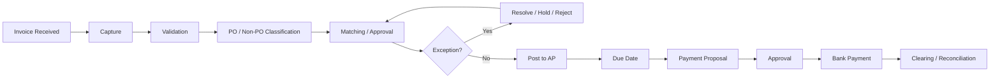
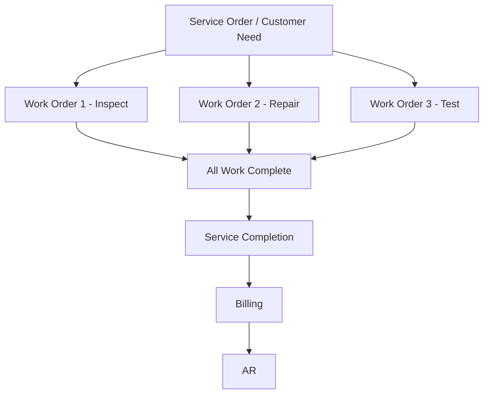
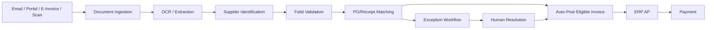
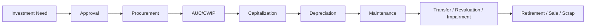

# Business Process and Finance Master Handbook

> **Beginner-to-Advanced Learning Guide and Practical Reference**  
> Version: **1.0**  
> Research review date: **14 August 2026**  
> Primary source notes consolidated: `PO.docx`, `PR to pay.docx`, `SO and WO.docx`, and `state.docx`

---

## About This Handbook

This handbook brings together the business-process and finance concepts contained in the four source documents and turns them into one structured reference. It keeps the original topics—P2P, PR/PO/GRN, CAPEX and OPEX, AP and AR, Service Orders and Work Orders, Journal Vouchers, statutory payments, advance payments, Gate & Scan, ERS, and related terminology—but removes duplication, fills missing explanations, clarifies organization-specific terminology, and adds broader finance, control, accounting, ERP, and operational context.

The teaching approach is:

> **What is it? → Why is it needed? → How does it work? → How to use it? → Example → Output → Real-world use → Alternatives → Common mistakes → Best practices → Advanced notes**

This is not a substitute for your company's accounting policy, ERP configuration, tax advice, legal advice, or statutory notifications. Business processes vary by company, industry, country, ERP, and internal control framework.

### Important terminology warning

Some terms in the source documents are **company- or ERP-specific**, not universal standards:

- **GIR** may mean *Goods Inward Register*, *Goods Inward Report*, or simply a custom goods-receipt status.
- **GRS** may mean *Goods Receipt Slip*, *Goods Receipt System*, or another local name for receiving.
- **SO** can mean *Service Order* in service-management contexts, but in many ERP and sales teams **SO also means Sales Order**.
- **CAPEX PO / OPEX PO** are useful business classifications, but not every ERP implements them as separate technical PO document types.
- **Control / Intra / Inter JV** is a useful organizational classification from the source notes, but it is not a universal accounting-standard classification.
- Workflow meanings such as **Reject** and **Terminate** must be confirmed in the specific application. They are not universal accounting terms.

Whenever a term is configurable, this handbook explains both the generic industry concept and the possible company-specific interpretation.

---

# Table of Contents

1. [The Big Picture: Enterprise Business Processes](#1-the-big-picture-enterprise-business-processes)
2. [Finance and Accounting Foundations](#2-finance-and-accounting-foundations)
3. [Master Data and Organizational Structure](#3-master-data-and-organizational-structure)
4. [Source-to-Pay and Procure-to-Pay](#4-source-to-pay-and-procure-to-pay)
5. [Purchase Requisition (PR)](#5-purchase-requisition-pr)
6. [Sourcing, RFQ, Quotation and Supplier Selection](#6-sourcing-rfq-quotation-and-supplier-selection)
7. [Purchase Orders (PO)](#7-purchase-orders-po)
8. [CAPEX vs OPEX](#8-capex-vs-opex)
9. [Supplier Acknowledgement, ASN, Gate and Scan](#9-supplier-acknowledgement-asn-gate-and-scan)
10. [Goods and Service Receipt: GRN, GIR, GRS and SES](#10-goods-and-service-receipt-grn-gir-grs-and-ses)
11. [Invoice Processing and Accounts Payable](#11-invoice-processing-and-accounts-payable)
12. [2-Way, 3-Way and 4-Way Matching](#12-2-way-3-way-and-4-way-matching)
13. [Exception Handling and Invoice Holds](#13-exception-handling-and-invoice-holds)
14. [Non-PO Invoices](#14-non-po-invoices)
15. [Advance Payments, Deposits and Down Payments](#15-advance-payments-deposits-and-down-payments)
16. [Debit Notes, Credit Notes and Returns](#16-debit-notes-credit-notes-and-returns)
17. [ERS / Evaluated Receipt Settlement](#17-ers--evaluated-receipt-settlement)
18. [Vendor Payment and AP Closing](#18-vendor-payment-and-ap-closing)
19. [P2P Accounting Entries](#19-p2p-accounting-entries)
20. [Order-to-Cash and Accounts Receivable](#20-order-to-cash-and-accounts-receivable)
21. [Service Order and Work Order](#21-service-order-and-work-order)
22. [Record-to-Report and the General Ledger](#22-record-to-report-and-the-general-ledger)
23. [Journal Vouchers and Journal Entries](#23-journal-vouchers-and-journal-entries)
24. [Accruals, Reversals, Provisions and Prepayments](#24-accruals-reversals-provisions-and-prepayments)
25. [Intercompany and Intracompany Accounting](#25-intercompany-and-intracompany-accounting)
26. [Financial Statements and Period Close](#26-financial-statements-and-period-close)
27. [Statutory Payments and India-Specific Compliance](#27-statutory-payments-and-india-specific-compliance)
28. [Travel and Expense (T&E)](#28-travel-and-expense-te)
29. [Internal Controls, Audit and Segregation of Duties](#29-internal-controls-audit-and-segregation-of-duties)
30. [Statuses, Workflow and Approval Design](#30-statuses-workflow-and-approval-design)
31. [Business Process KPIs and TAT](#31-business-process-kpis-and-tat)
32. [ERP Mapping: SAP and Oracle](#32-erp-mapping-sap-and-oracle)
33. [Automation, OCR, E-Invoicing and Modern AP](#33-automation-ocr-e-invoicing-and-modern-ap)
34. [Conceptual Data Model and Integration Architecture](#34-conceptual-data-model-and-integration-architecture)
35. [End-to-End Case Studies](#35-end-to-end-case-studies)
36. [Common Mistakes and Troubleshooting](#36-common-mistakes-and-troubleshooting)
37. [Interview and Practical Questions](#37-interview-and-practical-questions)
38. [Glossary](#38-glossary)
39. [Supplier Lifecycle and Vendor Master Governance](#39-supplier-lifecycle-and-vendor-master-governance)
40. [Inventory, Warehouse and Stock Controls](#40-inventory-warehouse-and-stock-controls)
41. [Fixed Asset Lifecycle Beyond Procurement](#41-fixed-asset-lifecycle-beyond-procurement)
42. [Treasury, Cash Management and Bank Reconciliation](#42-treasury-cash-management-and-bank-reconciliation)
43. [Budgeting, Cost Centers and Commitment Control](#43-budgeting-cost-centers-and-commitment-control)
44. [Process Governance: SOP, RACI, BPMN and Change Control](#44-process-governance-sop-raci-bpmn-and-change-control)
45. [Research Notes and References](#45-research-notes-and-references)

---

# 1. The Big Picture: Enterprise Business Processes

Large organizations usually do not think only in terms of individual screens such as "Create PO" or "Post Invoice." They think in **end-to-end business processes**. An end-to-end process begins with a business need and ends only after the economic outcome is completed and recorded.

## 1.1 Core process families

| Process | Full Form | Starts With | Ends With | Main Goal | Money Direction |
|---|---|---|---|---|---|
| S2P | Source-to-Pay | Need / sourcing demand | Supplier paid | Select supplier, buy, receive, pay | Outgoing |
| P2P / PtP | Procure-to-Pay | Purchase request | Supplier paid | Operational procurement and payment | Outgoing |
| O2C | Order-to-Cash | Customer order | Cash collected | Sell, deliver, invoice, collect | Incoming |
| I2C | Invoice-to-Cash | Customer invoice | Cash collected | Billing, collections, cash application | Incoming |
| R2R | Record-to-Report | Accounting transactions | Financial statements | Record, reconcile, close, report | Reporting |
| H2R | Hire-to-Retire | Recruitment | Employee exit | Manage employee lifecycle | Payroll-related |
| T&E | Travel & Expense | Employee expense/travel | Reimbursement/accounting | Control employee expenses | Outgoing |
| EAM / Maintenance | Asset/equipment need | Work completion/closure | Maintain operational assets | Operational reliability | Cost / asset impact |

### Beginner mental model

- **P2P** = We **buy and pay**.
- **O2C** = We **sell and collect**.
- **R2R** = We **record and report**.
- **H2R** = We **hire, manage and retire employees**.

These process families interact. For example, P2P posts expenses, inventory, assets and liabilities into finance; those postings ultimately appear in R2R and the financial statements.

## 1.2 P2P vs S2P

**P2P** normally focuses on requisition, purchase order, receipt, invoice and payment.

**S2P** is broader. It can begin earlier with:

1. Spend analysis
2. Category strategy
3. Supplier discovery
4. RFx / tendering
5. Negotiation
6. Contracting
7. Supplier onboarding
8. Procurement
9. Invoice and payment

### When to use which term

Use **P2P** when discussing the operational purchase-to-payment transaction flow. Use **S2P** when supplier sourcing, contracts and strategic procurement are also in scope.

---

# 2. Finance and Accounting Foundations

Before learning P2P, O2C and R2R, understand the accounting structure underneath them.

## 2.1 The accounting equation

The basic equation is:

```text
Assets = Liabilities + Equity
```

Every valid accounting transaction keeps this equation balanced.

### Examples

- Buy inventory on credit:
  - Inventory increases.
  - Accounts Payable increases.

- Pay the supplier:
  - Cash decreases.
  - Accounts Payable decreases.

## 2.2 Debit and credit

A debit is not automatically "good" and a credit is not automatically "bad." Debit and credit are the two sides of double-entry accounting.

| Account Type | Increase | Decrease |
|---|---|---|
| Asset | Debit | Credit |
| Expense | Debit | Credit |
| Liability | Credit | Debit |
| Equity | Credit | Debit |
| Revenue | Credit | Debit |

### Example: book an electricity bill of ₹50,000

```text
Electricity Expense A/c     Dr  50,000
    To Vendor Payable A/c       50,000
```

Output:

- P&L expense increases by ₹50,000.
- Balance-sheet liability increases by ₹50,000.

## 2.3 Accrual accounting

**What is it?**  
Accrual accounting records income and expenses when the economic activity occurs, not only when cash moves.

**Why is it needed?**  
Without accrual accounting, monthly financial results can become misleading.

### Example

Employees work in March, but salary is paid in April.

Correct March accrual:

```text
Salary Expense A/c          Dr  100,000
    To Salary Payable A/c       100,000
```

This allows March to show the March cost.

## 2.4 General Ledger (GL)

**What is it?**  
The General Ledger is the central accounting record in which financial postings are summarized by account.

**Why is it needed?**  
AP, AR, inventory, assets, payroll and manual journals all eventually affect the GL.

**Typical outputs**

- Trial balance
- Profit & Loss statement
- Balance Sheet
- Cash-flow information
- Management reporting

### GL vs subledger

A **subledger** contains detailed transactions for a specific domain.

Examples:

- AP subledger → individual vendor invoices and payments
- AR subledger → individual customer invoices and receipts
- Fixed asset subledger → asset master, depreciation and disposal
- Inventory subledger → stock movements and valuation

The GL normally contains the summarized accounting impact.

## 2.5 Control accounts

A **control account** is a GL account whose balance is supported by a subledger.

Examples:

- Accounts Payable control account
- Accounts Receivable control account

### Best practice

Do not post directly to control accounts unless the ERP and finance policy explicitly allow controlled adjustment. Direct manual posting can make the GL and subledger disagree.

## 2.6 Business Partner (BP)

**What is it?**  
A Business Partner is a master record representing a party that interacts with the company.

Possible roles:

- Supplier/vendor
- Customer
- Employee
- Bank or other party, depending on system design

Some ERP systems use one central BP object with different roles instead of completely separate vendor and customer masters.

---

# 3. Master Data and Organizational Structure

A process can be logically correct but still post incorrectly if master data is wrong.

## 3.1 Important master data

| Master | Examples of Key Fields | Why Important |
|---|---|---|
| Supplier | Legal name, tax ID, payment terms, bank details | Procurement and AP |
| Customer | Billing address, credit limit, tax data | Sales and AR |
| Material / Item | Description, UOM, valuation class, tax category | PO, inventory, costing |
| Service | Service code, description, UOM, price | Service procurement |
| GL Account | Account type, posting rules | Financial reporting |
| Cost Center | Department / responsibility | Cost tracking |
| Profit Center | Profit responsibility | Management reporting |
| Fixed Asset | Asset class, useful life, location | Asset accounting |
| Bank Master | Bank account details | Payments and receipts |
| Tax Code | GST/VAT/tax treatment | Tax calculation |
| Payment Terms | e.g. Net 30 | Due-date calculation |

## 3.2 Organizational dimensions

Common structures include:

- Legal entity / company code
- Business unit
- Plant
- warehouse/storage location
- purchasing organization
- purchasing group
- sales organization
- cost center
- profit center
- project / WBS
- branch / location

### Why they matter

A single invoice may need to answer all of these questions:

- Which legal entity owes the supplier?
- Which department incurred the cost?
- Which plant received the material?
- Which project should carry the cost?
- Which tax registration applies?
- Which bank account should make the payment?

---

# 4. Source-to-Pay and Procure-to-Pay

## 4.1 What is P2P?

**Procure-to-Pay (P2P)** is the end-to-end process used to request goods or services, order them, receive them, validate the supplier invoice and pay the supplier.

A common flow is:


### Simplified version

```text
Need → PR → Approval → PO → Receipt → Invoice → Match → AP → Payment
```

## 4.2 Why P2P is needed

A controlled P2P process helps an organization:

- authorize spending before commitment;
- ensure purchases are made from approved suppliers;
- verify price, quantity and receipt;
- reduce duplicate or fraudulent invoices;
- make accurate accounting entries;
- pay suppliers on time;
- maintain audit evidence;
- enforce budgets and contracts;
- forecast cash outflow.

## 4.3 Major actors

| Actor | Typical Responsibility |
|---|---|
| Requester | Raises need / PR |
| Manager | Approves business need |
| Budget Owner | Confirms budget |
| Procurement | Sources supplier and creates PO |
| Supplier | Delivers goods/services and invoice |
| Security / Gate | Controls physical inbound entry |
| Warehouse / Receiver | Records receipt |
| Quality Team | Inspection where required |
| Service Requester | Accepts service performed |
| Accounts Payable | Validates and posts invoice |
| Treasury | Executes payment |
| Finance / R2R | Reconciliation and period close |
| Internal Audit | Tests controls |

## 4.4 P2P is not always strictly sequential

A textbook diagram is linear, but real life has exceptions:

- Invoice may arrive before goods receipt.
- Partial receipt may happen against one PO.
- One invoice may reference multiple POs.
- Multiple invoices may reference one PO.
- Services may use a Service Entry Sheet instead of a physical GRN.
- Non-PO invoices may have no PO.
- Advance payment can happen before receipt.
- Credit/debit notes may modify the payable.
- ERS can create settlement from receipt without a normal supplier invoice.

The ERP therefore needs statuses, tolerances, holds and exception workflows.

---

# 5. Purchase Requisition (PR)

## 5.1 What is a PR?

A **Purchase Requisition** is an internal request asking the organization to procure a good or service.

A PR is **not yet a supplier order**. It is an internal authorization and planning document.

## 5.2 Why is it needed?

The PR allows the organization to check the need before committing money.

Typical controls:

- Is the purchase necessary?
- Is budget available?
- Is the requester authorized?
- Is an existing contract available?
- Is there already sufficient stock?
- Is the request duplicated?
- Is CAPEX approval required?
- Does the request need security, IT, legal or compliance approval?

## 5.3 Typical PR fields

### Header

- Requester
- Department
- Company/legal entity
- Request date
- Required date
- Justification
- Delivery location
- Cost center/project

### Line

- Item/service description
- Material/service code
- Quantity
- Unit of measure
- Estimated price
- Currency
- Preferred supplier, if allowed
- Budget/account assignment
- CAPEX/OPEX indicator or asset/project reference

## 5.4 PR workflow

Example:

```text
Requester
  ↓
Line Manager
  ↓
Budget Owner
  ↓
Functional Approval (if required)
  ↓
Procurement
```

Approval levels may depend on:

- value;
- category;
- business unit;
- CAPEX/OPEX;
- risk;
- supplier;
- contract exception.

## 5.5 Output

An approved PR generally produces one of these outcomes:

- convert to PO;
- send to sourcing/RFQ;
- reject;
- return for correction;
- cancel/terminate;
- combine with other demand.

## 5.6 Common mistakes

- vague description such as "IT item";
- wrong quantity/UOM;
- incorrect cost center;
- bypassing an existing contract;
- splitting a request to avoid approval thresholds;
- raising duplicate PRs;
- selecting CAPEX when the item should be expensed, or vice versa.

## 5.7 Best practices

- Use standardized catalogs and item masters.
- Make business justification mandatory for non-catalog spend.
- Check budget at PR stage.
- Detect duplicate or near-duplicate requests.
- Use approval delegation with expiry dates.
- Keep threshold rules in a centrally controlled matrix.

---

# 6. Sourcing, RFQ, Quotation and Supplier Selection

This stage is sometimes outside narrow P2P and inside S2P.

## 6.1 RFQ / RFP / RFI

| Term | Meaning | Typical Use |
|---|---|---|
| RFI | Request for Information | Understand supplier capability |
| RFQ | Request for Quotation | Compare price for defined need |
| RFP | Request for Proposal | Compare technical/commercial solutions |
| Tender | Formal competitive procurement | Larger/regulatory purchases |

## 6.2 Supplier selection factors

Price alone is not enough. Procurement may evaluate:

- technical fit;
- total cost of ownership;
- delivery lead time;
- quality;
- warranty;
- payment terms;
- tax compliance;
- financial stability;
- information security;
- sustainability;
- legal terms;
- past performance.

## 6.3 Output

The output may be:

- selected supplier;
- negotiated contract;
- rate card;
- blanket/framework agreement;
- approved source list;
- purchase order.

## 6.4 Common control

The person requesting an item should not be able to single-handedly create a supplier, approve the PR, create the PO and approve the invoice. This is a segregation-of-duties issue.

---

# 7. Purchase Orders (PO)

## 7.1 What is a PO?

A **Purchase Order** is a formal purchasing document issued to a supplier describing what the organization intends to buy and under what terms.

It normally includes:

- supplier;
- buyer entity;
- items/services;
- quantity;
- price;
- currency;
- delivery date/location;
- payment terms;
- tax conditions;
- contract reference;
- account assignment;
- incoterms, where relevant;
- terms and conditions.

## 7.2 Why is a PO needed?

A PO provides:

- commercial authorization;
- supplier communication;
- price and quantity baseline;
- receiving reference;
- invoice-matching reference;
- budget commitment;
- audit trail.

## 7.3 Main PO classifications

There is no single universal list. Different classifications answer different questions.

### A. By purchasing behavior

#### 1. Standard PO

**What:** One-time or defined purchase with specific quantity/price.

**Example:** 100 laptops at ₹50,000 each.

**Use:** Normal material or service purchase.

#### 2. Blanket / Framework / Open PO

**What:** A longer-term arrangement with a value or quantity ceiling.

**Example:** Office supplies up to ₹10 lakh for one year.

**Use:** Repetitive low-value purchases.

**Risk:** Weak monitoring can lead to overspend against the limit.

#### 3. Contract PO / Contract Release

**What:** Purchases executed against negotiated contractual terms.

**Example:** IT hardware under a three-year rate agreement.

#### 4. Planned / Scheduled PO

**What:** Future deliveries are planned using dates or schedule lines.

**Example:** 10 tonnes of material delivered every month.

#### 5. Service PO

**What:** PO for services instead of inventory goods.

**Example:** Annual maintenance, consulting or facility management.

**Receipt:** Often uses service acceptance or a **Service Entry Sheet (SES)** rather than a physical GRN.

### B. By accounting purpose

#### 6. CAPEX-oriented PO

Used when the purchase is expected to be capitalized as an asset or construction-in-progress, subject to accounting policy.

#### 7. OPEX-oriented PO

Used for normal operating expenses such as maintenance, utilities, consumables and professional services.

### C. By inventory treatment

#### 8. Stock PO

Material is received into inventory.

#### 9. Non-stock / direct-consumption PO

The purchase is charged directly to an expense, project, cost center or asset rather than stocked.

### D. By fulfillment

#### 10. Drop-ship PO

Supplier delivers directly to the end customer or another destination without normal warehouse handling by the buyer.

## 7.4 Important correction: classifications can overlap

A single PO can be:

- Standard + CAPEX + non-stock
- Standard + OPEX + stock
- Blanket + OPEX + service
- Contract-based + service + OPEX

Therefore, "types of PO" are usually **dimensions**, not mutually exclusive categories.

## 7.5 PO approval and release

Common controls:

- PR must be approved first.
- Supplier must be approved.
- Contract price must be respected.
- PO value must be within authority.
- Changes after approval may trigger reapproval.
- Supplier bank details should not be changed through PO data alone.
- PO amendments should preserve version history.

## 7.6 Does creating a PO create an accounting entry?

Usually **no**, under normal financial accounting. A PO is normally a commitment, not yet an accounting recognition of inventory/expense or supplier liability.

However:

- budgetary/commitment accounting may record commitments;
- ERP encumbrance functionality can produce internal accounting entries;
- local public-sector rules can differ.

---

# 8. CAPEX vs OPEX

## 8.1 What is CAPEX?

**Capital Expenditure (CAPEX)** is spending that results in an asset or improves an asset in a way that meets capitalization criteria under the relevant accounting policy.

Examples may include:

- machinery;
- servers;
- buildings;
- production equipment;
- major infrastructure;
- vehicles;
- qualifying project costs.

A simple beginner rule is "long-term asset," but useful life alone is not enough. Recognition depends on the applicable accounting framework and company capitalization policy.

Under IAS 16, property, plant and equipment is generally recognized as an asset when future economic benefits are probable and cost can be measured reliably. [R2]

## 8.2 What is OPEX?

**Operating Expenditure (OPEX)** is normally recognized as expense in the period of consumption unless another accounting rule requires deferral or capitalization.

Examples:

- electricity;
- rent;
- routine maintenance;
- office consumables;
- normal professional services.

## 8.3 CAPEX vs OPEX comparison

| Aspect | CAPEX | OPEX |
|---|---|---|
| Economic nature | Investment in asset/capability | Day-to-day operating consumption |
| Initial statement impact | Balance sheet asset | P&L expense |
| Later P&L impact | Depreciation/amortization/impairment | Usually immediate |
| Cash-flow classification | Often investing for qualifying asset acquisitions | Usually operating, subject to accounting framework |
| Approval | Often investment/budget committee | Operational budget |
| Master data | Asset/project/AUC may be required | Cost center/GL usually sufficient |

## 8.4 CAPEX procurement flow


## 8.5 Asset Under Construction (AUC) / CWIP

Large projects are often not ready for use immediately.

During construction:

- qualifying costs accumulate in **Asset Under Construction (AUC)** or **Capital Work in Progress (CWIP)**;
- depreciation generally does not start merely because costs have been incurred;
- when the asset is ready for its intended use, costs are transferred to the final asset class;
- depreciation begins according to the accounting policy and applicable standard.

## 8.6 Example: ₹50 lakh server infrastructure

1. Business raises investment request.
2. CAPEX budget approved.
3. PR raised.
4. PO issued.
5. Servers delivered and received.
6. Installation and directly attributable setup costs assessed.
7. Asset/AUC created.
8. Supplier invoice matched and posted.
9. Payment made.
10. Asset capitalized when ready for use.
11. Depreciation recorded over useful life.

## 8.7 Common mistakes

- Capitalizing routine repairs.
- Expensing a material asset because invoice value was split.
- Starting depreciation before the asset is ready for use.
- Forgetting to settle AUC/CWIP.
- Including non-qualifying administrative cost in asset cost.
- Not recording asset location/custodian.

## 8.8 Advanced accounting note

IAS 16 describes cost components that may be included in the initial cost of qualifying property, plant and equipment, such as purchase price and directly attributable costs to bring the asset to the location and condition necessary for intended operation. [R2]

---

# 9. Supplier Acknowledgement, ASN, Gate and Scan

## 9.1 Supplier acknowledgement

After receiving the PO, the supplier may confirm:

- accepted quantity;
- price;
- delivery date;
- ship-to location;
- exceptions;
- estimated dispatch date.

This prevents silent disagreement between buyer and supplier.

## 9.2 ASN - Advance Shipment Notice

An **Advance Shipment Notice** tells the buyer what is being shipped before arrival.

Common data:

- PO number;
- shipment number;
- carrier;
- vehicle;
- expected arrival;
- item quantities;
- package/pallet identifiers.

## 9.3 Gate process

**What is it?**  
Physical entry control at the factory, warehouse or secured receiving location.

Security may verify:

- supplier;
- vehicle;
- driver;
- PO;
- delivery challan;
- appointment;
- material category;
- safety requirements.

**Output:** gate-entry record or rejection.

## 9.4 Scan process

Barcode, QR or RFID scanning may capture:

- material;
- serial number;
- batch;
- package;
- quantity;
- location;
- delivery document.

### Flow

```text
PO → Supplier Dispatch → ASN → Gate Entry → Scan → Receipt/Inspection → GRN
```

## 9.5 Benefits

- real-time inbound visibility;
- less manual entry;
- faster receipt;
- better traceability;
- security control;
- serial/batch accuracy.

## 9.6 Alternatives

For small organizations:

- manual gate register;
- delivery challan entry;
- spreadsheet;
- direct warehouse receipt.

For advanced organizations:

- dock scheduling;
- OCR of delivery documents;
- RFID;
- weighbridge integration;
- mobile receiving app;
- automated quality sampling.

---

# 10. Goods and Service Receipt: GRN, GIR, GRS and SES

## 10.1 GRN - Goods Receipt Note

**What is it?**  
A document or ERP transaction confirming that goods have been received.

**Why is it needed?**

- confirms physical receipt;
- supports inventory update;
- supports invoice matching;
- supports quality checks;
- provides audit evidence.

### Example

```text
GRN No: GRN-20260803-001
PO No: PO-10025
Supplier: ABC Electronics
Item: Laptop
Ordered Qty: 100
Received Qty: 100
Accepted Qty: 98
Rejected Qty: 2
Receipt Date: 03-Aug-2026
```

### Important statuses

- received;
- under inspection;
- accepted;
- rejected;
- partially accepted;
- reversed/cancelled.

## 10.2 Partial delivery

If a PO orders 100 units and only 60 arrive:

- receive 60;
- PO open quantity remains 40;
- invoice should normally be matched against the permitted receipt/quantity according to policy;
- final-delivery indicator should not be set unless no more receipt is expected.

## 10.3 Over-receipt

Example:

- PO quantity = 100
- delivered = 105

System behavior may be:

- block over-receipt completely;
- allow tolerance;
- require approval;
- amend PO before receiving.

## 10.4 Quality inspection

A 4-way control can require:

```text
PO ↔ Receipt ↔ Invoice ↔ Inspection/Acceptance
```

Quality can affect:

- accepted quantity;
- inventory status;
- supplier claim;
- debit note;
- payment hold.

## 10.5 GIR - Goods Inward Register / Report

In the source notes, GIR is described as a master log or a custom status showing whether a PO's goods-receipt process is complete.

### Generic interpretation

**GRN** = one receipt transaction/document.

**GIR** = register/log containing many inward receipts.

Example:

| Date | GRN | Supplier | Item | Qty |
|---|---|---|---|---:|
| 01-Aug | GRN001 | ABC | Laptop | 100 |
| 02-Aug | GRN002 | XYZ | Mouse | 500 |
| 03-Aug | GRN003 | PQR | Keyboard | 200 |

### Company-specific warning

A field such as:

```text
is_po_gir_status = 0 / 1
```

may simply be a custom Boolean flag.

Possible meaning:

```text
0 = receipt not complete
1 = receipt complete
```

Do not assume this interpretation without checking business rules or database documentation.

## 10.6 GRS - Goods Receipt Slip/System

**GRS** is not one universally standardized ERP term. Some organizations use it as another name for the goods-receipt document or process.

Best practice:

> In requirements and API documentation, define the term exactly and map it to the actual ERP transaction/document.

## 10.7 Service Entry Sheet (SES)

Services do not always involve a physical goods receipt.

An SES records that a service was performed and accepted.

Examples:

- consulting hours;
- maintenance visit;
- facility-management work;
- installation;
- manpower service.

Typical SES fields:

- service PO;
- service line;
- performance period;
- quantity/hours;
- amount;
- requester/acceptor;
- evidence/attachment;
- approval status.

SAP documentation confirms that performed services can be recorded against a service PO through a Service Entry Sheet and accepted before related invoice processing, depending on configuration. [R8]

## 10.8 Receipt accounting: an important clarification

The source notes state that liability may be created at GRN. In many ERP designs, **receipt creates an accrual**, while the actual vendor AP liability is created when the invoice is posted.

A simplified inventory example:

At goods receipt:

```text
Inventory / Receiving      Dr
    To GR/IR Accrual           Cr
```

At invoice:

```text
GR/IR Accrual              Dr
    To Vendor Payable          Cr
```

Exact accounts depend on configuration, inventory method and accounting framework.

---

# 11. Invoice Processing and Accounts Payable

## 11.1 What is Accounts Payable?

**Accounts Payable (AP)** manages amounts the company owes to suppliers and other payees.

Typical AP responsibilities:

- receive invoice;
- validate supplier and invoice;
- check tax;
- identify PO/non-PO;
- perform matching;
- route exceptions;
- post payable;
- schedule payment;
- resolve supplier queries;
- reconcile vendor accounts;
- support period close.

## 11.2 Invoice lifecycle



## 11.3 Invoice capture

Channels:

- email;
- supplier portal;
- EDI;
- e-invoice integration;
- scanned PDF;
- paper scan;
- API;
- OCR.

Captured data can include:

- supplier name/code;
- invoice number;
- invoice date;
- PO number;
- tax ID/GSTIN;
- currency;
- subtotal;
- tax;
- gross amount;
- line items;
- bank/payment information;
- attachments.

## 11.4 Basic invoice validations

### Header validation

- supplier exists and active;
- invoice number present;
- invoice date valid;
- duplicate not found;
- currency valid;
- tax registration present where required;
- legal entity correct.

### Line validation

- PO line exists;
- quantity;
- UOM;
- unit price;
- tax;
- freight/other charges;
- total calculation.

### Control validation

- bank master not changed through invoice;
- approval policy met;
- sanctions/compliance checks where applicable;
- period open;
- attachment/evidence present.

## 11.5 AP does not always come after GRN

A simplified teaching flow often says:

```text
PR → PO → GRN → Invoice → AP → Payment
```

But in reality:

- invoice can arrive before receipt and be put on hold;
- non-PO invoices may have no GRN;
- service invoices may depend on SES;
- advances may be paid before receipt;
- statutory payments may not involve a supplier PO.

Therefore AP is part of the P2P ecosystem, but the exact sequence depends on transaction type.

---

# 12. 2-Way, 3-Way and 4-Way Matching

## 12.1 Why matching exists

Matching reduces the risk of paying for:

- items not ordered;
- items not received;
- quantities above receipt;
- incorrect price;
- duplicate bills;
- failed quality.

## 12.2 2-way match

```text
PO ↔ Invoice
```

Checks can include:

- supplier;
- item;
- quantity;
- price;
- tax;
- amount.

### When used

- some services;
- low-risk categories;
- cases where receipt is not required;
- policies configured for PO-only matching.

## 12.3 3-way match

```text
PO ↔ Receipt ↔ Invoice
```

Conceptually:

- PO = what was ordered;
- Receipt = what was received;
- Invoice = what was billed.

SAP describes invoice verification against PO and goods receipt as three-way matching. [R7] Oracle also supports matching invoice lines to purchase orders or receipts. [R9]

### Example

PO:

```text
100 units × ₹1,000 = ₹100,000
```

Receipt:

```text
90 units accepted
```

Invoice:

```text
100 units × ₹1,000 = ₹100,000
```

Potential result:

- invoice quantity exceeds accepted receipt;
- line is blocked or exception is created depending on tolerance.

## 12.4 4-way match

```text
PO ↔ Receipt ↔ Inspection/Acceptance ↔ Invoice
```

Useful for:

- high-value material;
- regulated quality;
- engineering components;
- pharmaceuticals;
- safety-critical items.

## 12.5 Tolerances

Exact matching is not always practical.

Possible tolerances:

- quantity percentage;
- price percentage;
- absolute amount;
- freight;
- tax rounding;
- date;
- exchange rate.

### Example

PO price = ₹100.00  
Invoice price = ₹100.50  
Tolerance = 1%

Variance = 0.5% → may pass.

## 12.6 Matching output

Common outputs:

- matched/validated;
- blocked;
- price variance;
- quantity variance;
- no receipt;
- missing PO;
- duplicate;
- tax variance;
- approval required.

## 12.7 Common mistake: treating 3-way match as universally mandatory

3-way matching is a strong and very common control, but whether it is mandatory depends on company policy, category, ERP configuration and transaction type. A non-PO utility bill cannot be matched to a nonexistent PO/GRN.

---

# 13. Exception Handling and Invoice Holds

Exceptions are a normal part of P2P.

## 13.1 Common exceptions

- missing PO;
- wrong PO;
- PO closed;
- no receipt;
- partial receipt;
- price mismatch;
- quantity mismatch;
- duplicate invoice;
- tax mismatch;
- invalid supplier;
- missing bank validation;
- damaged material;
- quality rejection;
- invoice total calculation mismatch;
- invoice date outside allowed period;
- currency mismatch.

## 13.2 Hold vs reject vs return vs terminate

### Hold

Transaction remains pending until condition is resolved.

### Return for correction

Requester/supplier corrects data and resubmits.

### Reject

Approval is denied.

### Terminate / cancel

Process is intentionally stopped and should not continue.

### Important company-specific note

The source notes contain an application-specific rule resembling:

- **Reject** → rejected in workflow but may still result in a downstream ERP posting in that custom process.
- **Terminate** → closes the transaction with no ERP document number.

That is **not a universal definition**. Treat it as a custom workflow rule that must be validated against the application's configured behavior.

## 13.3 Root-cause approach

Do not only fix individual invoices. Track why exceptions occur.

Example Pareto:

| Cause | Count | Action |
|---|---:|---|
| No GRN | 300 | Improve receiving discipline |
| Wrong PO price | 150 | Improve PO amendments |
| Duplicate supplier invoice | 80 | Strengthen duplicate check |
| Tax mismatch | 60 | Correct tax master |
| OCR error | 40 | Improve extraction/model |

---

# 14. Non-PO Invoices

## 14.1 What is a non-PO invoice?

An invoice that is not supported by a purchase order.

Examples may include:

- utilities;
- rent;
- legal fees;
- certain taxes/fees;
- emergency purchases;
- subscriptions;
- some employee-related expenses.

## 14.2 Typical flow

```text
Expense / Service
    ↓
Invoice Received
    ↓
Coding
    ↓
Business Approval
    ↓
Finance / Tax Validation
    ↓
AP Posting
    ↓
Payment
```

## 14.3 Why non-PO spend is risky

Without a PO there is no pre-approved commercial baseline for:

- price;
- quantity;
- supplier;
- budget;
- terms.

Therefore controls must move to:

- invoice approval;
- contract evidence;
- coding;
- budget confirmation;
- duplicate prevention.

## 14.4 Best practice

Use non-PO only for approved categories. Do not let it become a general bypass of procurement.

---

# 15. Advance Payments, Deposits and Down Payments

## 15.1 What is an advance payment?

Money paid before the goods or services have been fully received.

Examples:

- booking deposit;
- project mobilization advance;
- machinery advance;
- event venue deposit;
- supplier security deposit, depending on nature.

## 15.2 Buyer accounting

A normal advance is usually not immediately an expense merely because cash was paid.

Example:

```text
Advance to Supplier A/c    Dr  50,000
    To Bank A/c                50,000
```

When final invoice/receipt is recognized:

```text
Expense / Asset / Inventory Dr
    To Vendor Payable           Cr
```

Then advance is adjusted:

```text
Vendor Payable              Dr
    To Advance to Supplier      Cr
```

Remaining balance is paid.

## 15.3 Example

Purchase value = ₹20,000  
Advance = ₹5,000

```text
Advance paid: ₹5,000
Remaining settlement: ₹15,000
```

subject to tax and contractual treatment.

## 15.4 Controls

- advance percentage limit;
- approval threshold;
- bank guarantee where required;
- contract milestone;
- aging report;
- mandatory clearing against final invoice;
- stale advance review.

## 15.5 Common mistake

Leaving advances uncleared for months can overstate assets and hide supplier disputes.

---

# 16. Debit Notes, Credit Notes and Returns

## 16.1 Debit note in procurement

A buyer may issue a debit note or debit memo to reduce the amount otherwise payable, subject to local legal/tax documentation rules.

Possible reasons:

- quantity shortage;
- damaged goods;
- price overcharge;
- quality penalty;
- returned material.

### Example

Original invoice: ₹10,000  
Eligible reduction: ₹2,000  
Net economic payable: ₹8,000

## 16.2 Credit note

A supplier may issue a credit note to reduce the receivable/payable.

Typical flow:

```text
Supplier Invoice 10,000
Less Credit Note 2,000
Net Payable 8,000
```

## 16.3 Goods return

Possible process:

```text
GRN → Quality Rejection → Return to Vendor → Debit/Credit Adjustment → AP Adjustment
```

## 16.4 Accounting example

If inventory worth ₹2,000 is returned before payment:

```text
Vendor Payable / GRIR      Dr  2,000
    To Inventory               2,000
```

Exact entry depends on whether the invoice was already posted and on ERP configuration.

---

# 17. ERS / Evaluated Receipt Settlement

## 17.1 What is ERS?

**Evaluated Receipt Settlement** is a process in which the system calculates what is payable using trusted purchasing and receipt information, reducing or eliminating the need for a conventional supplier invoice for eligible transactions.

## 17.2 Why use it?

Benefits:

- less invoice processing;
- fewer invoice-entry errors;
- faster settlement;
- lower AP workload.

## 17.3 How it works

A simplified flow:

```text
PO with agreed price
   ↓
Receipt accepted
   ↓
System calculates payable
   ↓
Settlement document / self-billing output
   ↓
AP liability / payment process
```

Oracle describes a "Pay on Receipt" process in which receipt data can be used to generate payable invoices in configured scenarios. [R9]

## 17.4 Preconditions

ERS works best when:

- supplier is trusted;
- price is contractually stable;
- receipt is accurate;
- tax requirements are satisfied;
- supplier agrees to the process;
- master data quality is high.

## 17.5 When not to use

Avoid or carefully control ERS when:

- price frequently changes;
- complex taxes/charges exist;
- receipt quality is poor;
- services are disputed;
- supplier invoices contain necessary additional information.

---

# 18. Vendor Payment and AP Closing

## 18.1 Payment process

Typical steps:

1. Posted invoice reaches due date.
2. Payment proposal selects eligible items.
3. Holds and blocks are reviewed.
4. Cash availability is checked.
5. Payment batch is approved.
6. Payment file/API sent to bank.
7. Bank confirms execution.
8. AP items are cleared.
9. Bank reconciliation is performed.

## 18.2 Payment terms

Examples:

- Net 30
- Net 45
- 2% discount if paid within 10 days
- milestone payment
- advance + balance

Due date may depend on:

- invoice date;
- receipt date;
- baseline date;
- contract;
- local law;
- dispute status.

## 18.3 Payment methods

- bank transfer;
- electronic payment file;
- API payment;
- cheque, where used;
- virtual card;
- netting;
- intercompany settlement.

## 18.4 Payment controls

- maker-checker;
- payment approval limits;
- bank-account-change verification;
- positive pay/beneficiary validation where applicable;
- duplicate payment detection;
- blocked suppliers;
- sanctions screening if required;
- payment batch reconciliation.

## 18.5 AP close

Month-end activities may include:

- unposted invoice review;
- GR/IR aging;
- unmatched receipt review;
- vendor statement reconciliation;
- advance aging;
- debit balance review;
- blocked invoice review;
- accruals;
- foreign-currency revaluation;
- AP-to-GL reconciliation.

---

# 19. P2P Accounting Entries

The exact accounting depends on ERP configuration, accounting framework, inventory valuation and tax. The following examples are conceptual.

## 19.1 PO creation

Usually:

```text
No financial entry
```

Possible commitment/encumbrance entry in specialized systems.

## 19.2 Stock material receipt before invoice

PO: 100 units × ₹1,000

At receipt:

```text
Inventory                 Dr  100,000
    To GR/IR Accrual          100,000
```

At invoice:

```text
GR/IR Accrual             Dr  100,000
Input Tax Recoverable     Dr   <tax>
    To Vendor Payable         <gross>
```

At payment:

```text
Vendor Payable            Dr   <gross>
    To Bank                    <gross>
```

## 19.3 Direct-consumption service

At invoice/accepted service:

```text
Consulting Expense        Dr  200,000
Input Tax Recoverable     Dr   <tax>
    To Vendor Payable         <gross>
```

If receipt accrual is configured, an intermediate accrual entry may exist.

## 19.4 CAPEX asset

At qualifying asset recognition:

```text
Asset / AUC               Dr  5,000,000
Input Tax Recoverable     Dr   <eligible tax>
    To Vendor / Accrual       <gross/net as configured>
```

Depreciation later:

```text
Depreciation Expense      Dr
    To Accumulated Depreciation
```

## 19.5 Non-PO rent invoice

```text
Rent Expense              Dr
Input Tax Recoverable     Dr   <if eligible>
    To Vendor Payable         <gross>
```

## 19.6 Advance

```text
Advance to Vendor         Dr
    To Bank
```

Later clear the advance against the payable.

## 19.7 Inventory accounting note

IAS 2 provides principles for inventory cost and subsequent expense recognition, including measurement at the lower of cost and net realisable value. [R3]

---

# 20. Order-to-Cash and Accounts Receivable

P2P is the buying side. O2C is the selling side.

## 20.1 What is O2C?

**Order-to-Cash** covers the process from a customer order through fulfillment, billing, collection and cash application.

Typical flow:


## 20.2 Accounts Receivable (AR)

AR manages amounts customers owe the company.

Responsibilities may include:

- customer invoicing;
- receivable posting;
- collections;
- credit management;
- cash application;
- dispute management;
- credit notes;
- aging;
- bad debt;
- customer reconciliation.

### Easy memory aid

- AP = company pays **out**.
- AR = company receives money **in**.

## 20.3 O2C accounting example

Customer sale: ₹100,000 + tax

At invoice:

```text
Customer Receivable       Dr  <gross>
    To Revenue                 100,000
    To Output Tax              <tax>
```

At receipt:

```text
Bank                      Dr  <gross>
    To Customer Receivable     <gross>
```

## 20.4 Revenue recognition is not always equal to invoicing

For simple goods sales, invoice and revenue timing may be close.

For:

- subscriptions;
- implementation projects;
- maintenance contracts;
- long-term services;
- multiple deliverables;

revenue recognition can differ from billing.

IFRS 15 uses a five-step model: identify the customer contract, identify performance obligations, determine transaction price, allocate that price, and recognize revenue when/as performance obligations are satisfied. [R5]

## 20.5 I2C vs O2C

**I2C (Invoice-to-Cash)** starts later than O2C.

```text
O2C: Customer demand → Order → Fulfillment → Invoice → Collection
I2C:                                  Invoice → Collection
```

---

# 21. Service Order and Work Order

## 21.1 Acronym warning: "SO"

In the source documents, **SO = Service Order**.

In many sales/ERP contexts, however:

> **SO = Sales Order**

Always state the full term in requirements and API names.

## 21.2 Service Order

**What is it?**  
A business document/request representing a service to be provided to a customer or internal recipient, depending on system design.

Typical information:

- customer;
- service location;
- service type;
- contract/warranty;
- SLA;
- price;
- requested date;
- priority.

### Example

Customer requests AC repair.

Service Order:

```text
Customer: ABC Ltd
Location: Mumbai Site
Service: AC Repair
SLA: 8 hours
Contract: Annual Maintenance
Priority: High
```

## 21.3 Work Order

**What is it?**  
A task-oriented execution document used to plan and perform maintenance or service work.

Typical fields:

- equipment/asset;
- technician/team;
- operation/task;
- parts;
- tools;
- planned hours;
- actual hours;
- status;
- completion notes;
- failure code.

## 21.4 Relationship



A service order can create one or more work orders.

## 21.5 Work Order can exist without Service Order

Important edge case:

- preventive maintenance;
- internal equipment repair;
- planned plant maintenance;
- safety inspection;
- calibration.

Example:

```text
Maintenance Plan → Work Order → Technician → Completion
```

No external customer or service order is required.

## 21.6 Lifecycle

### Service Order

```text
Create → Validate → Approve → Schedule → Execute → Complete → Bill → Close
```

### Work Order

```text
Create → Plan → Assign → Release → Execute → Confirm → Complete → Close
```

## 21.7 Common mistakes

- assuming every WO must have an SO;
- using "SO" without clarifying Sales Order vs Service Order;
- billing before service acceptance;
- closing service order before all required work orders are complete;
- not capturing actual parts/hours.

---

# 22. Record-to-Report and the General Ledger

## 22.1 What is R2R?

**Record-to-Report** is the finance process that takes accounting data from all operational processes and converts it into reconciled financial reporting.

Typical flow:

```text
Subledger Transactions
    ↓
GL Posting
    ↓
Journal Entries
    ↓
Accruals / Adjustments
    ↓
Reconciliations
    ↓
Trial Balance
    ↓
Close
    ↓
Financial Statements
    ↓
Management / Statutory Reporting
```

## 22.2 Major R2R activities

- GL accounting;
- journal processing;
- bank reconciliation;
- AP/AR reconciliation;
- fixed asset accounting;
- inventory accounting;
- intercompany;
- allocations;
- accruals;
- provisions;
- foreign exchange revaluation;
- consolidation;
- period close;
- reporting.

## 22.3 Trial balance

A trial balance lists GL balances and verifies:

```text
Total Debits = Total Credits
```

A balanced trial balance does **not** prove every transaction is correct. A wrong debit and wrong credit can still balance.

---

# 23. Journal Vouchers and Journal Entries

## 23.1 What is a Journal Voucher (JV)?

A **Journal Voucher** is a controlled mechanism for entering accounting adjustments that are not automatically generated by normal subledger processes, or for specific manual/controlled finance adjustments.

Examples:

- accrual;
- provision;
- reclassification;
- correction;
- allocation;
- intercompany entry;
- depreciation adjustment;
- opening balance.

## 23.2 Why use JVs carefully?

Manual journals can bypass automated business-process controls.

Risks:

- wrong GL;
- wrong amount;
- wrong period;
- unsupported adjustment;
- management override;
- direct posting to control accounts;
- duplicate journal.

## 23.3 Typical JV fields

- journal type;
- company/legal entity;
- posting date;
- document date;
- currency;
- debit/credit lines;
- GL accounts;
- cost center/profit center;
- reference;
- explanation;
- supporting attachment;
- preparer;
- approver;
- reversal flag/date.

## 23.4 Source classification: Control, Intra, Inter

The source notes classify JVs into three groups.

### A. Control-account JV

Used for controlled adjustments involving accounts linked to subledgers such as AP/AR.

Example:

```text
Bad Debt Expense          Dr
    To Customer-related Adjustment / AR
```

**Warning:** Direct posting to a control account can break subledger reconciliation if not supported by the ERP.

### B. Intra-company JV

Internal transfer within the same legal entity.

Example:

```text
Marketing Expense         Dr
    To Administration Expense
```

This may represent a reclassification, not a cash movement.

### C. Intercompany JV

Transaction between different legal entities within a group.

Example concept:

Company A pays an expense for Company B.

Company A:

```text
Intercompany Receivable   Dr
    To Bank / Payable
```

Company B:

```text
Expense                   Dr
    To Intercompany Payable
```

### Advanced note

"Control/Intra/Inter" is a useful local classification but not a universal IFRS or ERP standard. Other organizations classify journals as:

- standard;
- accrual;
- recurring;
- adjustment;
- reclassification;
- intercompany;
- consolidation;
- top-side;
- reversal.

## 23.5 JV workflow

Good control:

```text
Preparer → Validator → Approver → Post → Review
```

For high-risk journals:

- independent approver;
- evidence mandatory;
- restricted posting users;
- period controls;
- post-close analytics.

---

# 24. Accruals, Reversals, Provisions and Prepayments

These concepts are often confused.

## 24.1 Accrual

Expense or income recognized before the final invoice/cash transaction is processed.

Example:

March service received, invoice arrives in April.

```text
Professional Fee Expense  Dr  100,000
    To Accrued Liability      100,000
```

## 24.2 Reversing journal

A reversal does **not delete** the original entry.

Original entry remains in the audit trail. A new opposite entry is posted later.

### Example

31 March:

```text
Salary Expense            Dr  100,000
    To Salary Payable         100,000
```

Reversal on 1 April:

```text
Salary Payable            Dr  100,000
    To Salary Expense         100,000
```

### Why reverse?

It prevents double counting when the actual April invoice/payroll entry is posted.

### Meaning of "Reversal Request = Yes"

Conceptually:

> "Post this journal now, and create an opposite journal on the configured future date."

Typical required fields:

- reversal date;
- reversal reason/type;
- sometimes reversal period.

## 24.3 Provision

A **provision** is different from a routine accrual. Under IAS 37, it is a liability of uncertain timing or amount and is recognized when the relevant recognition criteria are met. [R4]

Examples can include:

- warranty obligation;
- certain legal claims;
- restoration obligation.

## 24.4 Prepayment

Cash paid before the related expense period.

Example: annual insurance paid upfront.

At payment:

```text
Prepaid Insurance         Dr  120,000
    To Bank                   120,000
```

Monthly:

```text
Insurance Expense         Dr   10,000
    To Prepaid Insurance       10,000
```

## 24.5 Comparison

| Concept | Cash Timing | Recognition Timing | Typical Balance Sheet |
|---|---|---|---|
| Accrual | Cash later | Expense now | Liability |
| Prepayment | Cash now | Expense later | Asset |
| Provision | Uncertain amount/timing | Recognize if criteria met | Liability |
| Reversal | No new economic event required | Cancels previous journal impact | Depends |

---

# 25. Intercompany and Intracompany Accounting

## 25.1 Intracompany

Within the same legal entity.

Examples:

- cost-center reallocation;
- department recharge;
- project reclassification.

No external receivable/payable between legal entities is necessary.

## 25.2 Intercompany

Between different legal entities in the same group.

Examples:

- shared service center charges;
- management fees;
- one company buys on behalf of another;
- cross-company inventory transfer;
- intercompany loan.

## 25.3 Why intercompany is complex

Both companies must agree on:

- amount;
- currency;
- tax;
- transaction date;
- counterparty;
- transfer price;
- settlement;
- elimination during consolidation.

## 25.4 Reconciliation

Company A's:

```text
Intercompany Receivable
```

should agree with Company B's:

```text
Intercompany Payable
```

after considering timing and FX differences.

## 25.5 Consolidation elimination

For consolidated group reporting, reciprocal intercompany balances and transactions are eliminated so the group does not report amounts owed to itself.

---

# 26. Financial Statements and Period Close

## 26.1 Profit & Loss (P&L)

Shows financial performance over a period.

Simplified:

```text
Revenue
- Cost of Sales
= Gross Profit
- Operating Expenses
= Operating Profit
± Other Items
= Profit Before Tax
- Tax
= Profit After Tax
```

## 26.2 Balance Sheet

Shows financial position at a point in time.

Main categories:

- assets;
- liabilities;
- equity.

P2P commonly affects:

- inventory;
- fixed assets;
- prepaid expenses;
- accounts payable;
- accrued liabilities;
- cash.

O2C commonly affects:

- accounts receivable;
- revenue;
- tax payable;
- cash.

## 26.3 Cash Flow Statement

IAS 7 classifies cash flows into operating, investing and financing activities. [R6]

Examples:

- supplier payments for operations → generally operating;
- purchase of qualifying long-term assets → generally investing;
- debt proceeds/repayment → financing.

## 26.4 Month-end close

Possible close checklist:

- [ ] Freeze/communicate cut-off.
- [ ] Complete goods/service receipts.
- [ ] Review unposted invoices.
- [ ] Accrue received-but-not-invoiced items.
- [ ] Reconcile GR/IR.
- [ ] Reconcile AP and AR to GL.
- [ ] Reconcile banks.
- [ ] Post depreciation.
- [ ] Review fixed-asset additions.
- [ ] Review provisions and prepayments.
- [ ] Revalue foreign currency.
- [ ] Reconcile intercompany.
- [ ] Post allocations.
- [ ] Review suspense accounts.
- [ ] Run trial balance.
- [ ] Perform analytical review.
- [ ] Lock period after approval.

## 26.5 GR/IR aging

A useful control report identifies:

- goods received but not invoiced;
- invoiced but receipt not completed;
- old unmatched differences;
- quantities/values that require cleanup.

---

# 27. Statutory Payments and India-Specific Compliance

> **Important:** Tax laws, thresholds, forms, due dates and portal rules change frequently. The explanations below are educational. Always verify current notifications and professional advice before production use.

## 27.1 What is a statutory payment?

A payment required by law to a government or statutory authority.

Examples in India can include:

- GST-related liabilities;
- TDS/TCS;
- employee/social-security contributions such as EPF and ESI where applicable;
- regulatory levies and fees.

## 27.2 Statutory liability accounting

When liability becomes due:

```text
Relevant Expense / Payable   Dr or derived from transaction
    To Statutory Payable         Cr
```

When paid:

```text
Statutory Payable            Dr
    To Bank                       Cr
```

## 27.3 GST invoice basics

CBIC Rule 46 specifies tax-invoice particulars such as supplier identity/GSTIN, invoice serial number, date, recipient details, HSN/service code, description and value fields, subject to applicable rules. [R10]

AP invoice validation may therefore check:

- supplier GSTIN;
- recipient GSTIN;
- invoice number/date;
- place of supply;
- HSN/SAC;
- taxable value;
- tax rate/amount;
- e-invoice IRN/QR where applicable;
- eligibility of input tax credit.

## 27.4 E-invoicing

India's e-invoicing regime has changed over time. As of this handbook's research date:

- the notified threshold was expanded to businesses with AATO of ₹5 crore or more from 1 August 2023, subject to notified classes/exemptions; [R11]
- from 1 April 2025, taxpayers with AATO of ₹10 crore or more are subject to a 30-day reporting restriction for covered e-invoice documents on the referenced IRP advisory. [R12]

Because requirements can change, do not hard-code statutory logic without configurable effective dates.

## 27.5 TDS - important 2026 update

The source notes refer to the **Income Tax Act, 1961**. For current implementation in 2026, this requires a date-sensitive update.

The Income Tax Department states that:

- TDS obligations triggered on or before **31 March 2026** continue under the 1961 Act;
- corresponding withholding provisions for events on or after **1 April 2026** fall under the **Income Tax Act, 2025**;
- the new Act consolidates withholding provisions, and transition depends on the relevant credit/payment trigger. [R13]

### System design lesson

Tax engines should store:

```text
effective_from
effective_to
section / rule reference
threshold
rate
payee category
transaction category
exception
```

Do not permanently embed one section number or rate in source code.

## 27.6 EPF and ESI

EPFO provides employer registration, returns and contribution-payment facilities for covered establishments. [R14] ESI legislation provides for employer and employee contribution obligations for covered employment under the applicable law and rules. [R15]

For a handbook, focus on process:

```text
Payroll Calculation
    ↓
Employee / Employer Contribution Determination
    ↓
Statutory Liability
    ↓
Return / Challan
    ↓
Payment
    ↓
Reconciliation
```

Rates, wage ceilings and due dates should always be retrieved from current official sources.

---

# 28. Travel and Expense (T&E)

## 28.1 What is T&E Management?

Travel & Expense Management controls business travel and employee-reimbursable spending.

Examples:

- flight;
- hotel;
- taxi;
- meals;
- mileage;
- client visit expenses.

## 28.2 Process

```text
Travel Request
  ↓
Approval
  ↓
Booking / Advance
  ↓
Expense Incurred
  ↓
Expense Claim
  ↓
Receipt Validation
  ↓
Manager Approval
  ↓
Finance Audit
  ↓
Employee Reimbursement
  ↓
Accounting
```

## 28.3 Employee expense vs supplier AP

An employee expense can be processed:

- through a dedicated expense system;
- as employee-vendor AP;
- through payroll;
- through corporate card clearing.

## 28.4 Controls

- policy limits;
- duplicate receipt detection;
- mandatory receipt thresholds;
- business purpose;
- approved travel class;
- weekend/personal extension checks;
- corporate-card reconciliation;
- advance clearing.

---

# 29. Internal Controls, Audit and Segregation of Duties

A good process is not only fast—it is controlled.

## 29.1 Control types

### Preventive

Stops an error before it happens.

Examples:

- budget check;
- blocked supplier;
- approval limit;
- duplicate invoice rule.

### Detective

Finds an error after or during processing.

Examples:

- duplicate-payment report;
- AP aging;
- bank reconciliation;
- exception analytics.

### Corrective

Fixes the issue.

Examples:

- reversal;
- credit note;
- master data correction;
- payment recall, where possible.

## 29.2 Segregation of Duties (SoD)

High-risk combinations include one user being able to:

- create supplier + change bank + make payment;
- create PO + approve PO;
- create invoice + approve invoice;
- prepare journal + approve journal;
- create customer + issue credit note + write off AR.

## 29.3 Maker-checker

A maker prepares the transaction. A checker independently approves or verifies it.

This is especially important for:

- supplier bank changes;
- manual payments;
- high-value invoices;
- journals;
- customer credit notes;
- write-offs.

## 29.4 Key P2P controls

| Risk | Control |
|---|---|
| Unauthorized spend | PR/PO approval |
| Fake supplier | Supplier onboarding due diligence |
| Price manipulation | Contract/RFQ validation |
| Pay without receipt | 3-way match or service acceptance |
| Duplicate invoice | Supplier + invoice + amount/date duplicate checks |
| Fraudulent bank change | Independent callback/verification |
| Duplicate payment | Payment-run duplicate analytics |
| Old GR/IR | Aging and reconciliation |
| PO split | Threshold-splitting detection |
| Unrecorded liability | Period-end accrual |

## 29.5 Audit trail

A mature system records:

- who;
- what;
- before/after value;
- timestamp;
- source IP/device if relevant;
- workflow action;
- reason/comment;
- attachment;
- integration response;
- ERP document number.

Never "delete" financial history merely to make a screen look clean. Use status, reversal, cancellation and audit trail.

---

# 30. Statuses, Workflow and Approval Design

## 30.1 Why statuses matter

A status tells the system what actions are valid.

Example invoice lifecycle:

```text
Received
→ Extracted
→ Validated
→ Matching
→ Exception
→ Approved
→ Posted
→ Payment Scheduled
→ Paid
→ Closed
```

## 30.2 State machine principle

Do not rely only on free-text status.

Define allowed transitions:

```text
DRAFT -> SUBMITTED
SUBMITTED -> APPROVED | RETURNED | REJECTED
APPROVED -> POSTED
POSTED -> PAID | REVERSED
```

## 30.3 Rejection vs cancellation vs termination

Recommended semantic distinction:

- **Reject** = approval denied.
- **Return** = correction needed, can resubmit.
- **Cancel** = transaction invalidated before completion.
- **Terminate** = process intentionally ended.
- **Reverse** = opposite financial posting created.
- **Close** = no further normal processing expected.

Actual application semantics may differ.

## 30.4 Approval matrix

Possible dimensions:

- amount;
- department;
- legal entity;
- category;
- CAPEX/OPEX;
- risk;
- exception type;
- project;
- contract deviation.

## 30.5 Delegation

A robust delegation should have:

- delegate;
- start date;
- end date;
- scope;
- approval ceiling;
- audit log.

---

# 31. Business Process KPIs and TAT

## 31.1 TAT

**Turnaround Time (TAT)** is the time from a defined start event to a defined completion event.

Example:

```text
Invoice received → invoice posted = Invoice Processing TAT
```

Always define the exact clock boundaries.

## 31.2 P2P KPIs

### Procurement

- PR-to-PO cycle time
- PO approval TAT
- percentage spend under contract
- PO compliance rate
- sourcing savings
- supplier lead time

### Receiving

- dock-to-stock time
- receipt accuracy
- GRN TAT
- rejection rate
- supplier OTIF (On Time In Full)

### AP

- invoice processing cycle time
- first-pass match rate
- touchless invoice rate
- blocked invoice percentage
- duplicate invoice rate
- cost per invoice
- on-time payment rate
- early-payment discount capture
- supplier query aging

### Working capital

- DPO (Days Payable Outstanding)
- overdue payables
- advance aging
- GR/IR aging

## 31.3 AR KPIs

- DSO (Days Sales Outstanding)
- overdue receivables
- collection effectiveness
- unapplied cash
- dispute aging
- bad debt/write-off rate

## 31.4 R2R KPIs

- days to close
- late journal count
- manual journal percentage
- reconciliation completion
- unreconciled balance aging
- intercompany mismatch

## 31.5 KPI warning

Optimizing one KPI can damage another.

Example:

- pushing DPO too high may improve cash temporarily but hurt supplier relationships;
- forcing 100% touchless processing may increase risk if controls are weak.

---

# 32. ERP Mapping: SAP and Oracle

This section is intentionally high-level because exact screens, transaction codes and data models vary by product version and configuration.

## 32.1 SAP conceptual mapping

| Business Area | Common SAP Area |
|---|---|
| Procurement | Sourcing and Procurement / MM |
| Inventory receipt | MM / Inventory Management |
| Invoice verification | Logistics Invoice Verification |
| AP | FI-AP |
| AR | FI-AR |
| General Ledger | FI-GL |
| Fixed Assets | FI-AA / Asset Accounting |
| Sales/O2C | Sales / SD-related processes |
| Cost accounting | CO |
| Maintenance / Work Orders | Asset Management / Maintenance |
| Service procurement | Service Entry Sheets / Lean Services |

SAP's current documentation describes three-way matching by comparing supplier invoice, purchase order and goods receipt in logistics invoice verification. [R7]

For services, SAP supports Service Entry Sheets referencing purchase orders and workflow approval/acceptance. [R8]

## 32.2 Oracle Fusion conceptual mapping

| Business Area | Oracle Fusion Area |
|---|---|
| Procurement | Procurement |
| Receiving | Receiving |
| Supplier invoice | Payables |
| AP payment | Payables / Cash Management |
| AR | Receivables |
| GL | General Ledger |
| Assets | Fixed Assets |
| Costing | Cost Management |
| Supplier portal | Supplier Portal / Procurement |
| Maintenance | Maintenance |

Oracle documentation describes invoice matching to purchase orders and receipts, including receipt-based matching behavior. [R9]

## 32.3 Do not copy technical assumptions across ERPs

Examples:

- one ERP's "document type" may be another ERP's "transaction source";
- one company's GIR may not exist at all in standard SAP/Oracle;
- status codes are configurable;
- posting logic can depend on account determination.

Functional requirements should describe the **business meaning first**, then map it to ERP fields.

---

# 33. Automation, OCR, E-Invoicing and Modern AP

## 33.1 Modern invoice automation

A common architecture is:



## 33.2 OCR responsibilities

OCR should not be treated as accounting truth.

OCR extracts candidate data such as:

- invoice number;
- date;
- PO;
- supplier;
- GSTIN;
- line description;
- quantity;
- amount;
- tax.

Business rules must validate extracted data against:

- supplier master;
- PO;
- receipt;
- tax master;
- ERP status.

## 33.3 Confidence and human review

Recommended pattern:

```text
High confidence + all validations pass → touchless
Medium confidence → targeted review
Low confidence / exception → manual review
```

## 33.4 Duplicate invoice detection

Use multiple signals:

- normalized supplier;
- invoice number;
- invoice date;
- gross amount;
- PO;
- tax ID;
- document hash;
- fuzzy invoice-number comparison.

## 33.5 Fraud/anomaly signals

Examples:

- new bank account + high-value payment;
- invoice just below approval threshold;
- repeated weekend emergency invoices;
- duplicate amount across similar invoice numbers;
- supplier and employee bank account match;
- PO split across several invoices;
- unusual tax code.

## 33.6 E-invoice integration

Do not confuse:

- **invoice PDF** = visual document;
- **structured e-invoice payload** = machine-readable tax/business data;
- **IRN/QR** = registration output under applicable e-invoice regime.

Where structured data is legally available and reliable, prefer it over OCR for those fields, while still retaining the original document and validation controls.

---

# 34. Conceptual Data Model and Integration Architecture

## 34.1 Core entities

A simplified data model:

```text
Supplier
  └── Purchase Requisition
       └── Purchase Order
            ├── PO Line
            │    ├── Goods Receipt / Service Entry
            │    └── Invoice Line Match
            └── Supplier Invoice
                 ├── Approval / Exception
                 ├── AP Accounting Document
                 └── Payment

Customer
  └── Sales/Service Order
       ├── Delivery / Work Order
       ├── Customer Invoice
       └── Receivable
            └── Receipt / Cash Application
```

## 34.2 Recommended identifiers

Do not rely only on display numbers.

Use:

- internal immutable ID;
- human document number;
- external supplier/customer reference;
- ERP document ID;
- fiscal year;
- company/legal entity.

## 34.3 Document relationship table

A central relation model can be useful:

| From Type | From ID | Relation | To Type | To ID |
|---|---|---|---|---|
| PR | PR1001 | converted_to | PO | PO4501 |
| PO | PO4501 | received_by | GRN | GRN8901 |
| GRN | GRN8901 | matched_to | Invoice | INVV001 |
| Invoice | INVV001 | posted_as | ERP_DOC | 51000001 |
| ERP_DOC | 51000001 | cleared_by | Payment | PAY2201 |

This supports traceability.

## 34.4 Event-driven integration

Possible events:

```text
PR_APPROVED
PO_RELEASED
ASN_RECEIVED
GOODS_RECEIVED
SERVICE_ACCEPTED
INVOICE_CAPTURED
INVOICE_MATCHED
INVOICE_BLOCKED
INVOICE_POSTED
PAYMENT_EXECUTED
PAYMENT_REVERSED
```

Consumers can include:

- ERP;
- workflow;
- supplier portal;
- notification;
- analytics;
- audit log;
- data warehouse.

## 34.5 Idempotency

Financial integrations must prevent duplicate posting.

If the same invoice-post request is retried, the system should recognize the original request using an idempotency key or business key and not create another financial document.

## 34.6 Reconciliation architecture

Every integration should have:

- source count/value;
- target count/value;
- failed items;
- retry status;
- final ERP document number;
- reconciliation report.

"API returned HTTP 200" is not enough evidence that the finance process is complete.

---

# 35. End-to-End Case Studies

## 35.1 Case Study A: 100 laptops - stock purchase

### Need

IT needs 100 laptops.

### Flow

1. IT raises PR.
2. Manager and budget owner approve.
3. Procurement compares quotations.
4. PO created for 100 × ₹50,000.
5. Supplier acknowledges.
6. Supplier sends ASN.
7. Truck passes gate.
8. Warehouse scans laptops.
9. GRN records 100 received.
10. Quality accepts 98 and rejects 2.
11. Supplier invoice bills 100.
12. 3-way/quality match detects 2-unit issue.
13. Invoice is blocked/adjusted.
14. Supplier issues credit note or replaces units.
15. AP posts accepted payable.
16. Payment runs according to terms.
17. AP and GR/IR are reconciled.

### Learning points

- PO quantity is not automatically payable quantity.
- Receipt and acceptance matter.
- Exception resolution must preserve audit trail.

---

## 35.2 Case Study B: ₹50 lakh server CAPEX

1. CAPEX proposal approved.
2. PR references investment/project.
3. PO created.
4. Servers delivered.
5. Receipt posted.
6. Installation costs collected in AUC/CWIP if qualifying.
7. Invoice matched.
8. Asset accounting creates/updates asset.
9. Payment made.
10. When ready for use, AUC settled to final asset.
11. Depreciation begins under policy.

### Accounting idea

```text
AUC / Asset               Dr
    To GR/IR / Vendor         Cr
```

followed by depreciation after capitalization.

---

## 35.3 Case Study C: Non-PO electricity bill

1. Utility invoice received.
2. Supplier and meter/site validated.
3. No PO because utility category is approved for non-PO.
4. Expense and cost center coded.
5. Site/manager approves.
6. Tax checked.
7. AP posts invoice.
8. Payment made.

### Key control

Use recurring contract/account data and consumption analytics to detect abnormal bills.

---

## 35.4 Case Study D: Consulting service PO

1. PR requests 200 consulting hours.
2. PO created at ₹5,000/hour.
3. Consultant works 80 hours in month 1.
4. Business owner records/approves SES for 80 hours.
5. Supplier invoices 80 hours.
6. Match: PO ↔ SES ↔ invoice.
7. AP posts.
8. Payment made.

### Mistake to avoid

Do not create a physical "goods" GRN merely to imitate a material receipt if the ERP supports service acceptance correctly.

---

## 35.5 Case Study E: AC repair - Service Order and Work Orders

Customer requests repair.

Service Order:

```text
SO: customer need, contract, SLA
```

Work Orders:

```text
WO1: inspection
WO2: compressor replacement
WO3: final testing
```

After all required work orders complete:

```text
Service completion → billing → AR → customer payment
```

### Edge case

A quarterly preventive-maintenance WO for the company's own machine can exist without a customer Service Order.

---

## 35.6 Case Study F: Month-end accrual and reversal

On 31 March, legal service worth ₹200,000 was received but invoice has not arrived.

31 March:

```text
Legal Expense             Dr  200,000
    To Accrued Expense        200,000
```

1 April reversal:

```text
Accrued Expense           Dr  200,000
    To Legal Expense          200,000
```

Actual invoice on 5 April:

```text
Legal Expense             Dr  200,000
    To Vendor Payable         200,000
```

This keeps March expense in March while allowing normal invoice processing in April.

---

## 35.7 Case Study G: Intercompany shared service

Company A's IT team provides ₹300,000 service to Company B.

Company A:

```text
Intercompany Receivable   Dr  300,000
    To Intercompany Revenue   300,000
```

Company B:

```text
IT Expense                Dr  300,000
    To Intercompany Payable   300,000
```

At group consolidation, reciprocal intercompany balances/revenue/expense are eliminated as required by consolidation policy.

---

# 36. Common Mistakes and Troubleshooting

## 36.1 Procurement

**Mistake:** PR and PO treated as the same thing.  
**Fix:** PR = internal request; PO = supplier-facing order.

**Mistake:** "CAPEX PO" assumed to mean every laptop purchase.  
**Fix:** Apply capitalization policy, useful life, materiality and intended use.

**Mistake:** PO amendment made after supplier invoice without reapproval.  
**Fix:** Preserve amendment workflow and audit trail.

## 36.2 Receiving

**Mistake:** GRN created before physical receipt to allow payment.  
**Risk:** false receipt / financial misstatement.

**Mistake:** GIR assumed to be standard.  
**Fix:** Document exact local meaning.

## 36.3 AP

**Mistake:** AP pays only based on invoice PDF.  
**Fix:** Validate supplier, PO/receipt/approval, tax and duplicate risk.

**Mistake:** Invoice arrives before GRN and is deleted.  
**Fix:** Keep it pending/on hold and resume when receipt is available.

**Mistake:** Duplicate check uses only invoice number.  
**Fix:** Use multiple attributes and normalization.

## 36.4 Journals

**Mistake:** reversing journal is thought to delete original.  
**Fix:** Original remains; reverse entry offsets the financial effect.

**Mistake:** journal directly posts to AP control GL without supplier item.  
**Fix:** Use subledger-supported adjustment process if required.

## 36.5 Service process

**Mistake:** "SO" means Service Order everywhere.  
**Fix:** Explicitly write `Service Order` or `Sales Order`.

**Mistake:** every WO linked to a customer.  
**Fix:** maintenance WO can be independent.

## 36.6 Statutory

**Mistake:** hard-coding rates/sections.  
**Fix:** effective-dated rules and official-source validation.

## 36.7 Integration

**Mistake:** success message shown before ERP document is confirmed.  
**Fix:** wait for durable posting confirmation or use asynchronous status.

**Mistake:** retry creates duplicate invoice.  
**Fix:** idempotent integration.

---

# 37. Interview and Practical Questions

## 37.1 Beginner

### Q1. What is P2P?

P2P is the process of requesting goods/services, ordering, receiving, validating the invoice and paying the supplier.

### Q2. PR vs PO?

PR is an internal request. PO is the formal purchase order sent to the supplier.

### Q3. What is a GRN?

A record confirming goods were received.

### Q4. What is AP?

Accounts Payable manages money owed to suppliers.

### Q5. What is AR?

Accounts Receivable manages money owed by customers.

### Q6. What is 3-way matching?

Comparison of PO, goods/service receipt and supplier invoice.

### Q7. CAPEX vs OPEX?

CAPEX can create a qualifying long-term asset; OPEX is normally operating expense.

## 37.2 Intermediate

### Q8. What happens if invoice quantity is greater than receipt?

The system may block the invoice, allow only the accepted amount, apply tolerance or route an exception.

### Q9. Why can invoice arrive before GRN?

Supplier billing and warehouse receiving are separate processes. The invoice may be captured but held pending receipt.

### Q10. What is GR/IR?

A clearing/accrual concept used to bridge timing between receipt and invoice in many ERP accounting designs.

### Q11. What is an SES?

Service Entry Sheet—records/accepts performed services against a service PO.

### Q12. What is ERS?

Settlement where the system calculates payable based on receipt/purchasing data for eligible suppliers, reducing traditional invoice handling.

### Q13. What is a reversing JV?

A journal configured to automatically create an opposite posting later.

## 37.3 Advanced

### Q14. Why should supplier creation and payment be segregated?

Otherwise one user could create a fake supplier, set a bank account and pay it.

### Q15. What is the difference between AP liability and receipt accrual?

Receipt accrual recognizes economic receipt before invoice; AP liability represents the amount owed to the specific supplier after invoice/subledger posting.

### Q16. How would you design invoice auto-posting?

Auto-post only when:

- supplier confidently identified;
- invoice is unique;
- required tax validations pass;
- PO/receipt match within tolerance;
- no policy exception;
- ERP period is open;
- integration is idempotent.

### Q17. Why is "3-way match mandatory" not always correct?

Some services and approved non-PO categories have different control models. The correct matching method depends on policy and transaction type.

### Q18. How do you avoid duplicate ERP postings after API timeout?

Use a stable idempotency/business key and query the target system before retrying.

---

# 38. Glossary

| Term | Meaning |
|---|---|
| AP | Accounts Payable |
| AR | Accounts Receivable |
| ASN | Advance Shipment Notice |
| AUC | Asset Under Construction |
| BP | Business Partner |
| CAPEX | Capital Expenditure |
| COA | Chart of Accounts |
| Cost Center | Organizational unit for tracking cost |
| CWIP | Capital Work in Progress |
| Debit Note | Adjustment document that can reduce amount payable/claim value depending on context |
| DPO | Days Payable Outstanding |
| DSO | Days Sales Outstanding |
| EAM | Enterprise Asset Management |
| ERS | Evaluated Receipt Settlement |
| GIR | Goods Inward Register/Report or custom receipt status |
| GL | General Ledger |
| GR/IR | Goods Receipt / Invoice Receipt clearing concept |
| GRN | Goods Receipt Note |
| GRS | Company-specific goods-receipt term |
| GST | Goods and Services Tax |
| H2R | Hire-to-Retire |
| I2C | Invoice-to-Cash |
| IRN | Invoice Reference Number in applicable e-invoice context |
| JV | Journal Voucher |
| KPI | Key Performance Indicator |
| O2C | Order-to-Cash |
| OPEX | Operating Expenditure |
| PO | Purchase Order |
| PR | Purchase Requisition |
| P2P / PtP | Procure-to-Pay / Purchase-to-Pay |
| R2R | Record-to-Report |
| RFI | Request for Information |
| RFP | Request for Proposal |
| RFQ | Request for Quotation |
| SES | Service Entry Sheet |
| SLA | Service Level Agreement |
| SO | Service Order **or** Sales Order—define context |
| SoD | Segregation of Duties |
| S2P | Source-to-Pay |
| T&E | Travel & Expense |
| TAT | Turnaround Time |
| TDS | Tax Deducted at Source |
| UOM | Unit of Measure |
| WO | Work Order |

---


# 39. Supplier Lifecycle and Vendor Master Governance

Supplier management begins before the first PO and continues after the final payment.

## 39.1 Supplier lifecycle

```text
Supplier Need
   ↓
Due Diligence
   ↓
Onboarding
   ↓
Approval
   ↓
Active Supplier
   ↓
Performance Monitoring
   ↓
Change Management
   ↓
Block / Suspend / Offboard
```

## 39.2 Supplier onboarding

Typical information:

- legal name;
- registered address;
- tax identifiers;
- registration/incorporation documents;
- bank details;
- contact details;
- payment terms;
- category;
- small-business/MSME status where relevant;
- sanctions/compliance declarations where applicable;
- conflict-of-interest declarations;
- insurance/certification for relevant categories.

## 39.3 Why vendor-master controls are critical

A fraudulent invoice cannot usually be paid successfully without a payable party and destination bank account. Therefore supplier creation and bank maintenance are among the highest-risk areas in P2P.

### Strong control pattern

```text
Request Supplier
   ↓
Independent Validation
   ↓
Master Data Team Creates
   ↓
Bank Verification
   ↓
Approval
   ↓
Supplier Activated
```

The same person should not control the full chain.

## 39.4 Bank-detail changes

Treat supplier-bank changes as high risk.

Recommended controls:

- do not accept change solely from an email reply;
- independently verify through a trusted contact/channel;
- compare account-holder name;
- require maker-checker approval;
- temporarily flag or hold high-risk payments after change where policy requires;
- log old and new values;
- alert treasury/AP.

## 39.5 Duplicate supplier prevention

Potential duplicate signals:

- same tax ID;
- same bank account;
- same legal name with spelling variation;
- same address;
- same phone/email;
- same registration number.

## 39.6 Supplier performance

Possible scorecard measures:

- on-time delivery;
- fill rate;
- quality rejection;
- invoice accuracy;
- response TAT;
- contract compliance;
- safety incidents;
- price variance.

## 39.7 Supplier blocking and offboarding

Reasons:

- contract ended;
- duplicate master;
- tax/registration issue;
- fraud investigation;
- poor performance;
- sanctions/compliance issue;
- no longer used.

Blocking should be controlled so open POs, invoices, returns and balances are handled appropriately.

---

# 40. Inventory, Warehouse and Stock Controls

## 40.1 What is inventory?

Inventory is material held for sale, production, consumption or related business use, depending on the entity and accounting framework.

Examples:

- raw materials;
- work in progress;
- finished goods;
- spare parts;
- trading goods.

IAS 2 provides principles for inventory costing and valuation. [R3]

## 40.2 Inventory movement lifecycle

```text
Purchase
  ↓
Receipt
  ↓
Inspection
  ↓
Put-away
  ↓
Storage
  ↓
Issue / Transfer / Production
  ↓
Sale or Consumption
```

## 40.3 Important warehouse controls

- restricted physical access;
- bin/location control;
- barcode/RFID where useful;
- serial/batch traceability;
- quarantine for rejected goods;
- cycle counts;
- annual/periodic physical count;
- expiry monitoring;
- obsolete/slow-moving review;
- negative-stock prevention where policy requires.

## 40.4 Stock vs non-stock procurement

### Stock

Receipt increases inventory.

```text
Inventory Dr
    To Receipt Accrual / GRIR
```

### Non-stock

Purchase is consumed directly by:

- cost center;
- project;
- asset;
- internal order;
- expense account.

## 40.5 Inventory transfer

Movement between:

- bins;
- warehouses;
- plants;
- legal entities.

Do not assume every stock transfer is financially neutral. A transfer between legal entities can involve intercompany sale/purchase and tax implications.

## 40.6 Cycle count

Instead of waiting for one annual stocktake, selected items are counted throughout the year.

High-value or fast-moving items can be counted more frequently.

## 40.7 Common inventory problems

- book stock does not match physical stock;
- unrecorded scrap;
- negative stock;
- old open transfer;
- incorrect UOM conversion;
- wrong batch/serial;
- slow-moving stock not reviewed;
- damaged stock still shown as usable.

---

# 41. Fixed Asset Lifecycle Beyond Procurement

CAPEX procurement is only the beginning of the asset lifecycle.

## 41.1 Full asset lifecycle



## 41.2 Asset master

Typical data:

- asset number;
- asset class;
- description;
- capitalization date;
- useful life;
- depreciation method;
- cost center;
- location;
- custodian;
- serial number;
- project/AUC source;
- acquisition cost.

## 41.3 Depreciation

Depreciation systematically allocates depreciable amount over useful life.

Conceptual entry:

```text
Depreciation Expense       Dr
    To Accumulated Depreciation
```

Do not confuse depreciation with cash payment. Cash normally moved at acquisition/payment; depreciation is a non-cash accounting charge.

## 41.4 Asset transfer

Examples:

- Mumbai office → Pune office;
- Cost Center A → Cost Center B;
- one plant → another.

Physical and accounting location/custodian should stay aligned.

## 41.5 Impairment

If indicators suggest an asset's carrying amount may not be recoverable according to the applicable standard, impairment assessment may be required.

## 41.6 Disposal

Possible disposal reasons:

- sale;
- scrap;
- loss;
- theft;
- donation;
- replacement.

A controlled disposal process should:

- approve disposal;
- verify asset physically;
- remove/transfer data securely for IT assets;
- record sale/scrap proceeds;
- remove cost and accumulated depreciation;
- recognize gain/loss;
- update asset register.

## 41.7 Common asset mistakes

- asset exists physically but not in register;
- asset in register but already disposed;
- wrong useful life;
- AUC never capitalized;
- asset tagged to wrong location;
- repairs incorrectly capitalized;
- disposal proceeds recorded without asset retirement.

---

# 42. Treasury, Cash Management and Bank Reconciliation

P2P ends with cash leaving the organization, and O2C ends with cash entering. Treasury and bank reconciliation therefore connect operational processes to actual cash.

## 42.1 Treasury responsibilities

Depending on organization:

- cash positioning;
- funding;
- payment execution;
- bank relationships;
- liquidity forecasting;
- foreign exchange;
- debt;
- investments;
- payment controls.

## 42.2 Payment run vs bank execution

These are different events.

```text
AP Invoice Approved
   ↓
Payment Proposal
   ↓
Payment Approved
   ↓
Payment File/API Generated
   ↓
Bank Accepts
   ↓
Bank Executes
   ↓
Statement Received
   ↓
Bank Reconciliation
```

"Sent to bank" does not necessarily mean "successfully paid."

## 42.3 Bank reconciliation

**What is it?**  
Comparison of the company's cash-book/GL transactions with the bank statement.

Possible reconciling items:

- outstanding payment;
- deposit in transit;
- bank charge;
- interest;
- failed payment;
- direct debit;
- unidentified receipt.

## 42.4 Example

Books show bank balance: ₹1,000,000.

Outstanding supplier payment in books: ₹100,000 not yet debited by bank.

Bank statement may show: ₹1,100,000.

The difference is explained by timing, not necessarily an error.

## 42.5 Cash application in AR

Customer payment arrives.

System needs to match it to:

- customer;
- invoice(s);
- amount;
- currency;
- deductions/short payment.

Unmatched cash becomes **unapplied/unidentified cash** until resolved.

## 42.6 Payment failure

Common reasons:

- invalid bank account;
- closed account;
- beneficiary mismatch;
- bank rejection;
- sanctions/compliance hold;
- insufficient funds;
- technical failure.

A failed payment should reopen or preserve the AP item according to ERP logic rather than being treated as completed.

---

# 43. Budgeting, Cost Centers and Commitment Control

## 43.1 Budget

A budget is an approved financial plan for a period.

Examples:

- department operating budget;
- CAPEX budget;
- project budget.

## 43.2 Why budget check at PR/PO stage?

If finance waits until the supplier invoice arrives, the organization may already be commercially committed.

Budget control can happen at:

- PR reservation;
- PO commitment;
- receipt actual/accrual;
- invoice actual.

## 43.3 Commitment concept

A PO can consume available budget even though it may not yet create a normal financial-accounting expense.

Example:

```text
Annual IT budget        10,000,000
PO commitments          -3,000,000
Actual expenses         -4,000,000
Available               3,000,000
```

## 43.4 Cost center

A cost center identifies where cost responsibility sits.

Examples:

- HR;
- Finance;
- IT;
- Plant Maintenance.

## 43.5 Profit center

Profit centers support management reporting for units responsible for profit/performance.

## 43.6 Project / WBS

Project structures are useful where cost must be tracked by initiative, such as:

- office relocation;
- ERP implementation;
- new factory line;
- data-center build.

## 43.7 Common errors

- wrong cost center copied from previous invoice;
- inactive project;
- budget owner not aligned;
- CAPEX project used for operating spend;
- PO commitment not released after cancellation.

---

# 44. Process Governance: SOP, RACI, BPMN and Change Control

Knowing the process is different from governing it.

## 44.1 SOP - Standard Operating Procedure

An SOP explains how a process is executed.

A strong SOP includes:

- purpose;
- scope;
- roles;
- prerequisites;
- step-by-step process;
- screenshots where useful;
- controls;
- exception paths;
- SLA/TAT;
- escalation;
- evidence;
- reports;
- version history.

## 44.2 RACI

RACI defines responsibility.

- **R** = Responsible: does the work.
- **A** = Accountable: owns the result.
- **C** = Consulted: gives input.
- **I** = Informed: receives information.

### Example: supplier invoice

| Activity | Requester | Procurement | Receiver | AP | Treasury |
|---|---|---|---|---|---|
| Create PR | R | C | I | I | I |
| Create PO | C | R/A | I | I | I |
| Receive goods | I | I | R/A | I | I |
| Validate invoice | C | C | C | R/A | I |
| Pay supplier | I | I | I | C | R/A |

The exact matrix varies by company.

## 44.3 Swimlane diagram

A swimlane shows which team owns each step.

```text
Requester   | PR ---- approval
Procurement |       PO --------
Supplier    |          deliver ---- invoice
Warehouse   |             GRN
AP          |                        match -- post
Treasury    |                                   pay
```

## 44.4 BPMN mindset

For complex workflows, model:

- start/end events;
- user tasks;
- service tasks;
- exclusive gateways;
- parallel gateways;
- timers;
- messages;
- exception events.

Example:

```text
Invoice Received
   ↓
PO Found?
 ├─ No → Non-PO Approval
 └─ Yes → Receipt Required?
           ├─ No → 2-Way Match
           └─ Yes → Receipt Exists?
                    ├─ No → Hold
                    └─ Yes → 3-Way Match
```

## 44.5 Change control

Finance processes should not change silently.

For changes to:

- approval threshold;
- tax logic;
- posting account;
- tolerance;
- payment method;
- supplier workflow;
- integration;

document:

- business request;
- risk assessment;
- approval;
- testing;
- effective date;
- rollback plan;
- release note.

## 44.6 UAT - User Acceptance Testing

Test happy path and exceptions.

For P2P:

- standard PO;
- partial receipt;
- over-receipt;
- price variance;
- invoice before receipt;
- duplicate invoice;
- credit note;
- advance;
- blocked supplier;
- payment failure;
- reversal;
- closed period.

## 44.7 Production support

For every incident, capture:

```text
Business document number
ERP document number
Status
Error message
User
Timestamp
Interface/request ID
Expected behavior
Actual behavior
Financial impact
```

Fixing only the technical error without checking financial impact is incomplete support.

---

---

# Suggested Learning Path

If you are completely new, study in this order:

1. Finance foundations: debit/credit, GL, AP, AR.
2. P2P big picture.
3. PR, PO and receipt.
4. Invoice matching.
5. AP and payment.
6. CAPEX/OPEX.
7. O2C and AR.
8. Service Order and Work Order.
9. Journal Vouchers and R2R.
10. Accruals, provisions, reversals and prepayments.
11. Internal controls and SoD.
12. ERP mappings.
13. Automation and integration architecture.
14. Statutory/compliance concepts.

---

# Final Mental Model

A strong business-process professional should be able to trace any transaction in four ways:

### 1. Business flow

```text
Why did the transaction happen?
```

### 2. Document flow

```text
PR → PO → Receipt → Invoice → Payment
```

or

```text
Customer Order → Delivery/Service → Invoice → Receipt
```

### 3. Accounting flow

```text
Which asset, liability, revenue, expense and cash accounts changed?
```

### 4. Control flow

```text
Who requested, approved, received, validated, posted and paid?
```

When all four views agree, the process is usually understandable, auditable and supportable.

---

---

# 45. Research Notes and References


## 45.1 Primary source documents consolidated

This handbook was built from the following user-provided materials:

1. `PO.docx`
   - CAPEX PO vs OPEX PO
   - PO classifications
   - GRN vs GIR
   - custom GIR-status interpretation

2. `PR to pay.docx`
   - PR-to-GRN/P2P workflow
   - validation/control points
   - AP vs AR
   - P2P/O2C/R2R/H2R/S2P/I2C
   - Gate & Scan

3. `SO and WO.docx`
   - Service Order
   - Work Order
   - SO/WO lifecycle
   - relationship and maintenance edge case

4. `state.docx`
   - JV, GL, GRS, AP, BP, ERS
   - Control/Intra/Inter JV
   - reversing journals
   - Reject vs Terminate local workflow notes
   - debit note
   - statutory payments
   - advance payments
   - TAT and T&E
   - non-PO process

## 45.2 Corrections and clarifications applied

The handbook intentionally clarifies several statements that are useful in training notes but too absolute for a master reference:

1. **AP is not always strictly after GRN.** Invoices may arrive first, non-PO invoices have no GRN, and advances can precede receipt.
2. **3-way matching is common, not universally mandatory.** Control design depends on transaction type and policy.
3. **Receipt does not always create the specific vendor payable.** Many systems create a receipt accrual/GRIR and create the AP subledger liability at invoice posting.
4. **SO is ambiguous.** It can mean Service Order or Sales Order.
5. **GIR and GRS are not globally standardized terms.**
6. **CAPEX/OPEX is accounting treatment, not necessarily a distinct technical PO type.**
7. **Control/Intra/Inter JV is organization-specific classification.**
8. **Reject/Terminate behavior must be confirmed in the local application.**
9. **India TDS references must be effective-dated for the 2026 transition to the Income Tax Act, 2025.**

## 45.3 External research references

The following official or primary documentation was used to validate and extend the handbook.

### Accounting standards

**[R1] IFRS Foundation — Conceptual Framework for Financial Reporting**  
https://www.ifrs.org/issued-standards/list-of-standards/conceptual-framework/

**[R2] IFRS Foundation — IAS 16 Property, Plant and Equipment**  
https://www.ifrs.org/issued-standards/list-of-standards/ias-16-property-plant-and-equipment/

**[R3] IFRS Foundation — IAS 2 Inventories**  
https://www.ifrs.org/issued-standards/list-of-standards/ias-2-inventories/

**[R4] IFRS Foundation — IAS 37 Provisions, Contingent Liabilities and Contingent Assets**  
https://www.ifrs.org/issued-standards/list-of-standards/ias-37-provisions-contingent-liabilities-and-contingent-assets/

**[R5] IFRS Foundation — IFRS 15 Revenue from Contracts with Customers**  
https://www.ifrs.org/issued-standards/list-of-standards/ifrs-15-revenue-from-contracts-with-customers/

**[R6] IFRS Foundation — IAS 7 Statement of Cash Flows**  
https://www.ifrs.org/issued-standards/list-of-standards/ias-7-statement-of-cash-flows.html/

### ERP / business-process validation

**[R7] SAP Help — Invoice Verification / Three-Way Matching**  
https://help.sap.com/docs/SAP_S4HANA_CLOUD/64609d0ecac54654b0837cba34555b82/6ba3568853b84aac89426208b735e0d3.html

**[R8] SAP Help — Service Entry Sheets / Entry of Services Performed**  
https://help.sap.com/docs/SAP_S4HANA_ON-PREMISE/af9ef57f504840d2b81be8667206d485/0ad9bb53707db44ce10000000a174cb4.html

**[R9] Oracle Documentation — Matching Invoice Lines**  
https://docs.oracle.com/en/cloud/saas/financials/25c/fappp/matching-invoice-lines.html

### India compliance references

**[R10] CBIC — GST Tax Invoice Rules / Rule 46 information**  
https://cbic-gst.gov.in/gst-invoice-rules.html

**[R11] GST e-Invoice Portal — Notification information on ₹5 crore threshold**  
https://einvoice6.gst.gov.in/content/notifications/

**[R12] GST e-Invoice Portal — 30-day reporting restriction for AATO ₹10 crore+**  
https://einvoice6.gst.gov.in/content/advisory-on-new-e-invoice-portal-gstn-authorized-private-irps/

**[R13] Income Tax Department — TDS Compliance FAQs / 2026 transition**  
https://www.incometax.gov.in/iec/foportal/help/all-topics/e-filing-services/tds-compliance

**[R14] Employees' Provident Fund Organisation — For Employers**  
https://www.epfindia.gov.in/site_en/For_Employers.php

**[R15] Employees' State Insurance Corporation — ESI Act / Contributions**  
https://www.esic.gov.in/Publications/ESIAct1948Amendedupto010610.htm

---

**End of Handbook**
