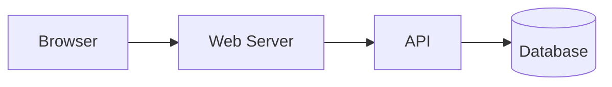
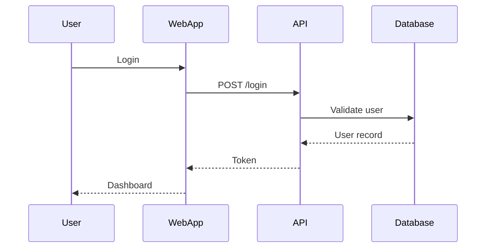
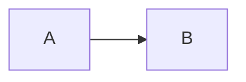

# Markdown Master Handbook

> A complete beginner-to-advanced learning guide for Markdown, CommonMark, GitHub Flavored Markdown (GFM), documentation writing, README files, technical notes, and real-world Markdown workflows.

**Last reviewed:** August 17, 2026

---

## Table of Contents

1. [About This Handbook](#1-about-this-handbook)
2. [What Is Markdown?](#2-what-is-markdown)
3. [Why Markdown Is Useful](#3-why-markdown-is-useful)
4. [How Markdown Works](#4-how-markdown-works)
5. [Markdown Standards and Flavors](#5-markdown-standards-and-flavors)
6. [Setting Up a Markdown Learning Environment](#6-setting-up-a-markdown-learning-environment)
7. [Your First Markdown Document](#7-your-first-markdown-document)
8. [Headings](#8-headings)
9. [Paragraphs and Line Breaks](#9-paragraphs-and-line-breaks)
10. [Emphasis: Bold, Italic, and Bold-Italic](#10-emphasis-bold-italic-and-bold-italic)
11. [Strikethrough](#11-strikethrough)
12. [Horizontal Rules](#12-horizontal-rules)
13. [Blockquotes](#13-blockquotes)
14. [Unordered Lists](#14-unordered-lists)
15. [Ordered Lists](#15-ordered-lists)
16. [Nested Lists](#16-nested-lists)
17. [Task Lists](#17-task-lists)
18. [Inline Code](#18-inline-code)
19. [Fenced Code Blocks](#19-fenced-code-blocks)
20. [Indented Code Blocks](#20-indented-code-blocks)
21. [Syntax Highlighting](#21-syntax-highlighting)
22. [Links](#22-links)
23. [Reference-Style Links](#23-reference-style-links)
24. [Automatic Links and URLs](#24-automatic-links-and-urls)
25. [Images](#25-images)
26. [Image Links](#26-image-links)
27. [Escaping Special Characters](#27-escaping-special-characters)
28. [HTML Inside Markdown](#28-html-inside-markdown)
29. [Tables](#29-tables)
30. [Footnotes](#30-footnotes)
31. [Definition Lists](#31-definition-lists)
32. [Heading IDs and Anchor Links](#32-heading-ids-and-anchor-links)
33. [Comments in Markdown](#33-comments-in-markdown)
34. [Special Characters and Entities](#34-special-characters-and-entities)
35. [Whitespace, Indentation, and Blank Lines](#35-whitespace-indentation-and-blank-lines)
36. [Markdown Parsing Concepts](#36-markdown-parsing-concepts)
37. [CommonMark Basics](#37-commonmark-basics)
38. [GitHub Flavored Markdown](#38-github-flavored-markdown)
39. [Markdown on GitHub](#39-markdown-on-github)
40. [README Files](#40-readme-files)
41. [Writing Good Technical Documentation](#41-writing-good-technical-documentation)
42. [Markdown for API Documentation](#42-markdown-for-api-documentation)
43. [Markdown for Tutorials](#43-markdown-for-tutorials)
44. [Markdown for Notes and Knowledge Bases](#44-markdown-for-notes-and-knowledge-bases)
45. [Markdown for Project Management](#45-markdown-for-project-management)
46. [Markdown for GitHub Issues and Pull Requests](#46-markdown-for-github-issues-and-pull-requests)
47. [Markdown for Changelogs](#47-markdown-for-changelogs)
48. [Markdown for ADRs](#48-markdown-for-adrs)
49. [Markdown for Meeting Notes](#49-markdown-for-meeting-notes)
50. [Markdown for Learning Handbooks](#50-markdown-for-learning-handbooks)
51. [Admonitions, Callouts, and Alerts](#51-admonitions-callouts-and-alerts)
52. [Mermaid Diagrams](#52-mermaid-diagrams)
53. [Mathematics and LaTeX-Style Expressions](#53-mathematics-and-latex-style-expressions)
54. [Front Matter](#54-front-matter)
55. [Markdown Extensions](#55-markdown-extensions)
56. [MDX](#56-mdx)
57. [Markdown Security Considerations](#57-markdown-security-considerations)
58. [Accessibility in Markdown](#58-accessibility-in-markdown)
59. [SEO and Markdown Content](#59-seo-and-markdown-content)
60. [Markdown File Organization](#60-markdown-file-organization)
61. [Naming Markdown Files](#61-naming-markdown-files)
62. [Reusable Documentation Patterns](#62-reusable-documentation-patterns)
63. [Markdown Style Guides](#63-markdown-style-guides)
64. [Markdown Linters](#64-markdown-linters)
65. [Formatters and Editors](#65-formatters-and-editors)
66. [Git Workflows for Markdown](#66-git-workflows-for-markdown)
67. [Converting Markdown to Other Formats](#67-converting-markdown-to-other-formats)
68. [Markdown in Static Site Generators](#68-markdown-in-static-site-generators)
69. [Markdown in Documentation Platforms](#69-markdown-in-documentation-platforms)
70. [Common Markdown Mistakes](#70-common-markdown-mistakes)
71. [Best Practices](#71-best-practices)
72. [Real-World Scenarios](#72-real-world-scenarios)
73. [Complete README Example](#73-complete-readme-example)
74. [Complete Tutorial Example](#74-complete-tutorial-example)
75. [Complete Project Documentation Structure](#75-complete-project-documentation-structure)
76. [Markdown Cheat Sheet](#76-markdown-cheat-sheet)
77. [Practice Exercises](#77-practice-exercises)
78. [Mini Projects](#78-mini-projects)
79. [Interview and Knowledge-Check Questions](#79-interview-and-knowledge-check-questions)
80. [Final Learning Roadmap](#80-final-learning-roadmap)
81. [Glossary](#81-glossary)

### Appendices and final summary

- [Appendix A: Markdown Characters at a Glance](#appendix-a-markdown-characters-at-a-glance)
- [Appendix B: Portable Markdown vs Platform Extensions](#appendix-b-portable-markdown-vs-platform-extensions)
- [Appendix C: Review Checklist for Markdown Documents](#appendix-c-review-checklist-for-markdown-documents)
- [Appendix D: Master Handbook Authoring Template](#appendix-d-master-handbook-authoring-template)
- [Appendix E: Documentation Quality Model](#appendix-e-documentation-quality-model)
- [Appendix F: A Practical Markdown Authoring Workflow](#appendix-f-a-practical-markdown-authoring-workflow)
- [Appendix G: Official References](#appendix-g-official-references)
- [Final Summary](#final-summary)

---

# 1. About This Handbook

This handbook is designed to be a **single master reference for learning Markdown**.

It starts with the absolute basics and gradually introduces more advanced topics such as:

- Markdown parsing rules
- CommonMark
- GitHub Flavored Markdown
- documentation architecture
- Markdown linting
- static site generators
- Mermaid diagrams
- front matter
- MDX
- accessibility
- security
- documentation workflows
- real-world project examples

The goal is not only to show syntax, but to explain:

> **What is it? → Why is it needed? → How does it work? → How do you use it? → What does it produce? → When should you use it? → What mistakes should you avoid?**

Throughout the handbook, platform-specific features are clearly identified because **not every Markdown renderer supports the same syntax**.

---

# 2. What Is Markdown?

Markdown is a lightweight plain-text markup language used to add structure and formatting to text.

Instead of writing HTML such as:

~~~html
<h1>My Project</h1>
<p>This is <strong>important</strong>.</p>
~~~

you can write:

~~~markdown
# My Project

This is **important**.
~~~

A Markdown processor can convert that text into HTML or another presentation format.

Conceptually:

~~~text
Markdown source
      ↓
Markdown parser / renderer
      ↓
HTML or formatted output
~~~

Markdown is popular because the source remains readable even before it is rendered.

For example:

~~~markdown
## Installation

Run:

`npm install`

Then start the application.
~~~

Even as plain text, the structure is obvious.

---

# 3. Why Markdown Is Useful

Markdown is widely used for:

- README files
- software documentation
- GitHub issues
- pull requests
- project wikis
- developer notes
- knowledge bases
- blogs
- static websites
- tutorials
- API documentation
- changelogs
- release notes
- technical handbooks
- meeting notes
- developer portfolios

## Markdown vs Word Processors

A word processor focuses mainly on visual formatting.

Markdown focuses on **content structure**.

For example, instead of manually selecting a large font and making it bold, you explicitly say:

~~~markdown
# Heading
~~~

That tells the renderer:

> This text is a level-one heading.

This separation between content and presentation is one of Markdown's biggest strengths.

## Advantages

Markdown files are:

- plain text
- small
- portable
- easy to version with Git
- easy to search
- easy for humans to read
- easy for programs to process
- independent of proprietary document formats
- suitable for automation

---

# 4. How Markdown Works

Markdown itself is not a visual document format.

It is source text containing special syntax.

For example:

~~~markdown
# Hello

This is **bold** and this is *italic*.
~~~

A renderer interprets the syntax.

Possible rendered HTML:

~~~html
<h1>Hello</h1>

<p>This is <strong>bold</strong> and this is <em>italic</em>.</p>
~~~

Different programs may render Markdown slightly differently.

Examples of Markdown renderers include:

- GitHub
- GitLab
- VS Code preview
- Obsidian
- Jekyll
- Hugo
- Docusaurus
- MkDocs
- Pandoc
- CommonMark implementations

This leads to an important lesson:

> Markdown is a family of related syntaxes rather than one universally identical implementation.

---

# 5. Markdown Standards and Flavors

When Markdown was originally created, some parsing behavior was not strictly standardized.

Different applications introduced their own extensions.

Today, several important variants exist.

## Original Markdown

The original syntax introduced basic features such as:

- headings
- paragraphs
- emphasis
- lists
- links
- images
- blockquotes
- code

## CommonMark

CommonMark provides a more precisely defined Markdown specification.

Its goal is to make Markdown parsing consistent.

## GitHub Flavored Markdown

GitHub Flavored Markdown, usually called **GFM**, extends CommonMark with features useful for software development.

Examples include:

- tables
- task lists
- strikethrough
- autolinks

## Platform-Specific Extensions

Some tools add syntax that is not standard Markdown.

Examples may include:

- footnotes
- admonitions
- wiki links
- Mermaid diagrams
- mathematics
- definition lists
- custom containers

Always check the renderer used by your platform.

## Think in layers

A practical way to understand compatibility is to separate three layers:

| Layer | Meaning | Examples |
|---|---|---|
| CommonMark core | Precisely specified base syntax | headings, paragraphs, lists, links, code |
| GFM extensions | Extensions defined by the GitHub Flavored Markdown specification | tables, task-list items, strikethrough, extended autolinks |
| Platform features | Extra behavior added by a particular site or tool | alerts, Mermaid rendering, math, front matter handling |

The key lesson is:

> **“GitHub supports it” does not automatically mean “it is part of the GFM specification.”**

Before using non-core syntax, ask where the file will be rendered, whether the target supports the feature, and whether the raw source still makes sense without it.


---

# 6. Setting Up a Markdown Learning Environment

You only need a text editor to write Markdown.

## Option 1: VS Code

Create a file named:

~~~text
learning.md
~~~

Open the preview using the editor's Markdown preview feature.

Typical workflow:

~~~text
Write Markdown
     ↓
Save file
     ↓
Open preview
     ↓
Compare source and rendered output
~~~

## Option 2: GitHub

Create a repository and add:

~~~text
README.md
~~~

GitHub automatically renders it on the repository page.

## Option 3: Dedicated Markdown Editors

Examples include note-taking and documentation applications that render Markdown while you type.

The syntax you should learn first, however, should remain portable.

## Recommended learning loop

For each new syntax feature:

```text
1. Type the smallest possible example.
2. Preview it.
3. Change one character.
4. Preview again.
5. Test it on the platform you actually plan to use.
```

Markdown parsing is context-sensitive. Blank lines and indentation can change how lists, code blocks, and other structures are interpreted.

Keep source and preview side by side so you learn how plain text maps to rendered structure.


---

# 7. Your First Markdown Document

Create `hello.md`:

~~~markdown
# My First Markdown Document

Welcome to Markdown.

## What I Am Learning

- Headings
- Lists
- Links
- Code

## Example Code

```python
print("Hello, Markdown!")
```

Visit [GitHub](https://github.com) to see Markdown used in real projects.
~~~

This simple document already contains:

- a level-one heading
- a level-two heading
- a paragraph
- an unordered list
- a fenced code block
- a hyperlink

## What a renderer conceptually produces

The document may become HTML resembling:

```html
<h1>My First Markdown Document</h1>
<p>Welcome to Markdown.</p>
<h2>What I Am Learning</h2>
<ul>
  <li>Headings</li>
  <li>Lists</li>
  <li>Links</li>
  <li>Code</li>
</ul>
```

Exact HTML varies by renderer, but the semantic structure should be recognizable.

If a beginner example renders unexpectedly, first check blank lines and indentation before adding more punctuation.


---

# 8. Headings

Headings organize a document into sections.

Markdown supports six heading levels.

~~~markdown
# Heading Level 1

## Heading Level 2

### Heading Level 3

#### Heading Level 4

##### Heading Level 5

###### Heading Level 6
~~~

These roughly correspond to HTML:

~~~html
<h1>...</h1>
<h2>...</h2>
<h3>...</h3>
<h4>...</h4>
<h5>...</h5>
<h6>...</h6>
~~~

## Recommended Hierarchy

Use headings hierarchically:

~~~markdown
# Project

## Installation

### Windows

### Linux

## Usage

### Basic Usage

### Advanced Usage
~~~

Avoid:

~~~markdown
# Project

#### Installation

## Windows
~~~

The second version jumps from H1 to H4 without a structural reason.

## Why Heading Hierarchy Matters

Good heading structure improves:

- readability
- accessibility
- table-of-contents generation
- navigation
- SEO when Markdown becomes a web page
- document maintainability

## Alternative Heading Syntax

Some Markdown implementations support Setext-style headings:

~~~markdown
Heading Level 1
===============

Heading Level 2
---------------
~~~

Equivalent to:

~~~markdown
# Heading Level 1

## Heading Level 2
~~~

ATX-style headings using `#` are generally clearer and easier to maintain.

## Optional Closing Hashes

This may also be valid:

~~~markdown
## Installation ##
~~~

But the closing hashes are unnecessary.

Prefer:

~~~markdown
## Installation
~~~

---

# 9. Paragraphs and Line Breaks

A paragraph is normally created by separating text with a blank line.

~~~markdown
This is the first paragraph.

This is the second paragraph.
~~~

## Common Mistake

Writing two lines does not always create two visual lines:

~~~markdown
Line one
Line two
~~~

Many renderers treat them as one paragraph.

## Hard Line Break

A traditional Markdown hard break can be created with two trailing spaces:

~~~markdown
Line one··
Line two
~~~

Here `··` represents two spaces.

Some renderers also recognize:

~~~markdown
Line one<br>
Line two
~~~

The HTML `<br>` approach is explicit but reduces Markdown portability.

## Best Practice

Use paragraphs unless you genuinely need a forced line break.

## Prefer paragraphs over forced line breaks

A blank line creates a new paragraph and communicates structure clearly.

A forced line break is appropriate for content where line boundaries matter, such as an address or short verse-like layout. Do not insert hard breaks after every sentence just to control visual width; let the renderer wrap prose naturally.

### Source line wrapping

Some teams wrap source text at a fixed column while others keep one logical paragraph on one source line. Both can render as the same paragraph. Follow the repository style and avoid changing wrapping only to create noisy Git diffs.


---

# 10. Emphasis: Bold, Italic, and Bold-Italic

## Italic

~~~markdown
*italic text*
~~~

or:

~~~markdown
_italic text_
~~~

Rendered conceptually:

*italic text*

## Bold

~~~markdown
**bold text**
~~~

or:

~~~markdown
__bold text__
~~~

Rendered:

**bold text**

## Bold and Italic

~~~markdown
***very important***
~~~

Rendered:

***very important***

## Recommended Style

Many documentation projects prefer:

~~~markdown
**bold**
*italic*
~~~

because the syntax is visually easy to distinguish.

## When to Use Bold

Use bold for:

- important terms
- UI labels
- warnings
- short emphasis

Example:

~~~markdown
Click **Save Changes**.
~~~

## When to Use Italic

Use italic for:

- mild emphasis
- titles
- newly introduced terms

Example:

~~~markdown
A *parser* converts Markdown syntax into a structured representation.
~~~

## Avoid Overusing Emphasis

Bad:

~~~markdown
**Click** the **button** and then **enter** your **username**.
~~~

Better:

~~~markdown
Click **Sign in**, then enter your username.
~~~

## Emphasis should carry meaning

Use italic emphasis for subtle emphasis or terms, and bold for strong importance.

Do not bold every keyword in a paragraph. Excessive emphasis makes nothing stand out and can make technical documentation harder to scan.

When punctuation or underscores appear inside identifiers, use inline code instead:

```markdown
Use `user_id`, not **user_id**.
```


---

# 11. Strikethrough

Strikethrough is commonly supported by GFM-style renderers.

~~~markdown
~~old value~~
~~~

Rendered:

~~old value~~

Use cases:

~~~markdown
- ~~Old deployment process~~
- New automated deployment process
~~~

Another example:

~~~markdown
Price: ~~₹999~~ ₹799
~~~

Do not rely on strikethrough in environments that support only basic Markdown.

## Compatibility note

Strikethrough is **not part of CommonMark core**. It is a GitHub Flavored Markdown extension and is also supported by many other tools.

```markdown
~~obsolete~~
```

may render as struck-out text on a GFM-compatible renderer but remain literal text elsewhere.

Use strikethrough when preserving a small amount of visibly superseded text is useful. For large outdated sections in Git-controlled documentation, deleting the stale material is often clearer because version control already preserves history.


---

# 12. Horizontal Rules

A horizontal rule separates major sections.

Common syntax:

~~~markdown

## What a horizontal rule means

In Markdown specifications this structure is commonly called a **thematic break**. It indicates a break between topics rather than merely decorative styling.

Common forms include:

```markdown
***
---
___
```

### Ambiguity to watch for

`---` can have other meanings in surrounding tooling. Below text it can interact with Setext-style headings, and at the very beginning of a file some static-site generators treat it as a front-matter delimiter.

Know the target processor before using top-of-file `---` as ordinary Markdown content.


---
~~~

Also commonly supported:

~~~markdown
***
~~~

or:

~~~markdown
___
~~~

Example:

~~~markdown
## Chapter 1

Content...

---

## Chapter 2
~~~

Use horizontal rules sparingly. Headings usually provide better semantic structure.

---

# 13. Blockquotes

A blockquote begins with `>`.

~~~markdown
> Markdown is designed to be readable as plain text.
~~~

## Multi-Line Blockquote

~~~markdown
> This is a blockquote.
>
> It can contain multiple paragraphs.
~~~

## Nested Blockquotes

~~~markdown
> First level
>
> > Second level
~~~

## Blockquotes with Other Markdown

~~~markdown
> **Warning**
>
> Always back up important files before modifying them.
>
> - Backup database
> - Backup configuration
> - Verify restore procedure
~~~

Use blockquotes for quotations or clearly separated commentary, not as a universal styling container.

## Blockquotes are for quoted or set-apart content

Syntax:

```markdown
> Quoted text
```

Use blockquotes for actual quotations or clearly separated notes when that convention fits the platform.

Do not use them simply to indent ordinary paragraphs. Indentation for appearance can create misleading semantics.

Nested blockquotes and lists are possible, but keep complex combinations readable in raw source.


---

# 14. Unordered Lists

Use `-`, `*`, or `+`.

~~~markdown
- HTML
- CSS
- JavaScript
~~~

Equivalent forms may include:

~~~markdown
* HTML
* CSS
* JavaScript
~~~

or:

~~~markdown
+ HTML
+ CSS
+ JavaScript
~~~

For consistency, most projects choose one marker.

Recommended:

~~~markdown
- Item one
- Item two
- Item three
~~~

## List Item with Multiple Paragraphs

Indent continuation content appropriately.

~~~markdown
- First item

  This paragraph belongs to the first item.

- Second item
~~~

Renderer behavior around indentation can vary, so keep list formatting simple.

## Marker choice and maintainability

Common markers are `-`, `*`, and `+`. Pick one style for a document or repository unless there is a reason to change it.

When a list item contains additional paragraphs, code, or nested lists, indentation and blank lines become structural. Preview complex list items in the target renderer.

Do not use list markers only to create decorative bullets when the content is not actually a list; semantic lists are easier to navigate and maintain.


---

# 15. Ordered Lists

Ordered lists use numbers followed by periods.

~~~markdown
1. Install Node.js
2. Clone the repository
3. Install dependencies
4. Start the application
~~~

Many parsers determine numbering automatically.

This:

~~~markdown
1. First
1. Second
1. Third
~~~

may render as:

1. First
2. Second
3. Third

## Which Style Should You Use?

For documentation, sequential numbering is easier for humans reviewing raw Markdown:

~~~markdown
1. Download the package.
2. Extract the files.
3. Run the installer.
~~~

Using repeated `1.` can be useful when frequently inserting new steps.

## Source numbering vs rendered numbering

A conventional ordered list is:

```markdown
1. First
2. Second
3. Third
```

Another maintainable style uses `1.` for each source item:

```markdown
1. First
1. Second
1. Third
```

Many Markdown renderers display sequential numbers for the second form as well. Use explicit source numbers when the number itself matters—for example, when instructions refer to “step 7.” Use repeated `1.` markers when frequent reordering would otherwise require constant renumbering.


---

# 16. Nested Lists

Indent child items.

~~~markdown
- Frontend
  - HTML
  - CSS
  - JavaScript
- Backend
  - PHP
  - Python
~~~

Ordered and unordered lists can be mixed.

~~~markdown
1. Install dependencies
   - Node.js
   - npm
2. Configure the project
   - Copy `.env.example`
   - Update database settings
3. Start the server
~~~

Avoid very deep nesting.

Bad structure:

~~~text
Level 1
  Level 2
    Level 3
      Level 4
        Level 5
~~~

Deep nesting is difficult to read and maintain.

Use headings when hierarchy becomes substantial.

## Indentation is structural

A safe beginner pattern is:

```markdown
- Frontend
  - HTML
  - CSS
- Backend
  - Node.js
```

For list items that also contain paragraphs or code, indentation rules become more subtle. Keep nesting shallow when possible; very deep lists are often easier to understand when some levels become headings.


---

# 17. Task Lists

GitHub Flavored Markdown supports task-list syntax.

Unchecked:

~~~markdown
- [ ] Write documentation
~~~

Checked:

~~~markdown
- [x] Create project
~~~

Example:

~~~markdown
## Release Checklist

- [x] Run tests
- [x] Build production assets
- [ ] Update documentation
- [ ] Create release
- [ ] Deploy
~~~

## Real-World Use

Task lists are useful in:

- GitHub issues
- pull requests
- release checklists
- project plans
- learning roadmaps

Be aware that whether checkboxes are interactive depends on the platform.

## Task lists and platform behavior

GFM defines task-list items using list items beginning with `[ ]` or `[x]`:

```markdown
- [ ] Write tests
- [x] Create project
```

A platform may make the boxes interactive, but that interactivity is a platform feature; the Markdown source itself does not execute anything.

Task lists work well for short checklists, pull requests, and acceptance criteria. For long-lived work with owners, dependencies, dates, and reporting, a dedicated project tracker is usually better.


---

# 18. Inline Code

Use backticks for short code fragments.

~~~markdown
Use the `git status` command.
~~~

Rendered:

Use the `git status` command.

## Good Uses

~~~markdown
The configuration file is named `.env`.

Call the `getUser()` method.

Set `APP_DEBUG=false`.
~~~

## Why Inline Code Helps

It visually distinguishes:

- commands
- variables
- functions
- class names
- filenames
- configuration keys
- literal values

## Backtick Inside Inline Code

If the content itself contains a backtick, use a longer delimiter.

Example source:

~~~markdown
``Use `code` here``
~~~

The parser can treat the double backticks as the outer delimiter.

## Inline code protects technical tokens from prose formatting

Use backticks for:

- variable names;
- filenames;
- commands;
- short expressions;
- configuration keys;
- literal punctuation.

Example:

```markdown
Set `emmet.triggerExpansionOnTab` to `true`.
```

If the code itself contains a backtick, Markdown supports code spans delimited by a longer run of backticks. Test unusual delimiter cases with the target renderer.


---

# 19. Fenced Code Blocks

For multi-line code, use fenced code blocks.

Example source:

~~~~markdown
```python
name = "Shoeb"
print(f"Hello, {name}")
```
~~~~

Rendered code:

```python
name = "Shoeb"
print(f"Hello, {name}")
```

## Why Fenced Blocks Are Preferred

They:

- preserve whitespace
- are easy to read in source
- support syntax highlighting
- are safer for code containing indentation

## Tilde Fences

Many Markdown implementations also support tildes:

~~~~markdown
~~~javascript
console.log("Hello");
~~~
~~~~

Tilde fences are particularly useful when teaching Markdown code that itself contains backtick fences.

## Choose the fence deliberately

Backticks are common:

````markdown
```js
console.log("hello");
```
````

Tildes are also supported by CommonMark:

```markdown
~~~js
console.log("hello");
~~~
```

A longer outer fence can contain a shorter fence in documentation examples. This is useful in a handbook that teaches Markdown itself.

Always close the fence and use the same marker character as the opening fence.


---

# 20. Indented Code Blocks

Traditional Markdown also supports code blocks using four spaces of indentation.

Example:

~~~text
    print("Hello")
~~~

This can render as code.

However, fenced code blocks are usually clearer:

~~~~markdown
```python
print("Hello")
```
~~~~

Prefer fenced blocks in modern technical documentation unless a specific style guide says otherwise.

## Why fenced code blocks are usually easier

Indented code blocks are portable core Markdown, but they can become difficult to maintain inside lists because indentation already carries structure.

Prefer fenced blocks in technical documentation when possible:

````markdown
```python
print("Hello")
```
````

Fences make boundaries obvious and allow a language identifier for syntax highlighting.


---

# 21. Syntax Highlighting

Many renderers support a language identifier after the opening fence.

~~~~markdown
```javascript
const message = "Hello";
console.log(message);
```
~~~~

Common identifiers include:

~~~text
html
css
javascript
typescript
python
php
java
c
cpp
csharp
go
rust
sql
bash
shell
powershell
json
yaml
xml
markdown
dockerfile
nginx
~~~

## Example: SQL

~~~~markdown
```sql
SELECT id, name
FROM users
WHERE active = 1;
```
~~~~

## Important

Syntax highlighting is not part of basic Markdown itself.

It is provided by the rendering platform.

If a language identifier is unsupported, the code usually still appears, just without specialized highlighting.

## Language identifiers are hints

In:

````markdown
```python
print("Hello")
```
````

`python` is an info string consumed by the renderer's highlighting system. Markdown itself does not define Python colors.

The renderer decides whether to highlight, which grammar to use, and how unknown identifiers are handled. Use a recognized language identifier for your target platform; do not invent one just to force a color scheme.


---

# 22. Links

Basic link syntax:

~~~markdown
[visible text](https://example.com)
~~~

Example:

~~~markdown
Visit [GitHub](https://github.com).
~~~

## Link with Title

~~~markdown
[GitHub](https://github.com "GitHub Homepage")
~~~

Title behavior varies by renderer and device.

## Relative Links

Within a repository:

~~~markdown
[Installation Guide](docs/installation.md)
~~~

Move up one directory:

~~~markdown
[Main README](../README.md)
~~~

Same-directory file:

~~~markdown
[Configuration](configuration.md)
~~~

## Why Relative Links Are Useful

They:

- work across repository branches
- avoid hardcoding full repository URLs
- make local previews easier
- make repositories portable

## Relative vs absolute links

Use relative links for files that move together in the same repository:

```markdown
[Installation guide](docs/install.md)
```

Use absolute URLs for external sites:

```markdown
[External documentation](https://example.com/docs)
```

Relative links are usually friendlier to forks, branches, and local clones.

### Use descriptive link text

Prefer:

```markdown
[Read the installation guide](docs/install.md)
```

over `Click here`. Descriptive text is easier to scan and more useful with assistive technology.


---

# 23. Reference-Style Links

Reference-style links separate the visible text from the URL definition.

~~~markdown
Read the [Markdown specification][commonmark].

[commonmark]: https://commonmark.org/
~~~

You can reuse the same reference:

~~~markdown
Read [the specification][spec].

The [specification][spec] explains parsing rules.

[spec]: https://commonmark.org/
~~~

## When Reference Links Are Useful

They are useful when:

- the same URL is reused
- long URLs make paragraphs difficult to read
- you want centralized link definitions

## When Not to Use Them

For short documentation pages with only a few links, inline links may be simpler.

## Why reference links help long documents

Reference-style links separate the readable sentence from a long URL.

```markdown
Read the [CommonMark specification][commonmark].

[commonmark]: https://spec.commonmark.org/
```

They are useful when the same destination appears repeatedly or when long inline URLs make paragraphs hard to edit.

Use clear reference labels. A document full of opaque labels such as `[1]`, `[2]`, `[3]` can become difficult to maintain.


---

# 24. Automatic Links and URLs

Angle-bracket syntax:

~~~markdown
<https://example.com>
~~~

Email syntax:

~~~markdown
<user@example.com>
~~~

Some GFM renderers automatically convert plain URLs into links:

~~~text
https://example.com
~~~

Do not assume automatic linking works identically everywhere.

If portability matters, explicit link syntax is safer.

## Two different ideas are often called “autolinks”

CommonMark supports angle-bracket autolinks such as:

```markdown
<https://example.com>
<person@example.com>
```

GFM additionally defines **extended autolinks** that recognize certain bare URLs and email-like text.

This explains why a bare URL can become clickable on one platform but remain ordinary text on another. When a link must be portable, use explicit link syntax or a CommonMark-compatible angle autolink.


---

# 25. Images

Basic syntax:

~~~markdown

~~~

Example:

~~~markdown

~~~

The structure is:

~~~text

~~~

## Alt Text Matters

Alt text describes the image for:

- screen readers
- users who cannot load the image
- accessibility
- context when images fail

Weak:

~~~markdown

~~~

Better:

~~~markdown

~~~

## Remote Image

~~~markdown

~~~

Remote images introduce dependency on another server.

For durable project documentation, repository-local images are often preferable.

## Alt text is part of the content

Basic syntax:

```markdown

```

The text inside `[]` is not a caption; it is alternative text.

Good alt text communicates the image's useful purpose or information. Avoid:

```markdown

```

For complex diagrams, provide a prose explanation near the image rather than trying to put the entire diagram into one alt-text sentence.


---

# 26. Image Links

Wrap image syntax inside link syntax:

~~~markdown
[](https://example.com)
~~~

This makes the image clickable.

Common uses include:

- badges
- logos
- screenshots linking to full-size versions

## Read image-link syntax from inside out

```markdown
[](https://example.com)
```

means:

```text
  → image
[ ... ](URL)               → link around the image
```

The image's alt text still matters. Describe the image or link purpose rather than using an unhelpful filename such as `logo2-final.png`.


---

# 27. Escaping Special Characters

Markdown uses special punctuation.

If you want a literal special character, prefix it with a backslash when supported.

~~~markdown
\*This is not italic\*
~~~

Potentially escapable characters include:

~~~text
\ ` * _ { } [ ] < > ( ) # + - . ! |
~~~

## Example

Without escaping:

~~~markdown
* important
~~~

may create a list item.

With escaping:

~~~markdown
\* important
~~~

you can display the literal asterisk.

## Better Alternative

When explaining code or syntax, inline code is often clearer:

~~~markdown
Use `*` for emphasis markers.
~~~

## Escape only when Markdown would otherwise interpret the character

A backslash can escape punctuation in contexts where it would trigger Markdown syntax.

Example:

```markdown
\*not italic\*
```

renders the asterisks literally.

Do not escape punctuation everywhere “just in case.” Excessive escaping makes source harder to read and can behave differently in extensions. First determine whether the character is special in that context.


---

# 28. HTML Inside Markdown

Many Markdown renderers permit some raw HTML.

Example:

~~~html
<details>
  <summary>Show answer</summary>

  Hidden content.

</details>
~~~

Possible use cases:

- collapsible sections
- custom alignment
- unsupported HTML structures
- special formatting

## Example: Details Element

~~~markdown
<details>
<summary>Show solution</summary>

The answer is 42.

</details>
~~~

## Important Limitations

Some environments:

- disable raw HTML
- sanitize unsafe attributes
- strip scripts
- render HTML differently

Avoid depending heavily on raw HTML if document portability is important.

## Security Warning

Never assume arbitrary HTML in user-generated Markdown is safe.

Rendering systems should sanitize untrusted content.

## Raw HTML reduces portability

Many Markdown processors allow some raw HTML, but support and sanitization differ.

Use HTML when the target platform explicitly requires a structure Markdown cannot express. Avoid using HTML merely to reproduce normal headings, paragraphs, links, or lists.

For user-provided/untrusted content, raw HTML is also a security boundary. A production renderer should have an explicit sanitization policy rather than trusting arbitrary HTML.


---

# 29. Tables

GitHub Flavored Markdown supports tables.

~~~markdown
| Name | Role | Status |
|---|---|---|
| Alice | Developer | Active |
| Bob | Tester | Active |
~~~

Rendered conceptually:

| Name | Role | Status |
|---|---|---|
| Alice | Developer | Active |
| Bob | Tester | Active |

## Alignment

~~~markdown
| Column A | Column B | Column C |
|:---|:---:|---:|
| Left | Center | Right |
~~~

Meaning:

- `:---` = left aligned
- `:---:` = centered
- `---:` = right aligned

## When to Use Tables

Good for:

- comparisons
- option matrices
- configuration references
- short structured data

## When Not to Use Tables

Avoid tables for:

- long paragraphs
- long code blocks
- deeply nested information
- content that must work well on narrow mobile screens

A list may be more readable.

## Tables are a GFM extension, not CommonMark core

GFM table syntax is convenient for compact tabular information.

Use a table when readers need to compare values across rows and columns.

Avoid very wide tables containing paragraphs, code blocks, or complex nested content. On narrow screens, a list of repeated labeled fields may be more readable.

### Alignment is presentation metadata

Colon placement in the delimiter row can request alignment on supported renderers, but exact visual styling is controlled by the renderer's CSS/theme.


---

# 30. Footnotes

Footnote syntax is supported by some Markdown platforms but is not universal.

Common syntax:

~~~markdown
Markdown is a lightweight markup language.[^1]

[^1]: A markup language adds structural annotations to text.
~~~

Multiple footnotes:

~~~markdown
CommonMark provides a specification.[^commonmark]

GFM extends CommonMark.[^gfm]

[^commonmark]: CommonMark defines parsing behavior.
[^gfm]: GitHub Flavored Markdown adds GitHub-oriented extensions.
~~~

Always test footnotes on your target platform.

## Compatibility note

Footnotes are **not part of CommonMark core** and are not one of the extension types defined by the formal GFM specification. Many platforms support footnotes as an additional extension.

A common syntax is:

```markdown
A statement with a note.[^1]

[^1]: Supporting detail.
```

Use footnotes for citations or side explanations when the target renderer supports them. For short technical notes, an inline explanation or normal link is often simpler.


---

# 31. Definition Lists

Definition lists are supported by some Markdown processors, but not by core CommonMark/GFM syntax everywhere.

A common extension looks like:

~~~markdown
Markdown
: A lightweight markup language.

Renderer
: A program that converts Markdown into formatted output.
~~~

If portability matters, use a normal list instead:

~~~markdown
- **Markdown:** A lightweight markup language.
- **Renderer:** A program that converts Markdown into formatted output.
~~~

## Compatibility note

Definition-list syntax is a renderer extension, not CommonMark core.

A common extension form is:

```markdown
Term
: Definition
```

If portability matters, use a fallback such as:

```markdown
**Term:** Definition
```

or a table when the content is genuinely tabular.


---

# 32. Heading IDs and Anchor Links

Many renderers generate anchors for headings.

Suppose your document contains:

~~~markdown
## Installation Guide
~~~

A generated anchor may be:

~~~text
#installation-guide
~~~

You may then link to it:

~~~markdown
[Go to Installation](#installation-guide)
~~~

## Typical Anchor Transformation

A renderer may:

- convert text to lowercase
- replace spaces with hyphens
- remove some punctuation
- resolve duplicate heading names specially

Example:

~~~markdown
## Docker Installation
~~~

Likely link:

~~~markdown
[Docker Installation](#docker-installation)
~~~

## Warning

Anchor-generation rules differ between renderers.

Always verify links on the platform where the document will be published.

## Anchor generation is platform-specific

Markdown syntax defines headings, but the exact HTML `id` generated from a heading is usually decided by the renderer.

For example, a heading such as:

```markdown
## Install on Windows
```

may produce an anchor resembling:

```text
#install-on-windows
```

but punctuation, Unicode text, duplicate headings, and case handling can differ.

### Safe workflow

1. Render the document on the target platform.
2. Copy the generated heading link if the platform exposes one.
3. Test the anchor after renaming headings.
4. Avoid manually guessing complicated anchors.

If stable anchors are part of a public API or documentation site, use the site's supported explicit-ID mechanism when available.


---

# 33. Comments in Markdown

Markdown has no universal native comment syntax.

HTML comments are commonly used:

~~~html
<!-- This comment is not normally displayed in rendered output. -->
~~~

Example:

~~~markdown
# Deployment

<!-- Update this section after the Kubernetes migration. -->

Run the deployment pipeline.
~~~

## Important

Comments may still exist in the source HTML or raw Markdown.

Do not put secrets inside comments.

Bad:

~~~html
<!-- Production password: secret123 -->
~~~

A comment is hidden visually, not necessarily private.

## Comments are usually HTML comments

A common form is:

```markdown
<!-- Internal author note -->
```

Whether the comment is removed, preserved in generated HTML source, or processed specially depends on the toolchain.

Do not put secrets in comments. “Not visible on the rendered page” does not mean “not present in the repository or generated source.”


---

# 34. Special Characters and Entities

HTML entities can sometimes be used in Markdown.

Examples:

~~~text
&amp;   → &
&lt;    → <
&gt;    → >
&nbsp;  → non-breaking space
&copy;  → ©
~~~

Example:

~~~markdown
Tom &amp; Jerry
~~~

Most Unicode characters can be written directly in modern Markdown files.

Prefer UTF-8 encoding.

## Prefer readable Unicode unless an entity solves a real problem

Markdown can contain ordinary Unicode characters directly.

HTML entities such as `&amp;` or `&lt;` may be useful when you specifically need to represent characters that would otherwise be interpreted as markup in a raw-HTML context.

Do not replace every non-ASCII character with an HTML entity. Plain UTF-8 source is usually easier to read and edit.


---

# 35. Whitespace, Indentation, and Blank Lines

Whitespace matters in Markdown.

## Blank Lines

Use blank lines between major block elements.

Better:

~~~markdown
## Installation

Install Node.js.

```bash
npm install
```

Then start the application.
~~~

Cramped source is harder to maintain.

## Indentation

Indentation can determine whether content belongs to:

- a list item
- nested list
- code block
- quote

## Trailing Spaces

Trailing spaces may create a line break in some Markdown syntax.

Because invisible whitespace is difficult to notice, many style guides avoid it unless intentionally required.

## Whitespace is syntax, not decoration

In Markdown, indentation can decide whether text is:

- a nested list item;
- continuation content;
- a code block;
- ordinary paragraph text.

Blank lines can separate block structures and remove ambiguity.

When formatting tools “clean up” whitespace, always preview the result. A formatter that changes indentation can change meaning, not just appearance.


---

# 36. Markdown Parsing Concepts

You do not need to implement a Markdown parser to write Markdown well, but understanding parsing explains surprising behavior.

Markdown syntax can be divided broadly into:

## Block-Level Elements

Examples:

- paragraphs
- headings
- blockquotes
- lists
- code blocks
- thematic breaks

## Inline Elements

Examples:

- emphasis
- links
- images
- inline code

The parser first determines structural blocks and then interprets inline syntax within eligible blocks.

Consider:

~~~markdown
# Hello **World**
~~~

The heading is a block-level construct.

`**World**` is inline emphasis inside the heading.

## Why This Matters

The same characters can mean different things depending on context.

For example:

~~~markdown
- item
~~~

starts a list.

But:

~~~markdown
Version 1-2
~~~

does not.

Context determines syntax.

## Block parsing happens before many inline details

A useful simplified mental model is:

```text
source text
   ↓
identify block structure
(headings, lists, quotes, code, paragraphs)
   ↓
interpret inline content
(emphasis, links, code spans)
   ↓
render output
```

This helps explain why the same punctuation can mean different things depending on context.

For example, `*` can participate in emphasis or act as a list marker. The surrounding block context helps the parser decide.


---

# 37. CommonMark Basics

CommonMark was created to provide an unambiguous Markdown specification.

You do not need to memorize every parsing rule.

For practical writing, remember:

1. Use blank lines around complex block elements.
2. Use consistent list indentation.
3. Prefer fenced code blocks.
4. Avoid clever or ambiguous combinations of punctuation.
5. Test output in your target renderer.

## Portability-First Example

Prefer:

~~~markdown
## Example

Here is the command:

```bash
npm install
```

After installation, run:

```bash
npm start
```
~~~

instead of compressed syntax that depends on renderer quirks.

The easiest Markdown to maintain is usually the least clever Markdown.

## Current specification baseline

As of this handbook's review date, the current published CommonMark specification is **0.31.2**.

CommonMark is valuable because it defines parsing behavior with detailed examples and tests. When two tools disagree about core Markdown, check whether both actually claim CommonMark compatibility and which version/extension layer they implement.

Do not assume “Markdown-compatible” means “identical to CommonMark.”


---

# 38. GitHub Flavored Markdown

GitHub Flavored Markdown extends CommonMark with functionality useful on GitHub.

Common GFM features include:

- tables
- task lists
- strikethrough
- autolinks

GitHub also adds platform behaviors beyond the GFM syntax specification, such as special references in issues and pull requests.

Examples:

~~~markdown
Fixes #42
~~~

or references to users:

~~~markdown
@username
~~~

These are GitHub platform features, not general Markdown features.

## Formal GFM vs GitHub.com features

The formal GFM specification is based on CommonMark and adds defined extensions including:

- tables;
- task-list items;
- strikethrough;
- extended autolinks.

GitHub.com also supports additional presentation features that are **not necessarily part of the formal GFM specification**.

Use this vocabulary carefully:

```text
CommonMark feature
GFM extension
GitHub platform feature
```

This distinction matters when the same `.md` file is rendered outside GitHub.


---

# 39. Markdown on GitHub

Markdown is extensively used in:

- `README.md`
- `CONTRIBUTING.md`
- `SECURITY.md`
- `CODE_OF_CONDUCT.md`
- issue descriptions
- pull request descriptions
- discussions
- wikis
- release notes

## Common Repository Documentation

~~~text
project/
├── README.md
├── CONTRIBUTING.md
├── CHANGELOG.md
├── SECURITY.md
├── LICENSE
└── docs/
    ├── installation.md
    ├── configuration.md
    ├── deployment.md
    └── troubleshooting.md
~~~

This structure keeps the README approachable while moving detailed material into dedicated pages.

## GitHub is both a renderer and a collaboration platform

Markdown on GitHub is influenced by where the text appears—for example, a repository file, issue, pull request, or discussion.

Features such as automatic references, mentions, task interactions, alerts, diagrams, or issue linking can be platform behaviors layered on top of Markdown parsing.

When writing reusable documentation, ask whether a feature should survive outside GitHub. If yes, provide a readable fallback in the source.


---

# 40. README Files

A README is often the first document someone sees in a project.

A useful README answers:

- What is this project?
- Why does it exist?
- What does it do?
- How do I install it?
- How do I use it?
- How do I configure it?
- How can I contribute?
- Where can I get help?
- What license is used?

## Recommended Structure

~~~markdown
# Project Name

Short description.

## Features

## Requirements

## Installation

## Configuration

## Usage

## Examples

## Project Structure

## Troubleshooting

## Contributing

## License
~~~

## Bad README

~~~markdown
# App

This is my app.
~~~

It gives a new user almost no useful information.

## Better README Opening

~~~markdown
# Invoice Parser

A command-line application that extracts structured invoice fields from PDF and image files.

## Features

- PDF and image input
- JSON output
- configurable field mapping
- batch processing
- error reporting
~~~

The second version explains value immediately.

## A README is an onboarding document, not a dumping ground

A strong README usually helps a new reader answer:

1. What is this project?
2. Why would I use it?
3. How do I install/run it?
4. What is the smallest working example?
5. Where is deeper documentation?
6. How do I contribute or get support?

Move deep architecture, exhaustive API reference, and long operational procedures into dedicated documents and link to them.


---

# 41. Writing Good Technical Documentation

Good Markdown syntax does not automatically create good documentation.

Technical writing should be:

- accurate
- structured
- task-oriented
- consistent
- searchable
- beginner-friendly where appropriate

## Use Progressive Disclosure

Teach simple concepts first.

For example:

~~~text
Basic installation
      ↓
Configuration
      ↓
Common usage
      ↓
Advanced options
      ↓
Internals
~~~

Do not explain advanced architecture before the reader can run the software.

## Keep Instructions Actionable

Weak:

> Configure the system correctly.

Better:

~~~markdown
1. Copy `.env.example` to `.env`.
2. Set `DB_HOST`.
3. Set `DB_DATABASE`.
4. Set `DB_USERNAME`.
5. Set `DB_PASSWORD`.
6. Restart the application.
~~~

## Include Expected Results

Example:

~~~~markdown
Run:

```bash
python --version
```

Expected output resembles:

```text
Python 3.x.x
```
~~~~

Showing expected output lets beginners verify that they are on the right path.

## Explain concepts near the code that needs them

A code example should not force the reader to jump several sections away just to understand a parameter, command, or assumption.

Before each non-obvious example, explain:

- what problem is being solved;
- what inputs/prerequisites exist;
- what the reader should notice.

After the example, show output or describe the resulting state when that helps confirm success.


---

# 42. Markdown for API Documentation

Markdown is excellent for API reference pages.

A useful endpoint section can include:

- purpose
- method
- path
- authentication
- parameters
- request example
- response example
- status codes
- errors

Example:

~~~markdown
## Get User

Returns a user by ID.

### Request

`GET /api/users/{id}`

### Path Parameters

| Parameter | Type | Required | Description |
|---|---|---:|---|
| `id` | integer | Yes | User identifier |

### Example

```bash
curl https://api.example.com/api/users/42
```

### Success Response

```json
{
  "id": 42,
  "name": "Alice"
}
```

### Errors

| Status | Meaning |
|---|---|
| `404` | User not found |
| `500` | Internal server error |
~~~

This structure is predictable and easy to scan.

## API documentation needs contracts, not only syntax

For each endpoint/function/command, capture the information a caller needs:

- purpose;
- inputs and constraints;
- output/response;
- errors;
- authentication/permissions where relevant;
- examples;
- edge cases.

Markdown is only the presentation format. The quality of API documentation comes from accurate contracts and tested examples.


---

# 43. Markdown for Tutorials

Tutorials should guide the learner through a successful outcome.

Recommended structure:

~~~markdown
# Build a Simple API

## What You Will Build

## Prerequisites

## Step 1: Create the Project

## Step 2: Install Dependencies

## Step 3: Add the Endpoint

## Step 4: Run the Application

## Step 5: Test the API

## Troubleshooting

## Next Steps
~~~

## Important Teaching Pattern

For each major step:

1. explain the goal
2. show the command/code
3. explain what the code does
4. show expected output
5. explain common failure modes

This is much more useful than showing unexplained code.

---

# 44. Markdown for Notes and Knowledge Bases

Markdown works well for personal and team knowledge systems.

Example:

~~~markdown
# Docker Networking Notes

## Key Idea

Containers on the same user-defined bridge network can communicate by container name.

## Example

```bash
docker network create app-network
```

## Remember

- `localhost` inside a container refers to that container.
- Use the service/container name to reach another container.

## Related Topics

- Docker Compose
- DNS
- Port publishing
~~~

## Atomic Notes vs Handbook Notes

### Atomic Note

Focuses on one concept.

Example:

~~~text
docker-bind-mounts.md
~~~

### Handbook

Combines related concepts into a structured learning path.

Example:

~~~text
docker-master-handbook.md
~~~

Both approaches are useful.

---

# 45. Markdown for Project Management

Markdown can be used for lightweight planning.

Example:

~~~markdown
# Release 2.0 Plan

## Goals

- Improve login flow
- Add audit logs
- Reduce API latency

## Tasks

- [x] Finalize requirements
- [x] Create database migration
- [ ] Implement API
- [ ] Add tests
- [ ] Update documentation

## Risks

| Risk | Impact | Mitigation |
|---|---|---|
| API regression | High | Add integration tests |
| Migration failure | High | Test backup and rollback |
~~~

Markdown is especially convenient when planning happens inside a Git repository.

---

# 46. Markdown for GitHub Issues and Pull Requests

## Issue Template Example

~~~markdown
## Description

Describe the problem.

## Steps to Reproduce

1. Open the application.
2. Go to Settings.
3. Click Save.

## Expected Behavior

The settings should be saved.

## Actual Behavior

The page returns an error.

## Environment

- OS:
- Browser:
- Application version:

## Additional Context

Add logs or screenshots if useful.
~~~

## Pull Request Template Example

~~~markdown
## Summary

Explain what this pull request changes.

## Changes

- Added validation
- Added unit tests
- Updated documentation

## Testing

- [x] Unit tests pass
- [x] Manual testing completed

## Related Issue

Closes #123
~~~

Structured Markdown improves collaboration and review quality.

---

# 47. Markdown for Changelogs

A changelog documents notable changes between releases.

Example:

~~~markdown
# Changelog

## [2.1.0] - 2026-08-17

### Added

- CSV export
- Audit-log filtering

### Changed

- Improved login error messages

### Fixed

- Duplicate invoice processing
~~~

Useful categories include:

- Added
- Changed
- Deprecated
- Removed
- Fixed
- Security

Avoid dumping raw Git commit messages into a changelog.

A changelog should explain changes from the user's perspective.

---

# 48. Markdown for ADRs

ADR means **Architecture Decision Record**.

It records an important technical decision.

Example:

~~~markdown
# ADR-001: Use PostgreSQL

## Status

Accepted

## Context

The system needs transactional relational storage and strong SQL support.

## Decision

Use PostgreSQL as the primary database.

## Consequences

### Positive

- Strong relational features
- Mature tooling

### Negative

- Team must maintain PostgreSQL expertise
- Additional operational responsibility
~~~

ADRs help future developers understand *why* a decision was made.

---

# 49. Markdown for Meeting Notes

Example:

~~~markdown
# API Migration Meeting

**Date:** 2026-08-17

## Attendees

- Alice
- Bob
- Chen

## Agenda

1. Migration status
2. Blocking issues
3. Release date

## Decisions

- Use versioned endpoints.
- Keep the old API for one release cycle.

## Action Items

- [ ] Alice: update API documentation
- [ ] Bob: prepare migration script
- [ ] Chen: add monitoring
~~~

Good meeting notes distinguish:

- discussion
- decisions
- action items

---

# 50. Markdown for Learning Handbooks

A master learning handbook should not be only a syntax dump.

A useful topic pattern is:

~~~markdown
## Topic Name

### What Is It?

### Why Is It Needed?

### How Does It Work?

### Syntax

### Basic Example

### Expected Output

### Real-World Example

### Common Mistakes

### Best Practices

### Advanced Notes

### Practice Exercise
~~~

Not every section needs all headings, but the learning flow is powerful.

## Example

Instead of:

~~~markdown
## Lists

Use `-` for lists.
~~~

write:

~~~markdown
## Lists

Lists group related items.

Use an unordered list when sequence does not matter:

```markdown
- HTML
- CSS
- JavaScript
```

Use an ordered list when sequence matters:

```markdown
1. Install dependencies
2. Configure the application
3. Start the server
```

Common mistake: using numbered lists for items that have no sequence.
~~~

The expanded version teaches concepts instead of merely documenting syntax.

---

# 51. Admonitions, Callouts, and Alerts

Admonition syntax is not universal Markdown.

Documentation platforms may provide special syntax for:

- notes
- warnings
- tips
- cautions
- important information

A portable alternative is:

~~~markdown
> **Warning**
>
> Back up the database before running the migration.
~~~

Example:

> **Warning**
>
> Back up the database before running the migration.

## GitHub-Style Alerts

Some GitHub Markdown contexts support alert-like blockquotes such as note or warning forms.

Because extension support changes between platforms, treat these as platform-specific and verify them before relying on them.

## Portable Rule

When compatibility matters, use:

~~~markdown
> **Note**
>
> Your content here.
~~~

## Portability strategy

Callout/alert syntax is highly platform-specific.

If an alert is important enough that readers must understand it even on an unsupported renderer, make the raw Markdown meaningful too.

For example, a plain blockquote fallback:

```markdown
> **Warning:** Back up the database before running the migration.
```

remains readable almost everywhere.

Prefer portable wording for safety-critical notes instead of relying only on special styling.


---

# 52. Mermaid Diagrams

Some Markdown platforms can render Mermaid diagrams from fenced code blocks.

Example source:

~~~~markdown

~~~~

Conceptual flow:

~~~text
Browser → Web Server → API → Database
~~~

## Common Diagram Types

Mermaid can describe:

- flowcharts
- sequence diagrams
- class diagrams
- state diagrams
- entity-relationship diagrams
- timelines
- Git graphs
- pie charts
- other supported diagram types

## Sequence Example

~~~~markdown

~~~~

## Important

Mermaid is **not core Markdown**.

The renderer must explicitly support it.

## Mermaid is a rendering extension, not core Markdown

A Mermaid block often looks like a fenced code block:

````markdown

````

If the renderer supports Mermaid, it may turn the code into a diagram. If not, readers may simply see the source text.

### Best practice

Keep the diagram source understandable and provide surrounding prose for critical information. A diagram should clarify documentation, not become the only place where an essential rule is stated.


---

# 53. Mathematics and LaTeX-Style Expressions

Some Markdown environments support mathematical notation.

Inline syntax may look like:

~~~markdown
$E = mc^2$
~~~

Block syntax may look like:

~~~markdown
$$
a^2 + b^2 = c^2
$$
~~~

Support varies significantly.

Some platforms use:

- MathJax
- KaTeX
- custom math renderers

If mathematical documentation must be portable, verify the target system before depending on math extensions.

## Math syntax depends on the renderer

Dollar-delimited or LaTeX-like math is not CommonMark syntax.

A processor may support forms such as:

```text
$E = mc^2$
```

while another displays the dollar signs literally.

When math is important:

1. identify the target rendering engine;
2. document its supported delimiters;
3. test escaping around currency values and dollar signs;
4. provide a plain-text explanation when portability matters.


---

# 54. Front Matter

Front matter is metadata placed at the beginning of a Markdown file.

YAML front matter commonly looks like:

~~~yaml

## Front matter belongs to the processing pipeline

Front matter is metadata consumed by a tool such as a static-site generator, documentation system, or note application. It is not part of the Markdown body itself.

Typical processing model:

```text
front matter metadata
        +
Markdown body
        ↓
site/document processor
        ↓
rendered page
```

Common fields may include title, date, tags, layout, or draft status, but field names and allowed values are tool-specific.

Never copy a front-matter schema from one generator to another without checking its documentation.


---
title: Markdown Guide
author: Example Author
date: 2026-08-17
tags:
  - markdown
  - documentation
---
~~~

A file may begin:

~~~markdown
---
title: Markdown Guide
description: Learn Markdown from beginner to advanced.
---

# Markdown Guide
~~~

## Common Uses

Static-site systems use front matter for:

- page title
- description
- date
- tags
- category
- layout
- draft status
- permalink
- sidebar order

## Important

Front matter is not part of core Markdown.

Its meaning depends entirely on the application processing the file.

---

# 55. Markdown Extensions

Different ecosystems extend Markdown.

Possible features include:

- footnotes
- definition lists
- abbreviations
- custom containers
- heading attributes
- citations
- mathematics
- diagrams
- wiki links
- embedded components

Before adopting an extension, ask:

1. Does our renderer support it?
2. Will the file be used elsewhere?
3. What happens if the extension is unsupported?
4. Is there a portable alternative?

## Extension migration checklist

Before depending on an extension, record:

- the feature name;
- the tool/plugin that implements it;
- required version/configuration;
- fallback behavior;
- whether the file still renders acceptably without it.

This becomes important when migrating from one documentation platform to another.

A useful rule is:

> Use extensions for deliberate capability, not because a syntax happened to work in one preview window.


---

# 56. MDX

MDX combines Markdown with JSX-style components.

It is often used in React-based documentation systems.

Conceptual example:

~~~mdx
# Product Guide

<Warning>
Do not use development credentials in production.
</Warning>

## Installation

Run:

```bash
npm install
```
~~~

This gives authors access to interactive UI components inside Markdown-like content.

## Markdown vs MDX

| Markdown | MDX |
|---|---|
| Plain text markup | Markdown plus components/JSX |
| Highly portable | Tied to MDX-capable tooling |
| Safer/simple authoring | More powerful |
| Easy to render | Requires build infrastructure |

Use plain Markdown when possible.

Use MDX when documentation genuinely needs interactive or reusable components.

## MDX changes the trust and build model

MDX combines Markdown-style authoring with JSX/component capabilities. That makes it much more powerful than ordinary Markdown, but also more tightly coupled to a JavaScript build/runtime ecosystem.

Use MDX when reusable interactive or design-system components genuinely improve the documentation.

Do not choose MDX merely for ordinary headings, paragraphs, tables, and code samples; plain Markdown is more portable and easier to process with generic tools.

Treat untrusted MDX content more cautiously than plain text because the processing pipeline can include executable component logic depending on the toolchain.


---

# 57. Markdown Security Considerations

Markdown looks harmless because it is plain text, but rendered Markdown can create security concerns.

## Untrusted HTML

If raw HTML is allowed, an unsafe renderer could expose users to malicious markup.

A secure platform should sanitize untrusted HTML.

## Dangerous Links

Markdown can contain links to:

- phishing sites
- malicious downloads
- deceptive domains

Review links in untrusted documents.

## Images and Tracking

Remote images may contact external servers when rendered.

This can have privacy implications.

## Secrets

Never store credentials in Markdown documentation.

Bad:

~~~markdown
Database password: `MySecretPassword123`
~~~

Also avoid secrets in HTML comments.

## Generated Markdown

If your application renders Markdown submitted by users:

- use a trusted Markdown library
- keep the renderer updated
- sanitize generated HTML
- restrict unsafe protocols
- use content-security protections where appropriate

## Threat model for untrusted Markdown

When users can submit Markdown, consider more than visible text.

Potential concerns include:

- raw HTML if the renderer allows it;
- dangerous or unexpected URL schemes;
- remote images that can reveal request metadata;
- misleading links;
- embedded content;
- renderer plugins that execute or transform content.

Use a renderer and sanitizer designed for untrusted input. Do not invent your own HTML sanitizer with regular expressions.

Also remember that a platform may sanitize raw HTML even though a local preview renders it, so test both security and compatibility in the actual deployment environment.


---

# 58. Accessibility in Markdown

Accessibility starts with good document structure.

## Use Logical Headings

Bad:

~~~markdown
# Guide

#### Installation
~~~

Better:

~~~markdown
# Guide

## Installation
~~~

## Write Useful Link Text

Weak:

~~~markdown
[Click here](installation.md)
~~~

Better:

~~~markdown
[Read the installation guide](installation.md)
~~~

Screen-reader users often navigate by links, so descriptive text helps.

## Write Useful Image Alt Text

Weak:

~~~markdown

~~~

Better:

~~~markdown

~~~

## Avoid Using Tables for Layout

Tables should represent actual tabular relationships.

Do not use them merely to place content side-by-side.

## Do Not Depend Only on Color

If diagrams or generated content are added later, ensure meaning is not communicated by color alone.

## Accessibility checklist

Markdown is only source syntax; accessibility depends on the semantic output and the content you write.

Prefer:

- one clear page title and logical heading hierarchy;
- descriptive link text;
- meaningful image alt text;
- real lists for list content;
- real tables only for tabular data;
- prose explanations for important diagrams;
- code examples that do not rely only on color.

Avoid using bold text as a fake heading or a table as a page-layout grid.


---

# 59. SEO and Markdown Content

Markdown itself does not guarantee SEO.

When converted into web pages, structure matters.

Useful practices:

- one clear page topic
- meaningful H1
- descriptive H2/H3 headings
- concise page title
- useful front-matter description where supported
- descriptive link text
- useful image alt text
- logical internal links
- high-quality original content

Bad heading:

~~~markdown
## Stuff
~~~

Better:

~~~markdown
## Install Docker on Ubuntu
~~~

The second heading helps both humans and search systems understand the section.

---

# 60. Markdown File Organization

Small projects may need only a README.

Larger projects should split documentation.

Example:

~~~text
docs/
├── index.md
├── getting-started/
│   ├── installation.md
│   ├── configuration.md
│   └── first-project.md
├── guides/
│   ├── authentication.md
│   ├── deployment.md
│   └── monitoring.md
├── reference/
│   ├── cli.md
│   ├── configuration.md
│   └── api.md
└── troubleshooting/
    ├── installation.md
    └── runtime-errors.md
~~~

## Organize by Reader Intent

A strong documentation system distinguishes:

- learning
- task guides
- explanations
- reference

Do not put everything into one enormous README if users cannot navigate it.

A master handbook can intentionally be large, but it should include a strong table of contents and predictable section hierarchy.

---

# 61. Naming Markdown Files

Good filenames are:

- descriptive
- consistent
- URL-friendly
- easy to type

Recommended:

~~~text
installation.md
docker-networking.md
api-authentication.md
troubleshooting.md
~~~

Avoid:

~~~text
My Final Documentation Latest NEW.md
doc1.md
misc.md
stuff.md
~~~

## Case Strategy

Choose a consistent convention.

Common:

~~~text
README.md
CHANGELOG.md
CONTRIBUTING.md
~~~

for standard repository files.

For documentation pages:

~~~text
getting-started.md
database-configuration.md
~~~

---

# 62. Reusable Documentation Patterns

## Prerequisite Pattern

~~~markdown
## Prerequisites

Before continuing, make sure you have:

- Python 3
- Git
- a terminal
- internet access
~~~

## Command Pattern

~~~~markdown
Run:

```bash
npm install
```

This downloads the project dependencies listed in `package.json`.
~~~~

## Expected Output Pattern

~~~~markdown
Expected output:

```text
Server running at http://localhost:3000
```
~~~~

## Warning Pattern

~~~markdown
> **Warning**
>
> This operation deletes existing data and cannot be undone.
~~~

## Troubleshooting Pattern

~~~markdown
### Error: Port Already in Use

**Cause:** Another process is using port `3000`.

**Solution:** Stop the other process or start the application on a different port.
~~~

These reusable patterns make documentation predictable.

---

# 63. Markdown Style Guides

A Markdown style guide defines consistent writing rules for a project.

Example decisions:

- use ATX headings (`#`)
- use `-` for unordered lists
- use fenced code blocks
- include language identifiers
- place blank lines around block elements
- avoid trailing whitespace
- wrap or do not wrap long prose
- use descriptive link text
- use sentence case for headings
- avoid skipped heading levels

## Example Style Rules

~~~markdown
# Markdown Style Rules

1. Use one `#` heading per page.
2. Do not skip heading levels.
3. Use `-` for unordered list items.
4. Use fenced code blocks.
5. Always specify a code language when known.
6. Use relative links for repository-local documentation.
7. Add alt text to meaningful images.
8. Keep headings descriptive.
~~~

The exact rules matter less than consistent application.

---

# 64. Markdown Linters

A Markdown linter checks files for style problems.

Possible checks include:

- skipped heading levels
- multiple H1 headings
- missing blank lines
- trailing spaces
- inconsistent list indentation
- line length
- missing language identifiers
- duplicate headings
- bare URLs
- malformed tables

Linters are valuable because large documentation repositories are difficult to review manually.

## Typical Workflow

~~~text
Write Markdown
      ↓
Run formatter
      ↓
Run Markdown linter
      ↓
Preview output
      ↓
Commit
~~~

## Important

Linter rules are not universal truth.

A project may disable rules that do not fit its documentation style.

## What a linter can and cannot do

A Markdown linter can catch structural/style problems such as inconsistent heading levels, spacing, list style, or malformed constructs.

It cannot prove that:

- technical facts are correct;
- links lead to trustworthy sources;
- examples actually work;
- the explanation is beginner-friendly.

Use linting as one layer of quality control, not as a substitute for technical review.


---

# 65. Formatters and Editors

Markdown editors may provide:

- live preview
- heading navigation
- automatic table formatting
- link completion
- spelling checks
- linting
- code block highlighting

A formatter can make source style consistent.

However, formatting tools should not silently change technical meaning.

Review automated changes when documentation contains:

- templates
- embedded HTML
- MDX
- front matter
- unusual code examples

## Formatting can be semantic

A formatter should make source consistent, but Markdown whitespace can carry meaning.

Before enabling automatic formatting across a large repository:

1. run it on a small sample;
2. inspect list nesting and code blocks;
3. check tables;
4. preview the rendered result;
5. review the diff.

Do not configure a formatter only for “prettier source” if it changes how the document renders.


---

# 66. Git Workflows for Markdown

Markdown works especially well with Git because it is text-based.

## Typical Workflow

~~~bash
git checkout -b docs/improve-installation
~~~

Edit documentation.

Then:

~~~bash
git add docs/installation.md
git commit -m "docs: improve installation guide"
git push
~~~

A pull request can then review the exact text changes.

## Benefits

Git gives Markdown documentation:

- version history
- authorship
- review
- rollback
- branching
- collaboration

## Useful Commit Prefixes

Some projects use:

~~~text
docs:
fix:
chore:
~~~

Example:

~~~text
docs: add Docker troubleshooting guide
~~~

Follow your project's conventions.

---

# 67. Converting Markdown to Other Formats

Markdown can be converted into formats such as:

- HTML
- PDF
- DOCX
- EPUB
- presentation formats
- man pages

Tools such as document converters or static-site generators can process Markdown.

Conceptually:

~~~text
Markdown
  ├──→ HTML
  ├──→ PDF
  ├──→ DOCX
  └──→ Website
~~~

## Why This Matters

Markdown can be your source-of-truth format while output is generated for different audiences.

For example:

~~~text
docs/*.md
   ↓
Static-site generator
   ↓
Documentation website
~~~

or:

~~~text
handbook.md
   ↓
Document converter
   ↓
PDF handbook
~~~

Always test conversion because extensions may not be supported by every tool.

## Conversion is rarely lossless

A converter may map headings, paragraphs, lists, and code blocks cleanly while handling extensions differently.

Features most likely to need special treatment include:

- Mermaid;
- mathematics;
- custom containers/alerts;
- front matter;
- raw HTML;
- platform-specific references;
- MDX components.

For important publishing workflows, keep a small “conversion test” document containing every feature your project uses.


---

# 68. Markdown in Static Site Generators

Static site generators often use Markdown as content source.

A page may look like:

~~~markdown
---
title: Installation
---

# Installation

Run:

```bash
npm install
```
~~~

During build:

~~~text
Markdown + Theme + Templates
            ↓
         Static HTML
~~~

Benefits:

- content lives in Git
- developers can contribute easily
- fast static output
- simple hosting
- automated deployment

Possible ecosystems include documentation-focused and general static-site generators.

Each system may add its own Markdown extensions.

---

# 69. Markdown in Documentation Platforms

Documentation platforms commonly add features beyond basic Markdown:

- tabs
- callouts
- API components
- reusable snippets
- automatic table of contents
- navigation metadata
- diagrams
- code-group tabs
- version selectors

Before moving Markdown between systems, audit:

- front matter
- custom directives
- embedded components
- image paths
- internal links
- heading anchors

Portable core Markdown reduces migration effort.

## Choose a portability boundary

There are two valid strategies:

**Portable-first**

```text
CommonMark/GFM subset
→ many renderers
```

Choose this when files move between repositories, package sites, editors, and documentation tools.

**Platform-first**

```text
platform-specific Markdown + extensions
→ richer target experience
```

Choose this when the documentation has one controlled publishing system.

Neither is automatically better. The mistake is using platform-specific syntax accidentally while believing the content is portable.


---

# 70. Common Markdown Mistakes

## Mistake 1: Missing Blank Lines

Risky:

~~~~markdown
## Example
```bash
npm install
```
~~~~

Safer:

~~~~markdown
## Example

```bash
npm install
```
~~~~

## Mistake 2: Skipping Heading Levels

Bad:

~~~markdown
# Guide

#### Installation
~~~

Better:

~~~markdown
# Guide

## Installation
~~~

## Mistake 3: Generic Link Text

Bad:

~~~markdown
[Click here](setup.md)
~~~

Better:

~~~markdown
[Read the setup guide](setup.md)
~~~

## Mistake 4: Missing Image Alt Text

Bad:

~~~markdown

~~~

Better:

~~~markdown

~~~

Decorative images may be handled differently depending on accessibility goals, but meaningful images should have useful descriptions.

## Mistake 5: Huge Tables

Tables with large paragraphs become difficult to read.

Use headings and lists instead.

## Mistake 6: Excessive Raw HTML

Heavy HTML defeats the simplicity and portability of Markdown.

## Mistake 7: Assuming Every Platform Supports Every Feature

Footnotes, Mermaid, alerts, math, and custom directives may work on one platform and fail on another.

## Mistake 8: Putting Secrets in Documentation

Never commit:

- passwords
- API keys
- private tokens
- production credentials

## Mistake 9: Unexplained Code

Bad tutorial:

~~~~markdown
```python
import requests
print(requests.get(url).json())
```
~~~~

Better documentation explains:

- what the code does
- what `url` contains
- expected result
- required dependency
- common errors

## Mistake 10: Overusing Bold

If everything is important, nothing is important.

---

# 71. Best Practices

## 1. Write for the Reader

Before writing, determine:

- Who is reading?
- What do they already know?
- What are they trying to accomplish?

## 2. Prefer Simple Syntax

Portable Markdown is easier to maintain.

## 3. Use a Predictable Structure

Readers should know where to find:

- installation
- usage
- configuration
- troubleshooting
- reference

## 4. Show Commands in Code Blocks

Use:

~~~~markdown
```bash
npm install
```
~~~~

not:

~~~markdown
npm install
~~~

inside a paragraph when the command is important.

## 5. Show Expected Output

Especially useful for beginners.

## 6. Explain Placeholders

Bad:

~~~bash
ssh user@host
~~~

Better explanation:

~~~text
Replace `user` with your server account and `host` with the server hostname or IP address.
~~~

## 7. Keep Examples Realistic

Use examples that resemble actual work.

## 8. Test Links

Broken internal links make documentation frustrating.

## 9. Preview Before Publishing

Never assume source that looks correct will render correctly.

## 10. Treat Documentation Like Code

Review it, version it, test it, and maintain it.

---

# 72. Real-World Scenarios

This section demonstrates how Markdown is used in different situations.

## Scenario 1: Software Installation Guide

~~~~markdown
# Installation

## Requirements

- Node.js
- npm
- Git

## Clone the Repository

```bash
git clone https://example.com/project.git
cd project
```

## Install Dependencies

```bash
npm install
```

## Start Development Server

```bash
npm run dev
```

Expected output:

```text
Server started on http://localhost:3000
```
~~~~

### Why This Structure Works

It separates:

- prerequisites
- commands
- expected output

A beginner can verify each stage.

---

## Scenario 2: Configuration Reference

~~~markdown
# Configuration

| Variable | Required | Default | Description |
|---|---:|---|---|
| `APP_PORT` | No | `3000` | HTTP port |
| `DB_HOST` | Yes | — | Database server |
| `DB_NAME` | Yes | — | Database name |
| `LOG_LEVEL` | No | `info` | Logging verbosity |
~~~

Tables are appropriate because each row has the same fields.

---

## Scenario 3: Troubleshooting Guide

~~~markdown
# Troubleshooting

## Application Does Not Start

### Symptom

The server exits immediately.

### Possible Cause

Port `3000` is already in use.

### Check

```bash
netstat -ano
```

### Solution

Stop the process using the port or configure another port.
~~~

The symptom → cause → check → solution structure is easy to scan.

---

## Scenario 4: Learning Notes

~~~markdown
# SQL JOIN Notes

## INNER JOIN

Returns rows that match in both tables.

```sql
SELECT customers.name, orders.id
FROM customers
INNER JOIN orders
    ON customers.id = orders.customer_id;
```

## LEFT JOIN

Returns all rows from the left table and matching rows from the right table.

## Common Mistake

Do not place a right-table filter in `WHERE` without understanding how it can affect unmatched rows.
~~~

---

## Scenario 5: Release Checklist

~~~markdown
# Production Release

- [ ] Merge approved pull requests
- [ ] Run test suite
- [ ] Create database backup
- [ ] Run migration
- [ ] Deploy application
- [ ] Verify health endpoint
- [ ] Verify core user flow
- [ ] Publish release notes
~~~

This is appropriate for repeatable operational work.

---

## Scenario 6: Team Decision

~~~markdown
# Decision: Adopt Docker Compose for Local Development

## Context

Developers currently install database and cache services manually.

## Decision

Use Docker Compose for local infrastructure.

## Benefits

- consistent environment
- simpler onboarding
- versioned service configuration

## Risks

- Docker becomes a development prerequisite
~~~

---

## Scenario 7: Portfolio Project Page

~~~markdown
# Invoice OCR Engine

An application that extracts structured fields and line items from invoice documents.

## Features

- PDF and image upload
- OCR processing
- JSON extraction
- vendor mapping
- line-item extraction

## Technology

- Python
- FastAPI
- OCR engine
- JavaScript

## Screenshot


~~~

---

## Scenario 8: Open-Source Contribution Guide

~~~markdown
# Contributing

Thank you for contributing.

## Before You Start

1. Search existing issues.
2. Open an issue for significant changes.
3. Fork the repository.
4. Create a focused branch.

## Development

```bash
npm install
npm test
```

## Pull Requests

- Keep changes focused.
- Add tests when required.
- Update documentation.
- Explain the reason for the change.
~~~

---

## Scenario 9: Command Reference

~~~markdown
# CLI Reference

## `app serve`

Starts the local development server.

### Syntax

```bash
app serve [options]
```

### Options

| Option | Description |
|---|---|
| `--port <number>` | Sets the listening port |
| `--host <address>` | Sets the bind address |

### Example

```bash
app serve --port 8080
```
~~~

---

## Scenario 10: Security Warning

~~~markdown
> **Security Warning**
>
> Never commit `.env` files containing production secrets.
>
> Add sensitive files to `.gitignore` and use a secret-management system in production.
~~~

---

# 73. Complete README Example

The following example combines many concepts.

~~~~markdown
# TaskFlow

TaskFlow is a lightweight web application for managing team tasks.

## Features

- Create and assign tasks
- Track task status
- Add due dates
- Search tasks
- Export reports

## Requirements

Before installation, make sure you have:

- Node.js
- npm
- PostgreSQL
- Git

## Installation

Clone the repository:

```bash
git clone https://example.com/taskflow.git
cd taskflow
```

Install dependencies:

```bash
npm install
```

Create the environment file:

```bash
cp .env.example .env
```

Update the database configuration:

```text
DB_HOST=localhost
DB_PORT=5432
DB_NAME=taskflow
DB_USER=taskflow_user
DB_PASSWORD=change-me
```

> **Warning**
>
> Do not commit real production passwords.

Run database migrations:

```bash
npm run migrate
```

Start the application:

```bash
npm run dev
```

Expected output:

```text
TaskFlow running at http://localhost:3000
```

## Project Structure

```text
taskflow/
├── src/
│   ├── controllers/
│   ├── models/
│   ├── routes/
│   └── services/
├── tests/
├── docs/
├── package.json
└── README.md
```

## Usage

1. Open `http://localhost:3000`.
2. Create an account.
3. Create your first project.
4. Add a task.
5. Assign the task to a team member.

## Running Tests

```bash
npm test
```

## Documentation

- [Installation](docs/installation.md)
- [Configuration](docs/configuration.md)
- [Deployment](docs/deployment.md)
- [Troubleshooting](docs/troubleshooting.md)

## Contributing

Contributions are welcome. Read [CONTRIBUTING.md](CONTRIBUTING.md) before opening a pull request.

## License

See the `LICENSE` file.
~~~~

---

# 74. Complete Tutorial Example

~~~~markdown
# Build Your First Python CLI

In this tutorial, you will create a command-line program that greets a user.

## Prerequisites

You need:

- Python 3
- a terminal
- a text editor

## Step 1: Create the File

Create:

```text
hello.py
```

## Step 2: Add the Program

```python
name = input("What is your name? ")
print(f"Hello, {name}!")
```

### How It Works

`input()` displays a prompt and waits for the user to type text.

The value entered by the user is stored in `name`.

The formatted string then inserts that value into the greeting.

## Step 3: Run the Program

```bash
python hello.py
```

Example interaction:

```text
What is your name? Alice
Hello, Alice!
```

## Common Error: Python Not Found

If your terminal reports that `python` is not recognized, confirm that Python is installed and available on your system path.

Some systems use:

```bash
python3 hello.py
```

## Challenge

Modify the program to ask for the user's city and print it in the greeting.
~~~~

The tutorial explains both the action and the reason behind it.

---

# 75. Complete Project Documentation Structure

A mature software project may use:

~~~text
project/
├── README.md
├── CHANGELOG.md
├── CONTRIBUTING.md
├── SECURITY.md
├── CODE_OF_CONDUCT.md
├── LICENSE
├── docs/
│   ├── index.md
│   ├── getting-started/
│   │   ├── installation.md
│   │   ├── configuration.md
│   │   └── quick-start.md
│   ├── guides/
│   │   ├── authentication.md
│   │   ├── deployment.md
│   │   ├── backups.md
│   │   └── monitoring.md
│   ├── reference/
│   │   ├── api.md
│   │   ├── cli.md
│   │   └── environment-variables.md
│   ├── architecture/
│   │   ├── overview.md
│   │   ├── data-flow.md
│   │   └── decisions/
│   │       ├── adr-001-database.md
│   │       └── adr-002-cache.md
│   └── troubleshooting/
│       ├── installation.md
│       ├── database.md
│       └── networking.md
└── examples/
    └── README.md
~~~

## Purpose of Standard Files

### `README.md`

Entry point and project overview.

### `CONTRIBUTING.md`

Explains how people can contribute.

### `CHANGELOG.md`

Records user-relevant changes by release.

### `SECURITY.md`

Explains security support and reporting procedures.

### `CODE_OF_CONDUCT.md`

Defines expected community behavior.

### `docs/`

Contains detailed documentation.

### `architecture/decisions/`

Stores ADRs.

---

# 76. Markdown Cheat Sheet

## Headings

~~~markdown
# H1
## H2
### H3
#### H4
##### H5
###### H6
~~~

## Bold

~~~markdown
**bold**
~~~

## Italic

~~~markdown
*italic*
~~~

## Bold Italic

~~~markdown
***bold italic***
~~~

## Strikethrough

~~~markdown
~~deleted~~
~~~

## Unordered List

~~~markdown
- One
- Two
- Three
~~~

## Ordered List

~~~markdown
1. One
2. Two
3. Three
~~~

## Task List

~~~markdown
- [ ] Pending
- [x] Done
~~~

## Link

~~~markdown
[OpenAI](https://openai.com)
~~~

## Image

~~~markdown

~~~

## Inline Code

~~~markdown
`npm install`
~~~

## Code Block

~~~~markdown
```javascript
console.log("Hello");
```
~~~~

## Blockquote

~~~markdown
> Quoted text
~~~

## Table

~~~markdown
| Name | Role |
|---|---|
| Alice | Developer |
~~~

## Horizontal Rule

~~~markdown
---
~~~

## Internal Anchor

~~~markdown
[Installation](#installation)
~~~

## Comment

~~~html
<!-- Hidden note -->
~~~

## Reference Link

~~~markdown
[CommonMark][cm]

[cm]: https://commonmark.org/
~~~

---

# 77. Practice Exercises

## Exercise 1: Basic Formatting

Create a Markdown file containing:

- one H1
- two H2 headings
- bold text
- italic text
- one unordered list
- one ordered list

## Exercise 2: Developer Profile

Create:

~~~text
developer-profile.md
~~~

Include:

- name
- role
- skills
- projects
- links
- learning goals

## Exercise 3: Installation Guide

Write an installation guide containing:

- prerequisites
- three numbered steps
- shell command
- expected output
- warning
- troubleshooting note

## Exercise 4: Table

Create a table comparing:

- Markdown
- HTML
- rich-text editor

Compare:

- readability
- portability
- learning difficulty
- source control friendliness

## Exercise 5: README

Create a README for a fictional command-line application.

Required sections:

- description
- features
- requirements
- installation
- usage
- example
- troubleshooting
- license

## Exercise 6: Documentation Accessibility

Take an existing Markdown page and improve:

- heading hierarchy
- link text
- image alt text
- table readability

## Exercise 7: Convert a Bad Document

Improve:

~~~markdown
# App
### install
click [here](setup)
run npm install
**IMPORTANT IMPORTANT**
~~~

Think about:

- heading hierarchy
- descriptive links
- code formatting
- clear instructions
- useful warning style

## Exercise 8: Design a Documentation Tree

Create a documentation structure for an e-commerce application.

Include:

- getting started
- API
- payment
- deployment
- security
- troubleshooting

---

# 78. Mini Projects

## Project 1: Personal Knowledge Base

Create:

~~~text
knowledge-base/
├── README.md
├── linux/
├── git/
├── docker/
└── programming/
~~~

Each topic should include:

- explanation
- examples
- mistakes
- commands
- related links

## Project 2: Open-Source README

Build a professional README for a fictional open-source tool.

Include:

- project purpose
- screenshot
- badges if appropriate
- installation
- usage
- configuration
- contribution guide
- license

## Project 3: Master Handbook

Choose one technical subject and create a handbook using:

~~~text
What is it?
Why is it needed?
How does it work?
How is it used?
Basic example
Expected output
Real-world example
Common mistakes
Best practices
Advanced notes
Exercises
~~~

## Project 4: Documentation Website Source

Create a Markdown documentation hierarchy that could later be used by a static-site generator.

Include at least:

- home page
- quick start
- 3 guides
- 2 reference pages
- troubleshooting page

---

# 79. Interview and Knowledge-Check Questions

## Beginner

1. What is Markdown?
2. Why is Markdown called a lightweight markup language?
3. How do you create an H1?
4. How do you create bold text?
5. How do you create italic text?
6. How do you create a hyperlink?
7. How do you add an image?
8. What is alt text?
9. How do you create an ordered list?
10. What is a fenced code block?

## Intermediate

11. What is the difference between Markdown and GitHub Flavored Markdown?
12. What is CommonMark?
13. What are reference-style links?
14. Why are relative links useful in repositories?
15. Why can Markdown render differently across platforms?
16. Why should heading levels not be skipped?
17. When is a table better than a list?
18. Why should code fences include a language identifier?
19. What are task lists?
20. What is front matter?

## Advanced

21. Why can raw HTML in Markdown create security concerns?
22. Why are Markdown extensions a portability concern?
23. What is MDX?
24. How would you structure documentation for a large project?
25. Why is Git well suited to Markdown?
26. How can Markdown linting improve documentation quality?
27. What makes link text accessible?
28. Why should remote images be considered from a privacy perspective?
29. What is an ADR?
30. How would you design a Markdown-based documentation workflow for a software team?

---

# 80. Final Learning Roadmap

Follow this order if you are learning Markdown from scratch.

## Stage 1: Core Syntax

Learn:

- headings
- paragraphs
- bold
- italic
- lists
- blockquotes
- code
- links
- images

Build:

~~~text
personal-notes.md
~~~

## Stage 2: Developer Markdown

Learn:

- fenced code blocks
- syntax highlighting
- relative links
- tables
- task lists
- anchor links

Build:

~~~text
README.md
~~~

for a small project.

## Stage 3: Documentation Writing

Learn:

- information hierarchy
- tutorials
- reference docs
- troubleshooting
- expected output
- accessibility

Build:

~~~text
docs/
~~~

for a fictional application.

## Stage 4: GitHub Workflow

Learn:

- issue Markdown
- pull request Markdown
- changelogs
- contributing guides
- Git-based review

## Stage 5: Advanced Ecosystem

Learn:

- CommonMark
- GFM
- front matter
- static-site generators
- Mermaid
- math extensions
- MDX
- Markdown linters

## Stage 6: Documentation Engineering

Learn how to:

- automate linting
- test links
- maintain consistent style
- generate websites
- convert output formats
- review documentation through pull requests
- treat documentation as a maintained product

---

# 81. Glossary

## Anchor

A location within a document that can be linked to, often generated from a heading.

## Alt Text

Text describing an image for accessibility and fallback purposes.

## Block Element

A structural element such as a heading, paragraph, list, quote, or code block.

## CommonMark

A formal specification designed to define Markdown parsing consistently.

## Fenced Code Block

A multi-line code region surrounded by backticks or tildes.

## Front Matter

Metadata stored at the top of a Markdown document, usually for a publishing system.

## GFM

GitHub Flavored Markdown, a CommonMark-based Markdown variant with GitHub-oriented extensions.

## Inline Element

Formatting that appears inside a block, such as emphasis, code, or links.

## Markdown Flavor

A Markdown implementation or extension with syntax or behavior that differs from another implementation.

## Markdown Linter

A tool that checks Markdown source for style and structural problems.

## MDX

A format that combines Markdown with JSX-style components.

## Parser

Software that interprets Markdown syntax.

## Renderer

Software that turns parsed Markdown into formatted output such as HTML.

## Relative Link

A link whose target is expressed relative to the current file location.

## Static Site Generator

A tool that converts source files such as Markdown and templates into static web pages.

## Syntax Highlighting

Visual styling of source code according to the programming language.

---

# Appendix A: Markdown Characters at a Glance

| Character | Common Purpose |
|---|---|
| `#` | Heading |
| `*` | Emphasis or list marker |
| `_` | Emphasis |
| `-` | List item or thematic break |
| `+` | List item |
| `>` | Blockquote |
| `` ` `` | Inline code / code fence |
| `[` `]` | Link or image text |
| `(` `)` | Link or image destination |
| `!` | Image marker |
| `|` | Table separator |
| `\` | Escape character |

Interpretation depends on context.

---

# Appendix B: Portable Markdown vs Platform Extensions

## Usually Safe Core Features

These are widely supported:

- headings
- paragraphs
- emphasis
- blockquotes
- ordered lists
- unordered lists
- links
- images
- inline code
- code blocks
- horizontal rules

## Common but Not Universal Extensions

These may depend on the platform:

- tables
- task lists
- strikethrough
- footnotes
- Mermaid
- mathematics
- custom alerts
- definition lists
- wiki links
- MDX components

When writing content that must render in many places, favor the portable core.

---

# Appendix C: Review Checklist for Markdown Documents

Before publishing a Markdown document, review the following.

## Structure

- [ ] Does the page have a clear title?
- [ ] Are headings hierarchical?
- [ ] Are sections easy to scan?
- [ ] Is the table of contents accurate if one exists?

## Content

- [ ] Does the introduction explain the purpose?
- [ ] Are prerequisites stated?
- [ ] Are commands explained?
- [ ] Are examples realistic?
- [ ] Is expected output shown where helpful?
- [ ] Are advanced topics clearly separated from beginner material?

## Formatting

- [ ] Are code blocks fenced correctly?
- [ ] Are language identifiers added where useful?
- [ ] Are lists consistently formatted?
- [ ] Are tables readable?
- [ ] Are blank lines used consistently?

## Links and Images

- [ ] Do links work?
- [ ] Are repository links relative when appropriate?
- [ ] Do meaningful images have useful alt text?
- [ ] Are remote assets trustworthy and stable?

## Safety

- [ ] Are there no passwords?
- [ ] Are there no API keys?
- [ ] Are there no access tokens?
- [ ] Are there no private production URLs accidentally exposed?

## Accessibility

- [ ] Are heading levels logical?
- [ ] Is link text descriptive?
- [ ] Is image alt text meaningful?
- [ ] Are tables used only for tabular content?

## Portability

- [ ] Are platform-specific features intentionally used?
- [ ] Has the file been previewed with its target renderer?
- [ ] Are unsupported extensions documented or avoided?

---

# Appendix D: Master Handbook Authoring Template

Use this template when creating a new learning handbook.

~~~~markdown
# Subject Master Handbook

> Short description of what the learner will gain.

## Table of Contents

...

# 1. Introduction

## What Is It?

Explain the concept in beginner-friendly language.

## Why Is It Needed?

Explain the problem it solves.

## How Does It Work?

Explain the mechanism.

## Basic Syntax

```text
example
```

## Basic Example

```language
example
```

## Expected Output

```text
output
```

## Real-World Scenario

Explain where this appears in real projects.

## Common Mistakes

- Mistake
- Why it happens
- How to fix it

## Best Practices

- Practice
- Reason

## Advanced Notes

Explain optional advanced details.

## Exercise

Give the learner something to build.
~~~~

This structure is particularly useful when building a long-form technical learning repository.

---

# Appendix E: Documentation Quality Model

A strong Markdown handbook should satisfy five qualities.

## 1. Correctness

Technical information must be accurate.

Never invent:

- commands
- options
- API parameters
- function behavior
- configuration keys

## 2. Clarity

A beginner should understand the first explanation.

If advanced terminology is necessary, define it.

## 3. Completeness

Cover enough surrounding context for the reader to successfully use the concept.

## 4. Practicality

Include:

- examples
- scenarios
- expected output
- mistakes
- troubleshooting

## 5. Maintainability

Use:

- predictable headings
- consistent syntax
- reusable patterns
- relative links
- source control
- linting

---

# Appendix F: A Practical Markdown Authoring Workflow

Use this process for serious documentation.

~~~text
1. Define the reader
        ↓
2. Define the reader's goal
        ↓
3. Create outline
        ↓
4. Write simple explanation
        ↓
5. Add examples
        ↓
6. Add expected results
        ↓
7. Add mistakes and troubleshooting
        ↓
8. Preview Markdown
        ↓
9. Run linter
        ↓
10. Test links
        ↓
11. Review technically
        ↓
12. Commit through Git
~~~

This workflow turns Markdown from a formatting syntax into a professional documentation system.

---


# Appendix G: Official References

Use primary specifications and platform documentation when a syntax detail matters.

## CommonMark

- Specification: https://spec.commonmark.org/
- Current reviewed specification: CommonMark 0.31.2

CommonMark is the best baseline for understanding portable core parsing rules.

## GitHub Flavored Markdown

- Specification: https://github.github.com/gfm/

The formal GFM specification reviewed for this handbook is version `0.29-gfm`. It extends CommonMark with GitHub-oriented extension types such as tables, task-list items, strikethrough, and extended autolinks.

## GitHub writing documentation

- Writing on GitHub: https://docs.github.com/en/get-started/writing-on-github

Use GitHub's product documentation for GitHub-specific behavior that goes beyond the formal GFM specification.

## Tool-specific documentation

For Mermaid, math, MDX, front matter, admonitions, wiki links, or static-site-generator features, use the documentation for the exact tool that renders the file.

### Verification rule

When sources disagree, identify the layer first:

```text
Is this CommonMark?
        ↓
Is this a GFM extension?
        ↓
Is this a platform/plugin feature?
```

Most apparent “Markdown inconsistencies” become easier to explain once the rendering layer is known.

---

# Final Summary

Markdown is easy to begin but has a surprisingly deep ecosystem.

At the beginner level, learn:

- headings
- emphasis
- lists
- links
- images
- code blocks

At the intermediate level, learn:

- tables
- task lists
- anchor links
- repository documentation
- README structure
- technical writing

At the advanced level, learn:

- CommonMark
- GFM
- platform extensions
- front matter
- Mermaid
- MDX
- accessibility
- security
- linting
- documentation automation
- static-site generation

The most important principle is:

> **Use Markdown to make information easier to understand, not merely to make text look formatted.**

When syntax portability matters, start with CommonMark, add GFM features deliberately, and treat renderer-specific extensions as dependencies that should be documented and tested.

A professional Markdown document combines clean syntax with clear teaching, correct technical information, useful examples, and a structure that helps the reader find answers quickly.
